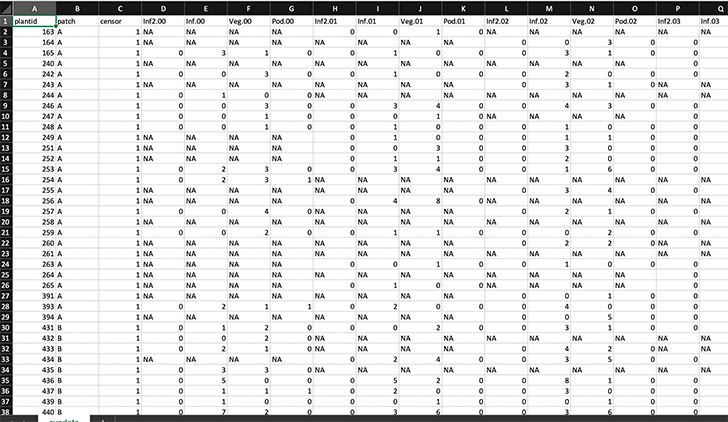
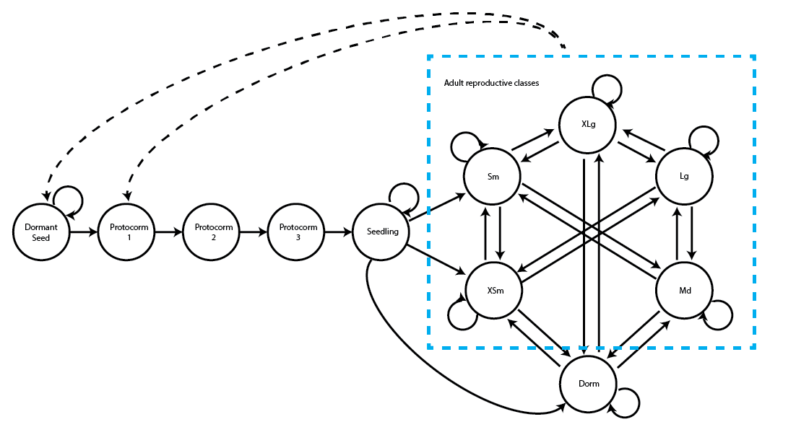

```{r, include = FALSE}
knitr::opts_chunk$set(
  collapse = TRUE,
  comment = "#>"
)
```

  <p style="text-indent: 20px">This document was built in Markdown in R `r getRversion()` and compiled on `r format(Sys.time(), '%d %B %Y')`. It covers package `lefko3` version `r getNamespaceVersion("lefko3")`. This is a long-format vignette, meaning that we have tried to include a good deal more code and output than is permissible in the standard CRAN-packaged vignette. Note, however, that code that results in dramatically long output has been hashtagged to prevent the inclusion of tens of pages of output that may confuse the user. In these cases, please remove the hashtag to see the output.</p>

## CASE STUDIES OF AMERICAN *Cypripedium candidum* POPULATION

  <p style="text-indent: 20px">In this vignette, we use the `cypdata` and `cypvert` datasets to illustrate the estimation of **raw MPMs** and **function-based MPMs**. Please see the other vignettes included in package `lefko3`, as well as further vignettes posted online on <a href = "http://www.sheffersonlab.com/projects">the projects page</a> of the Shefferson lab website, for further demonstrations of raw MPMs, function-based MPMs, IPMs, and age-by-stage MPMs.</p>

### ORGANISM AND POPULATION

  <p style="text-indent: 20px">The white lady's slipper, <a href = "https://goorchids.northamericanorchidcenter.org/species/cypripedium/candidum/">*Cypripedium candidum*</a>, is a North American perennial herb in the family Orchidaceae. It is long-lived and of conservation concern. This plant begins life by germinating from a <a href = "https://www.seashoretoforestfloor.com/pink-lady-slipper-cypripedium-acaule/">dust seed</a>, and then develops into a <a href = "https://www.orchidconservationcoalition.org/pr/bluestem/lab/bfcypreginaeflask.html">protocorm<a/>, which is a special subterranean life stage found in orchids and pyroloids. During this stage, the plant is non-photosynthetic and completely parasitic on its mycorrhizal fungi. It spends several years as a protocorm, and previous studies suggest that it typically spends 3 years before becoming a seedling. As a seedling, it may or may not produce aboveground sprouts, often remaining entirely subterranean and continuing its parasitic lifestyle. It may persist this way for many years before attaining adult size, at which point it may sprout with or without flowers, or may remain underground in a condition referred to as **vegetative dormancy**. The latter condition may continue for many years, with over a decade of continuous dormancy documented in the literature [@shefferson_drivers_2018].</p>
  
</img>  

**Figure 3L.1.** Field work in the *Cypripedium candidum* habitat yielding the demographic data included with package `lefko3`. Photo courtesy of R. Shefferson.
  
  <p style="text-indent: 20px">The population from which the dataset originates is located within a wet meadow in a state nature preserve located in northeastern Illinois, USA (Figure 3L.1). The population was monitored annually from 2004 to 2009, with two monitoring sessions per year. Monitoring sessions took roughly 2 weeks each, and included complete censuses of the population divided into sections referred to as patches. Each monitoring session consisted of searches for previously recorded individuals, which were located according to coordinates relative to fixed stakes at the site, followed by a search for new individuals. Data recorded per individual included: the location, the number of non-flowering sprouts, the number of flowering sprouts, the number of flowers per flowering sprout, and the number of fruit pods per sprout (only in the second monitoring session per year, once fruiting had occurred). Location was used to infer individual identity. More information about this population and its characteristics is given in @shefferson_estimating_2001 and @shefferson_predicting_2017.</p>


### OVERALL GOALS AND INITIAL CONSIDERATIONS
  
  <p style="text-indent: 20px">Our goal in this exercise will be to produce ahistorical and historical raw and function-based matrices for full comparison. We will assess the influence of history, and showcase the pros and cons of all four of these styles of MPMs. We will also illustrate the use of multiple demographic data formats via comparisons of the `cypdata` and `cypvert` datasets, which present the same information but in different input format. Where appropriate, we will provide commentary to illustrate where analyses may be shortened or altered for more typical analyses.</p>
  
  <p style="text-indent: 20px">The horizontal dataset `cypdata`, and the ahistorical vertical dataset `cypvert` which is the same as `cypdata` but is structured differently, both include only data for the adult stages because the  monitoring protocol did not include monitoring of juveniles. This is a result of the life history of these organisms, which includes substantial time belowground where individuals cannot be tracked and identified. Let's begin by clearing the memory, loading the package, and loading the vertical and horizontal datasets.</p>
```{r Ch3L.0}
rm(list=ls(all=TRUE))
library(lefko3)

data(cypdata)
data(cypvert)
```
  
  <p style="text-indent: 20px">The dataset `cypdata` is organized in horizontal format, meaning that rows correspond to unique individuals and columns correspond to stage in particular years. Looking at the original Excel spreadsheet (below), you will note a repeating pattern in the names of the columns. Package `lefko3` includes functions to handle data in horizontal format, as well as functions to handle vertically formatted data (i.e. data for individuals is broken up across rows, where each row is a unique combination of individual and year in time *t*).</p>
  
</img>  

**Figure 3L.2.** Organization of the *Cypripedium candidum* horizontal dataset, as viewed in Microsoft Excel.
  
  <p style="text-indent: 20px">When we imported the dataset into R, we utilized this structure, and R handles the variables accordingly. We can see this in the summary for the dataset, as below (we also use `dim()` to calculate the dimensions of the dataset).</p>
```{r Ch3L.1}
writeLines("Dimensions of dataset, in rows (data points) followed by columns (variables): ")
dim(cypdata)
writeLines("\nSummary: ")
summary(cypdata)
```
  
  <p style="text-indent: 20px">In this dataset, there are 77 individuals, so there are 77 rows with data (not counting the header). There are 27 columns, which are the variables in the dataset. Note that the first 3 columns are variables giving identifying information about each individual, with each individual's data entirely restricted to one row. This is followed by a number of sets of 4 columns, each named `Inf2.XX`, `Inf.XX`, `Veg.XX`, and `Pod.XX`. The XX in each case corresponds to a specific year, which are organized consecutively. Thus, columns 4-7 refer to year 04 (short for 2004), columns 8-11 refer to year 05, columns 12-15 refer to year 06, columns 16-19 refer to year 07, columns 20-23 refer to year 08, and columns 24-27 refer to year 09. Within each set of years, we see a repeating pattern of our 4 variables, which makes standardization easier later (although this repeating pattern is actually not required). To properly conduct this exercise, we need to know the exact number of years used, which is six years here (includes all years from 2004 to 2009).</p>
  
  <p style="text-indent: 20px">Although this dataset is in horizontal structure, many demographers prefer to keep their data in a vertical structure. Data `cypvert` is essentially the same dataset as `cypdata`, but supplied in vertical structure. Let's look at a screenshot of the Excel spreadsheet.</p>

</img>  

**Figure 3L.3.** Organization of the *Cypripedium candidum* vertical dataset, as viewed in Microsoft Excel.
  
  <p style="text-indent: 20px">We can see a number of differences from the horizontal dataset. One key difference is that each row includes not just identifying information for the individual, but also there is a column identifying the year that each datum was recorded. Here, the column `year2` represents the monitoring occasion in time *t*. Some demographers include a single year of data per row, while others include two years in order to use the dataset directly in matrix estimation. Package `lefko3` can handle all of these variations.</p>
  
  <p style="text-indent: 20px">Here we view the vertical dataset's dimensions and summary.</p>
```{r Ch3L.2}
writeLines("Dimensions of dataset, in rows (data points) followed by columns (variables): ")
dim(cypvert)
writeLines("\nSummary: ")
summary(cypvert)
```
  
  <p style="text-indent: 20px">This dataset is longer and narrower, with more rows and fewer columns. This is because we constructed the dataset by splitting the data for each individual across multiple rows. After three columns of identifying information (`plantid`, `patch`, and `censor`), a single column designates the time of occasion *t*, given as `year2`. This dataset then includes columns showing individual state in pairs of consecutive years corresponding to occasions *t* and *t*+1. State in occasion *t*-1 is not presented because this is an ahistorical dataset. This dataset includes the `plantid` variable, which is an individual identity term that allows us to associate rows with their individuals and so allows conversion.</p>
  
  <p style="text-indent: 20px">Regardless of the approach used, each dataset must conform to some basic rules to make sure that R can properly process them. One important convention is that the name of each variable must appear only in the very first row of the spreadsheet, because name terms in rows below the first will likely change the variable definitions upon import. Another convention is that blank rows should be avoided, as these are typically interpreted as extra blank data points. The most important convention, however, is consistency of data type within variables. This generally means that variables should not include both numbers and text unless ALL entries are to be interpreted as text rather than true numbers. In essence, R interprets any variable with a single text entry as being purely text, and a variable cannot include a combination of true numbers and text. So, if you wish a variable to include true numbers for use in calculations, such as size measurements or binomial indicators of reproduction, then these variables must include ONLY NUMBERS and missing entries.</p>
  
  <p style="text-indent: 20px">Before going further and standardizing our datasets, let's consider the life history model(s) that we will be using.</p>

#### Step 1. Life history model development
  
  <p style="text-indent: 20px">Our first key decision is how to model the life history of the organism. We generally use the **life cycle graph** approach, and encourage its use as it simplifies the process of life history model development. The decision of the life history model, however, may be more complicated than simply diagramming the life cycle of the organism. Particularly, we must decide what life stages to include, how these life stages will be defined, and how these life stages are connected to one another via survival and fecundity transitions. These considerations will be strongly influenced by whether we wish to create a raw MPM or a function-based MPM.</p>
  
  <p style="text-indent: 20px">It might be easiest to begin our discussion with consideration of the function-based MPM, and what sort of life history model works best if we choose this approach. With a function-based MPM (which includes the integral projection model, or IPM), there are really only two considerations that we need to be concerned about. First, what stages should be included based on a purely biological understanding of the organism's life history? Some stages may never be monitored, and so these will have to be included but dealt with via proxy rates later. In our case, for example, we never monitored germinated seeds, protocorms, and seedlings, because it is essentially impossible to do so. We will include these stages in our life history model, but we will use proxy rates for their survival transitions, since we cannot use our dataset to estimate them. Second, what is the range of stages and/or sizes that actually occur in the dataset? This question is really focused on determining which survival and fecundity transitions we CAN estimate given our dataset. One key consideration here is to assess the complete range of sizes occurring within our dataset, since we do not wish to create stages in our life cycle model that go beyond the limits of what was actually observed (models that make predictions outside of the range of data they were parameterized with have a tendency to produce erroneous and at times egregiously strange predictions).</p>
  
  <p style="text-indent: 20px">Let's explore the range of sizes actually occurring in our dataset. There is no one variable that encapsulates the entire size of the individual in our dataset, so we will create a series of vectors that sums the numbers of sprouts that are single-flowered flowering, double-flowered flowering, and non-flowering, and use these sums as plant sizes. If we use the horizontal dataset for this purpose, then we get the following exploration.</p>
```{r Ch3L.3}
size.04 <- cypdata$Inf2.04 + cypdata$Inf.04 + cypdata$Veg.04
size.05 <- cypdata$Inf2.05 + cypdata$Inf.05 + cypdata$Veg.05
size.06 <- cypdata$Inf2.06 + cypdata$Inf.06 + cypdata$Veg.06
size.07 <- cypdata$Inf2.07 + cypdata$Inf.07 + cypdata$Veg.07
size.08 <- cypdata$Inf2.08 + cypdata$Inf.08 + cypdata$Veg.08
size.09 <- cypdata$Inf2.09 + cypdata$Inf.09 + cypdata$Veg.09

summary(c(size.04, size.05, size.06, size.07, size.08, size.09))
```
  
  <p style="text-indent: 20px">The summary shows that the smallest recorded size is a single sprout, and the largest is 24 sprouts. The 97 NAs are a combination of vegetative dormancy and instances of individuals being dead or simply not alive (i.e. not yet born). Given this, we might utilize the following life history model for our function-based MPMs.</p>
  
</img>  

**Figure 3L.4.** Life history model of *Cypripedium candidum* for use in function-based MPMs.
  
  <p style="text-indent: 20px">We can see a variety of transitions within this figure. The juvenile stages have fairly simple transitions. New recruits may enter the population directly from germination of a seed produced the previous year, in which case they start in the protocorm 1 stage, or they may begin as dormant seed. Dormant seed may remain dormant, die, or germinate into the protocorm 1 stage. Protocorms exist for up to 3 years, yielding the protocorm 1, 2, and 3 stages, without any possibility of staying within each of these stages for more than a single year. Protocorm 3 leads to a seedling stage, in which the plant may persist for many years before becoming mature. Here, maturity does not really refer to reproduction *per se*, but rather to a morphology indistinguishable from a reproductive plant except for the lack of a flower. The first mature stage is usually either vegetative dormancy (dorm), during which time the plant does not sprout, or a small, non-flowering adult (1V). Once in this portion of the life history, the plant may transition among 49 mature stages, including vegetative dormancy, 1-24 shoots without flowers, or 1-24 shoots with at least one flower.</p>
  
  <p style="text-indent: 20px">Now that we have our life history model, we will need to describe the life history characterizing the dataset, matching it to our analyses properly with a `stageframe` for our *Cypripedium candidum* dataset. This is a vitally important step, and most instances of errors occurring in the use of `lefko3` originate from an inappropriate `stageframe` being used in an analysis. Since this analysis will be function-based, we will include all possible size classes here. If constructing raw matrices, all sizes that occur in the dataset need to be accounted for in a way that is both natural and parsimonious with respect to the numbers of individuals moving through actual transitions. If constructing function-based matrices, such as IPMs, then representative sizes at systematic increments will be satisfactory. Since size is count-based in the *Cypripedium candidum* case, we will use all numbers of stems that might occur from 0 to the maximum in the dataset, representing the life history diagram shown in the beginning of this chapter.</p>
```{r Ch3L.4}
sizevector <- c(0, 0, 0, 0, 0, seq(from = 0, t = 24), seq(from = 1, to = 24))
stagevector <- c("SD", "P1", "P2", "P3", "SL", "D", "V1", "V2", "V3", "V4", "V5", 
  "V6", "V7", "V8", "V9", "V10", "V11", "V12", "V13", "V14", "V15", "V16", "V17", 
  "V18", "V19", "V20", "V21", "V22", "V23", "V24", "F1", "F2", "F3", "F4", "F5",
  "F6", "F7", "F8", "F9", "F10", "F11", "F12", "F13", "F14", "F15", "F16", "F17",
  "F18", "F19", "F20", "F21", "F22", "F23", "F24")
repvector <- c(0, 0, 0, 0, 0, rep(0, 25), rep(1, 24))
obsvector <- c(0, 0, 0, 0, 0, 0, rep(1, 48))
matvector <- c(0, 0, 0, 0, 0, rep(1, 49))
immvector <- c(0, 1, 1, 1, 1, rep(0, 49))
propvector <- c(1, rep(0, 53))
indataset <- c(0, 0, 0, 0, 0, rep(1, 49))
comments <- c("Dormant seed", "Yr1 protocorm", "Yr2 protocorm", "Yr3 protocorm",
  "Seedling", "Veg dorm", "Veg adult 1 stem", "Veg adult 2 stems",
  "Veg adult 3 stems", "Veg adult 4 stems", "Veg adult 5 stems",
  "Veg adult 6 stems", "Veg adult 7 stems", "Veg adult 8 stems",
  "Veg adult 9 stems", "Veg adult 10 stems", "Veg adult 11 stems",
  "Veg adult 12 stems", "Veg adult 13 stems", "Veg adult 14 stems",
  "Veg adult 15 stems", "Veg adult 16 stems", "Veg adult 17 stems",
  "Veg adult 18 stems", "Veg adult 19 stems", "Veg adult 20 stems",
  "Veg adult 21 stems", "Veg adult 22 stems", "Veg adult 23 stems",
  "Veg adult 24 stems", "Flo adult 1 stem", "Flo adult 2 stems",
  "Flo adult 3 stems", "Flo adult 4 stems", "Flo adult 5 stems",
  "Flo adult 6 stems", "Flo adult 7 stems", "Flo adult 8 stems",
  "Flo adult 9 stems", "Flo adult 10 stems", "Flo adult 11 stems",
  "Flo adult 12 stems", "Flo adult 13 stems", "Flo adult 14 stems",
  "Flo adult 15 stems", "Flo adult 16 stems", "Flo adult 17 stems",
  "Flo adult 18 stems", "Flo adult 19 stems", "Flo adult 20 stems",
  "Flo adult 21 stems", "Flo adult 22 stems", "Flo adult 23 stems",
  "Flo adult 24 stems")

cypframe_fb <- sf_create(sizes = sizevector, stagenames = stagevector, 
  repstatus = repvector, obsstatus = obsvector, matstatus = matvector, 
  propstatus = propvector, immstatus = immvector, indataset = indataset,
  comments = comments)
cypframe_fb
```
  
  <p style="text-indent: 20px">A close look at the resulting object, `cypframe`, shows a data frame that includes the following information in order for each stage: the stage's name, the associated size, its reproductive status, its status as an observable stage, its status as a propagule stage, its status as an immature stage, its status as a mature stage, whether it occurs in the dataset, the half-width of its size class bin, the minimum and maximum ages associated with the stage, the minimum and maximum of its size class bin, the centroid of its size class bin (currently the arithmetic mean), its full size class bin width, and a comments field describing the stage. Stage names and combinations of characteristics must be unique to prevent estimation errors, and the comments field may be edited to include any information deemed pertinent.</p>
  
  <p style="text-indent: 20px">How does the life history model differ if we wish to develop a raw MPM? The key difference is that we need to consider how large our dataset is, and to create only as many stages as can be routinely transitioned to and from based on the data. The life history model above in Fig. 3L.4, for example, is not useable for raw MPMs because we have cut the size bins too finely - it is likely that in a typical year, only some of these stages will have individuals actually transitioning between them. The impact of this is that we will end up with many 0s for transitions that, in a sufficiently large population, should not equal 0.</p> 
  
  <p style="text-indent: 20px">To deal with this problem, we need to explore the dataset to determine a reasonable number of life history stages and on where the breaks should occur between these stages. A number of means exist to do this, and users should see @caswell_matrix_2001 and @kendall_persistent_2019 for good discussions of the topic. Here, we suggest plotting a size distribution and assessing a series of numbers of natural breaks using the Jenks natural breaks algorithm [@jenks_data_1967], or another such algorithm. Let's take a look at a distribution plot of size.</p>
```{r Ch3L.5, fig.height = 4.5, fig.width = 7, fig.cap = "Figure 3L.5. Distribution of size in Cypripedium candidum"}
plot(density(c(size.04, size.05, size.06, size.07, size.08, size.09), na.rm = TRUE), 
  main = "", xlab = "Size (# of sprouts)", bty = "n")
```
  
  <p style="text-indent: 20px">We can see here that most individuals are small, and so our size data is densest around 1-2 sprouts or so. Large individuals are rare, so we will need to make size bins larger for big plants than for small plants. Let's try finding some natural breaks with the Jenks algorithm, separating into 3, 4, 5, and 6 stages. To separate the size data into these numbers of stages stages, we need to identify a total of 4, 5, 6, and 7 breaks including the minimum and maximum. Please make sure that you have installed the `BAMMtools` package for this to work properly.</p>
```{r Ch3L.6}
BAMMtools::getJenksBreaks(c(size.04, size.05, size.06, size.07, size.08, size.09), 
  k = 4)
BAMMtools::getJenksBreaks(c(size.04, size.05, size.06, size.07, size.08, size.09), 
  k = 5)
BAMMtools::getJenksBreaks(c(size.04, size.05, size.06, size.07, size.08, size.09), 
  k = 6)
BAMMtools::getJenksBreaks(c(size.04, size.05, size.06, size.07, size.08, size.09), 
  k = 7)
```
  
  <p style="text-indent: 20px">The Jenks method gives us the borders of the size classes under different numbers of stages. So, a 3 stage model has the first stage include 1-3 sprouts, the second stage include 3-10 sprouts, and the 3rd stage include 11-24 sprouts. Given what we know about the size distribution, we will try to separate the data into 5 stages (1 sprout, 2-4 sprouts, 5-7 sprouts, 8-14 sprouts, and 15-24 sprouts), which would result in 11 total life history stages in our like history (1 dormant seed, 3 protocorms, 1 seedling, 1 vegatative dormant stage, and 5 size-classified adult stages).</p> 
  
  <p style="text-indent: 20px">Let's now build a stageframe using these breaks.</p>
```{r Ch3L.7}
sizevector <- c(0, 0, 0, 0, 0, 0, 1, 3, 6, 11, 19.5)
stagevector <- c("SD", "P1", "P2", "P3", "SL", "D", "XSm", "Sm", "Md", "Lg",
  "XLg")
repvector <- c(0, 0, 0, 0, 0, 0, 1, 1, 1, 1, 1)
obsvector <- c(0, 0, 0, 0, 0, 0, 1, 1, 1, 1, 1)
matvector <- c(0, 0, 0, 0, 0, 1, 1, 1, 1, 1, 1)
immvector <- c(0, 1, 1, 1, 1, 0, 0, 0, 0, 0, 0)
propvector <- c(1, 0, 0, 0, 0, 0, 0, 0, 0, 0, 0)
indataset <- c(0, 0, 0, 0, 0, 1, 1, 1, 1, 1, 1)
binvec <- c(0, 0, 0, 0, 0, 0.5, 0.5, 1.5, 1.5, 3.5, 5)

comments <- c("Dormant seed", "1st yr protocorm", "2nd yr protocorm",
  "3rd yr protocorm", "Seedling", "Dormant adult",
  "Extra small adult (1 shoot)", "Small adult (2-4 shoots)",
  "Medium adult (5-7 shoots)", "Large adult (8-14 shoots)",
  "Extra large adult (>14 shoots)")

cypframe_raw <- sf_create(sizes = sizevector, stagenames = stagevector, 
  repstatus = repvector, obsstatus = obsvector, matstatus = matvector,
  propstatus = propvector, immstatus = immvector, indataset = indataset, 
  binhalfwidth = binvec, comments = comments)

cypframe_raw
```
  
  <p style="text-indent: 20px">The life history model corresponding to this stageframe is different than in the previous case, primarily in that it has fewer adult stages. Further, all adult stages are now treated as reproductive in order to minimize the possibility that some transitions will equal 0 simply from a lack of data (in contrast, we can separate reproductive and non-reproductive stages in the function-based case). Here is our new life history model:</p>
  
</img>  

**Figure 3L.6.** Life history model of *Cypripedium candidum* for use in raw-based MPMs.
  
  <p style="text-indent: 20px">Now that we have our life history models for our raw MPM and function-based MPM analyses, we can create our standardized datasets. We will standardize these datasets using our stageframes, and so we need to create two standardized datasets - one for the raw MPM and another for the function-based MPM. Let's first standardize the vertical dataset for the raw MPM. For this purpose, we will utilize the `verticalize3()` function. Because we are lumping reproductive and non-reproductive individuals into the non-dormant adult classes, we need to set `NRasRep = TRUE`. Otherwise, `verticalize3()` will attempt to use the reproductive status of individuals in classification, and will fail due to the presence of non-reproductive adults. We also need to set `NAas0 = TRUE` to make sure that NA values in size are turned into 0 entries where necessary, and so aid in the assignment of the vegetative dormancy stage. Finally, note that we set up three different size variables here, not as `sizea`, `sizeb`, and `sizec`, and that we tell R that we want overall size to be the sum of these (`stagesize = "sizeadded"`).</p>
```{r Ch3L.8}
cypraw_v1 <- verticalize3(data = cypdata, noyears = 6, firstyear = 2004, 
  patchidcol = "patch", individcol = "plantid", blocksize = 4,
  sizeacol = "Inf2.04", sizebcol = "Inf.04", sizeccol = "Veg.04",
  repstracol = "Inf.04", repstrbcol = "Inf2.04", fecacol = "Pod.04",
  stageassign = cypframe_raw, stagesize = "sizeadded", NAas0 = TRUE,
  NRasRep = TRUE)

head(cypraw_v1)
```
  
  <p style="text-indent: 20px">In the code above, we used the `head()` function to take a look at the first 6 rows of the standardized data frame. The variable names and formats work with all functions in `lefko3`, and of course this data frame may be used in other packages, as well. Let's now take a look at a summary of the full data frame.</p>
```{r Ch3L.9}
summary(cypraw_v1)
```
  
  <p style="text-indent: 20px">Let's also create our standardized data for the function-based MPM, as below. Remember that some of the settings need to change here, primarily because we are now going to separate adults not just by size but by reproductive status. So, we will NOT set `NRasRep = TRUE` here (the default is `NRasRep = FALSE`).</p>
```{r Ch3L.10}
cypfb_v1 <- verticalize3(data = cypdata, noyears = 6, firstyear = 2004, 
  patchidcol = "patch", individcol = "plantid", blocksize = 4, 
  sizeacol = "Inf2.04", sizebcol = "Inf.04", sizeccol = "Veg.04", 
  repstracol = "Inf.04", repstrbcol = "Inf2.04", fecacol = "Pod.04", 
  stageassign = cypframe_fb, stagesize = "sizeadded", NAas0 = TRUE)

summary(cypfb_v1)
```
  
#### Step 2b. Vertical dataset organization
  
  <p style="text-indent: 20px">We may also wish to see how to proceed if our original dataset is already in vertical, but ahistorical, format. This package also includes dataset `cypvert`, which is the same dataset as `cypdata` but set in ahistorical vertical format. Here, we will use the `historicalize3()` function to deal with this dataset, which uses an individual identity variable in order to put all of the data for each individual together. Here, the vertical dataset includes the `plantid` variable, which is an individual identity term and must be supplied for conversion. Here is the raw MPM dataset.</p>
```{r Ch3L.11}
cypraw_v2 <- historicalize3(data = cypvert, patchidcol = "patch",
  individcol = "plantid", year2col = "year2", sizea2col = "Inf2.2",
  sizea3col = "Inf2.3", sizeb2col = "Inf.2", sizeb3col = "Inf.3",
  sizec2col = "Veg.2", sizec3col = "Veg.3", repstra2col = "Inf2.2",
  repstra3col = "Inf2.3", repstrb2col = "Inf.2", repstrb3col = "Inf.3",
  feca2col = "Pod.2", feca3col = "Pod.3", repstrrel = 2,
  stageassign = cypframe_raw, stagesize = "sizeadded", censorcol = "censor",
  censorkeep = 1, censor = FALSE, NAas0 = TRUE, NRasRep = TRUE, reduce = TRUE)

summary(cypraw_v2)
```
  
  <p style="text-indent: 20px">Let's also create the function-based MPM version.</p>
```{r Ch3L.12}
cypfb_v2 <- historicalize3(data = cypvert, patchidcol = "patch",
  individcol = "plantid", year2col = "year2", sizea2col = "Inf2.2", 
  sizea3col = "Inf2.3", sizeb2col = "Inf.2", sizeb3col = "Inf.3", 
  sizec2col = "Veg.2", sizec3col = "Veg.3", repstra2col = "Inf2.2", 
  repstra3col = "Inf2.3", repstrb2col = "Inf.2", repstrb3col = "Inf.3", 
  feca2col = "Pod.2", feca3col = "Pod.3", repstrrel = 2,
  stageassign = cypframe_fb, stagesize = "sizeadded", censorcol = "censor",
  censorkeep = 1, censor = FALSE, NAas0 = TRUE, reduce = TRUE)

summary(cypfb_v2)
```

  <p style="text-indent: 20px">We can compare the dimensions of these datasets.</p>
```{r Ch3L.13}
dim(cypraw_v1)
dim(cypraw_v2)
dim(cypfb_v1)
dim(cypfb_v2)
```

  <p style="text-indent: 20px">The lengths of the datasets are the same in terms of rows and columns, and the variables and data are the same although the order of the columns and rows might not match (see the summaries for comparison).</p>
  
  <p style="text-indent: 20px">Let's now move on to supplying R with the proxy transitions that we need to properly parameterize our models.</p>
  
#### Step 2c. Provide supplemental information for matrix estimation

  <p style="text-indent: 20px">The next steps involve adding some external data to parameterize the matrices properly. There are two approaches for this:</p>
  
  1. using the `supplemental()` function, or
  2. creating a reproductive matrix and using the `overwrite()` function.
  
  <p style="text-indent: 20px">We advise the use of the first approach, the `supplemental()` function, which is more holistic and flexible than the other approach. The `supplemental()` function provides a means of inputting three kinds of data into MPM construction:</p>
  
  1. fixed transition values derived from other studies and added as constants to matrices,
  2. proxy transition values when data for particular transitions does not exist and other, estimable transitions will be used as proxies, and
  3. reproductive multipliers to indicate which stages lead to the production of which stages, and at what level relative to estimated fecundity.
  
  <p style="text-indent: 20px">We will start off by creating two supplemental tables taking all of these sorts of data for the function-based MPMs. The first is the supplemental table for the historical analysis, and the second table covers the ahistorical analysis. Each row refers to a specific transition, and in the historical case, there are codes for 16 given transitions (11 for the ahistorical case). The first 9 of the historical transitions are set to specific probabilities, and the next 5 are transitions that will be set to other, estimated transitions (these are the non-NA transitions in `eststage` set below). The final 2 terms are fecundity multipliers. Based on the literature, the proxies for entry into the adult classes are transitions from dormancy, as below. However, in the raw dataset, dormancy is not common enough to use as an effective proxy in raw matrix creation. Hence, we can use different proxies for function-based matrix estimation than for raw matrix estimation. Where necessary, we also use `rep` and `mat` as shorthand to code for all reproductive stages and all mature stages, respectively.</p>
  
  <p style="text-indent: 20px">Here is the historical supplemental table. We will also introduce a variable representing the number of seeds expected per pod (the term 'pod' refers to the fruits that orchids make). Note that the number of seeds per fruit is actually likely higher than this, but we are using this number to reflect the relatively stable population dynamics that we see in the population.</p>
```{r Ch3L.14}
seeds_per_pod <- 5000

cypsupp3_fb <- supplemental(stage3 = c("SD", "SD", "P1", "P1", "P2", "P3", "SL",
    "SL", "SL", "D", "V1", "D", "V1", "V2", "SD", "P1"), 
  stage2 = c("SD", "SD", "SD", "SD", "P1", "P2", "P3", "SL", "SL", "SL", "SL", 
    "SL", "SL", "SL", "rep", "rep"), 
  stage1 = c("SD", "rep", "SD", "rep", "SD", "P1", "P2", "P3", "SL", "P3", "P3",
    "SL", "SL", "SL", "mat", "mat"), 
  eststage3 = c(NA, NA, NA, NA, NA, NA, NA, NA, NA, "D", "V1", "D", "V1",
    "V2", NA, NA), 
  eststage2 = c(NA, NA, NA, NA, NA, NA, NA, NA, NA, "D", "D", "D", "D", 
    "D", NA, NA), 
  eststage1 = c(NA, NA, NA, NA, NA, NA, NA, NA, NA, "D", "D", "D", "D", 
    "D", NA, NA), 
  givenrate = c(0.01, 0.05, 0.10, 0.20, 0.1, 0.1, 0.05, 0.05, 0.05, NA, NA, NA,
    NA, NA, NA, NA),
  multiplier = c(NA, NA, NA, NA, NA, NA, NA, NA, NA, NA, NA, NA, NA, NA,
    (0.5 * seeds_per_pod), (0.5 * seeds_per_pod)),
  type = c("S", "S", "S", "S", "S", "S", "S", "S", "S", "S", "S", "S", "S", "S",
    "R", "R"), 
  type_t12 = c("S", "F", "S", "F", "S", "S", "S", "S", "S", "S", "S", "S", "S",
    "S", "S", "S"), stageframe = cypframe_fb)

cypsupp3_fb
```
  
  <p style="text-indent: 20px">Now we can input the ahistorical table.</p>
```{r Ch3L.15}
cypsupp2_fb <- supplemental(stage3 = c("SD", "P1", "P2", "P3", "SL", "SL", "D",
    "V1", "V2", "SD", "P1"), 
  stage2 = c("SD", "SD", "P1", "P2", "P3", "SL", "SL", "SL", "SL", "rep",
    "rep"), 
  eststage3 = c(NA, NA, NA, NA, NA, NA, "D", "V1", "V2", NA, NA), 
  eststage2 = c(NA, NA, NA, NA, NA, NA, "D", "D", "D", NA, NA), 
  givenrate = c(0.03, 0.15, 0.1, 0.1, 0.1, 0.05, NA, NA, NA, NA, NA), 
  multiplier = c(NA, NA, NA, NA, NA, NA, NA, NA, NA, (0.5* seeds_per_pod),
    (0.5 * seeds_per_pod)),
  type = c("S", "S", "S", "S", "S", "S", "S", "S", "S", "R", "R"),
  stageframe = cypframe_fb, historical = FALSE)

cypsupp2_fb
```
  
  <p style="text-indent: 20px">These supplemental tables provide the best means of adding external data to our MPMs because they allow both specific transitions to be isolated, and because they allow the use of shorthand to identify large groups of transitions (e.g. using `mat`, `rep`, `immat`, `prop`, or `all` to signify all mature stages, reproductive stages, immature stages, propagule stages, or simply all stages, respectively). Let's now also supply the supplemental tables for the raw MPMs.</p>
```{r Ch3L.16}
cypsupp3_raw <- supplemental(stage3 = c("SD", "SD", "P1", "P1", "P2", "P3",
    "SL", "SL", "SL", "D", "D", "SD", "P1"),
  stage2 = c("SD", "SD", "SD", "SD", "P1", "P2", "P3", "SL", "SL", "SL", "SL",
    "rep", "rep"),
  stage1 = c("SD", "rep", "SD", "rep", "SD", "P1", "P2", "P3", "SL", "P3",
    "SL", "mat", "mat"),
  eststage3 = c(NA, NA, NA, NA, NA, NA, NA, NA, NA, "XSm", "D", NA, NA),
  eststage2 = c(NA, NA, NA, NA, NA, NA, NA, NA, NA, "XSm", "XSm", NA, NA),
  eststage1 = c(NA, NA, NA, NA, NA, NA, NA, NA, NA, "XSm", "XSm", NA, NA),
  givenrate = c(0.01, 0.05, 0.10, 0.20, 0.1, 0.1, 0.05, 0.05, 0.05, NA, NA,
    NA, NA),
  multiplier = c(NA, NA, NA, NA, NA, NA, NA, NA, NA, NA, NA,
    (0.5 * seeds_per_pod), (0.5 * seeds_per_pod)),
  type = c(1, 1, 1, 1, 1, 1, 1, 1, 1, 1, 1, 3, 3),
  type_t12 = c(1, 2, 1, 2, 1, 1, 1, 1, 1, 1, 1, 1, 1),
  stageframe = cypframe_raw, historical = TRUE)

cypsupp2_raw <- supplemental(stage3 = c("SD", "P1", "P2", "P3", "SL", "SL", "D", 
    "XSm", "SD", "P1"),
  stage2 = c("SD", "SD", "P1", "P2", "P3", "SL", "SL", "SL", "rep", "rep"),
  eststage3 = c(NA, NA, NA, NA, NA, NA, "D", "XSm", NA, NA),
  eststage2 = c(NA, NA, NA, NA, NA, NA, "XSm", "XSm", NA, NA),
  givenrate = c(0.03, 0.15, 0.1, 0.1, 0.1, 0.05, NA, NA, NA, NA),
  multiplier = c(NA, NA, NA, NA, NA, NA, NA, NA, (0.5 * seeds_per_pod),
    (0.5 * seeds_per_pod)),
  type =c(1, 1, 1, 1, 1, 1, 1, 1, 3, 3),
  stageframe = cypframe_raw, historical = FALSE)

cypsupp3_raw

cypsupp2_raw
```
  
  <p style="text-indent: 20px">The supplemental tables provide all of the information that we need. However, there is an alternative means of supplying this information, and that is through the creation of a reproductive matrix and an `overwrite` table. The reproductive matrix is an **ahistorical** matrix detailing where fecundity rates are set, and at what level. *Cypripedium candidum* produces seeds that germinate by the following growing season (stage P1, or a first year protocorm), or that remain dormant for the next year (stage SD). In the following matrix, we detail that the fecundity of each reproductive stage needs to be split into two between each of these output stages. The actual split places 50% of the fecundity of a reproductive stage into each category of recruit, where the full fecundity is estimated by linear models that we will create. This reproductive matrix can be used in historical MPM construction, and it is assumed that stage at occasion *t*-1 is set to `all`.</p>
```{r Ch3L.17}
rep.assumptions_fb <- matrix(0, 54, 54)
rep.assumptions_fb[1:2,31:54] <- 0.5 * seeds_per_pod
rep.assumptions_fb
```

  <p style="text-indent: 20px">Next we will create the overwrite tables, which outline transitions that cannot be estimated from the data set and need to be set by other means. Here is an example of two overwrite tables for the *Cypripedium candidum* analysis. Note that they are fundamentally similar to supplemental tables, but do not allow the addition of fecundity multipliers and transition types from occasion *t*-1 to *t*, nor do they involve a check of entered stages against the stage frame.</p>
```{r Ch3L.18}
cypover3_fb <- overwrite(stage3 = c("SD", "SD", "P1", "P1", "P2", "P3", "SL", "SL", 
    "SL", "D", "V1", "D", "V1", "V2"), 
  stage2 = c("SD", "SD", "SD", "SD", "P1", "P2", "P3", "SL", "SL", "SL", "SL", 
    "SL", "SL", "SL"), 
  stage1 = c("SD", "rep", "SD", "rep", "SD", "P1", "P2", "P3", "SL", "P3", "P3",
    "SL", "SL", "SL"), 
  eststage3 = c(NA, NA, NA, NA, NA, NA, NA, NA, NA, "D", "V1", "D",
    "V1", "V2"), 
  eststage2 = c(NA, NA, NA, NA, NA, NA, NA, NA, NA, "D", "D", "D", "D", 
    "D"), 
  eststage1 = c(NA, NA, NA, NA, NA, NA, NA, NA, NA, "D", "D", "D", "D", 
    "D"), 
  givenrate = c(0.01, 0.05, 0.10, 0.20, 0.1, 0.1, 0.05, 0.05, 0.05, NA, NA, NA, 
    NA, NA), 
  type = c("S", "S", "S", "S", "S", "S", "S", "S", "S", "S", "S", "S", "S",
    "S"))

cypover2_fb <- overwrite(stage3 = c("SD", "P1", "P2", "P3", "SL", "SL", "D", "V1",
    "V2"), 
  stage2 = c("SD", "SD", "P1", "P2", "P3", "SL", "SL", "SL", "SL"), 
  eststage3 = c(NA, NA, NA, NA, NA, NA, "D", "V1", "V2"), 
  eststage2 = c(NA, NA, NA, NA, NA, NA, "D", "D", "D"), 
  givenrate = c(0.03, 0.15, 0.1, 0.1, 0.1, 0.05, NA, NA, NA), 
  type = c("S", "S", "S", "S", "S", "S", "S", "S", "S"))

cypover3_fb

cypover2_fb
```
  
  <p style="text-indent: 20px">Let's now also supply the overwrite tables and reproductive matrix for the raw MPM approach.</p>
```{r Ch3L.19}
rep_cyp_raw <- matrix(0, 11, 11)
rep_cyp_raw[1:2,7:11] <- 0.5 * seeds_per_pod

cypover2_raw <- overwrite(stage3 = c("SD", "P1", "P2", "P3", "SL", "SL", "D",
    "XSm", "Sm"),
  stage2 = c("SD", "SD", "P1", "P2", "P3", "SL", "SL", "SL", "SL"),
  eststage3 = c(NA, NA, NA, NA, NA, NA, "D", "XSm", "Sm"),
  eststage2 = c(NA, NA, NA, NA, NA, NA, "XSm", "XSm", "XSm"),
  givenrate = c(0.03, 0.15, 0.1, 0.1, 0.1, 0.05, NA, NA, NA),
  type = c("S", "S", "S", "S", "S", "S", "S", "S", "S"))

cypover3_raw <- overwrite(stage3 = c("SD", "SD", "P1", "P1", "P2", "P3", "SL",
    "SL", "SL", "D", "D", "XSm"),
  stage2 = c("SD", "SD", "SD", "SD", "P1", "P2", "P3", "SL", "SL", "SL", "SL",
    "SL"),
  stage1 = c("SD", "rep", "SD", "rep", "SD", "P1", "P2", "P3", "SL", "P3",
    "SL", "SL"),
  eststage3 = c(NA, NA, NA, NA, NA, NA, NA, NA, NA, "D", "D", "XSm"),
  eststage2 = c(NA, NA, NA, NA, NA, NA, NA, NA, NA, "XSm", "XSm", "XSm"),
  eststage1 = c(NA, NA, NA, NA, NA, NA, NA, NA, NA, "XSm", "XSm", "XSm"),
  givenrate = c(0.01, 0.05, 0.10, 0.20, 0.1, 0.1, 0.05, 0.05, 0.05, NA, NA,
    NA),
  type = c("S", "S", "S", "S", "S", "S", "S", "S", "S", "S", "S", "S"))

rep_cyp_raw

cypover2_raw

cypover3_raw
```

  <p style="text-indent: 20px">These approaches are less powerful than the supplemental table approach, but some might prefer their use. We can now proceed to test whether individual history is likely to be of importance in our analyses.</p>
  

#### Step 3. Tests of history

  <p style="text-indent: 20px">Matrix creation can proceed either as raw matrix creation, as initially outlined in @ehrlen_dynamics_2000, or via the creation of function-based matrices, in many ways equivalent to complex integral projection models per @ellner_integral_2006 and as further described in the non-Gaussian case in @shefferson_life_2014. The function-based approach requires the development of vital rate models, and these vital rate models serve not only to parameterize these matrices but also to allow us to test whether history is important to population dynamics in our study system. This is true even in the raw MPM case. We will proceed by developing vital rate models that test for history, and use these both to understand the overall demography of the system and to parameterize our function-based MPMs.</p>
  
  <p style="text-indent: 20px">Prior to vital rate estimation, a number of key decisions need to be made regarding the assumptions underlying the vital rates, and their relationships with the factors under investigation. These decisions include the **general modeling strategy**, and the **size and fecundity distributions**.</p>
  
#### Step 3a. General modeling strategy

  <p style="text-indent: 20px">Most function-based matrices, whether integral projection models or otherwise, are developed using either a generalized linear modeling (GLM) strategy, or a generalized linear mixed modeling (GLMM) strategy. The former is more common and is simpler, but the latter is more theoretically sound because it provides a means of correcting the lack of independence inherent in datasets incorporating repeated sampling of the same individuals. The difference between the two with regards to vital rate modeling is strongly related to assumptions regarding the individual and spatiotemporal variation in vital rates.</p>
  
  <p style="text-indent: 20px">In both GLM and GLMM-based MPMs, the underlying dataset utilized is a vertical dataset. Each row of data gives the state of the individual in either two consecutive occasions (the ahistorical case), or three consecutive occasions (the historical case). Under a GLM framework, time in occasion *t* is a fixed categorical variable, and individual identity is ignored. Treating time as fixed implies that the actual monitoring occasions are the only times for which inference is sought. Thus, if time is treated as fixed, then it would not be correct to infer future population dynamics after 2009 for a dataset collected between 2004 and 2009. Ignoring individual identity treats all transitions as independent, even though data originating from the same sampled individual is clearly not independent of that individual's previous transitions. This may be interpreted as a form of pseudoreplication because strongly related data is used to create matrices that are assumed to be statistically independent. This might impact demographic modeling by inflating Type 1 error in the linear modeling, yielding more significant terms in the chosen best-fit model and causing the retention of more terms than is warranted.</p>
  
  <p style="text-indent: 20px">Under a GLMM (generalized linear mixed model) framework, both time and individual identity can be treated as random categorical terms. This has two major implications. First, both time and individuals can be assumed to be random samples from a broader population of times and individuals for which inference is sought. Thus, sampled monitoring occasions represent a greater universe of years for which inference can be made, and so their associated coefficients can be assumed to come from a normal distribution with $mean = 0$. Second, treating individual as a random categorical term eliminates the pseudoreplication that is inherent in the GLM approach to vital rate estimation when individuals are monitored potentially many times, because each individual is assumed to be randomly drawn and associated with its own response distribution. Subpopulations may also be considered random, in which case they are assumed to have been sampled from all possible spaces that the species might occupy. We encourage researchers to use the GLMM approach in their demographic work, but we have also included easy-to-use GLM functionality, since many will find the GLM approach particularly useful in cases where mixed modeling breaks down.</p>
  
#### Step 3b. Size and fecundity distributions

  <p style="text-indent: 20px">Once a general approach is decided upon, the next step is to choose the underlying distributions. The probabilities of survival, observation, and reproductive status are automatically set to the binomial distribution, and this cannot be altered. However, the probability of size transition and the fecundity rate can be set to the Gaussian, Poisson, or negative binomial distributions, with zero-inflated and zero-truncated versions of the Poisson and negative binomial also available. If size or fecundity rate is a continuous variable (i.e., not an integer or count variable), then it should be set to the Gaussian distribution. However, if size or fecundity is a count variable, then it should be set to the Poisson distribution if the mean equals the variance. The negative binomial distribution is provided in cases where the assumption that the mean equals the variance is clearly broken. We do not encourage the use of the negative binomial except in such cases, as the extra parameters estimated for the negative binomial distribution reduce the power of the modeling exercises conducted.</p>
  
  <p style="text-indent: 20px">The Poisson and the negative binomial distributions both predict specific numbers of 0s in the response variable. If excess 0s occur within the dataset even after including the observation status and reproductive status as vital rates to absorb 0s, then a zero-inflated Poisson or negative binomial distribution may be used. These modeling approaches work by parameterizing a binomial model, typically with a logit link, to predict 0 responses. The Poisson or negative binomial is then used to predict non-zero responses. This conditional model ends up really acting as two separate models in which 0s are assumed to be predicted under potentially different processes than the remaining counts. Users should be aware that, because an extra model is built to cover 0s, zero-inflated models are much more complex and can include many more parameters than their non-inflated counterparts. The principle of parsimony suggests that they should only be used when there are significantly more 0s than expected.</p>
  
  <p style="text-indent: 20px">Cases may arise in which 0s do not exist in either size or fecundity. For these situations, we provide zero-truncated distributions. This may occur in size if all cases of `size = 0` are absorbed by observation status, leaving only positive integers for the size of observed individuals. For example, if an unobservable stage such as vegetative dormancy occurs and absorbs all cases of `size = 0`, then a zero-truncated Poisson or negative binomial distribution will be more appropriate than the equivalent distribution without zero-truncation. It can also occur if all cases of `fecundity = 0` are absorbed by reproductive status. Such distributions only involve the estimation of single, conditional models, and so are simpler than zero-inflated models.</p>
  
  <p style="text-indent: 20px">Package `lefko3` includes a function that can help in determining which distributions to use: `sf_distrib()`. Here, we use it to determine that we should use the zero-truncated negative binomial for size, and the zero-inflated Poisson for fecundity:</p>
```{r Ch3L.20}
sf_distrib(cypfb_v1, size3 = "size3added", size2 = "size2added",
  obs3 = "obsstatus3", fec = "feca2", repst = "repstatus2", zisize = FALSE)
```


#### Step 3c. Model building and selection

  <p style="text-indent: 20px">In *lefko3*, the `modelsearch` function is the workhorse that conducts vital rate model estimation. Here, we will create a full suite of vital rate models for the *Cypripedium candidum* dataset. Before proceeding, we need to decide on the linear model building strategy, the correct vital rates to model, the proper statistical distributions for estimated vital rates, the proper parameterizations for each vital rate, and the strategy for determination of the best-fit models.</p>
  
  <p style="text-indent: 20px">First, we must determine the model building strategy. In most cases, the best procedure will be through mixed linear models in which monitoring occasion and individual identity are random terms. We will set monitoring occasion as random because we wish to make inferences for the population as a whole and do not wish to restrict ourselves to inference only for the years monitored (i.e. our distribution of monitoring occasions sampled is itself a sample of the population in time). We will set individual identity as random because many or most of the individuals that we have sampled to produce our dataset yield multiple observation data points across time. Thus, we will set `approach = "mixed"`. To make sure that time and individual identity are treated as random, we will set the proper variable names for `indiv` and `year`, corresponding to individual identity (`individ` by default), and to occasion *t* (`year2` by default). The `year.as.random` option is set to random by default, and leaving it this way also means that R will randomly draw coefficient values for years with inestimable coefficients. Setting `year.as.random` to FALSE would make time a fixed categorical variable.</p>
  
  <p style="text-indent: 20px">The mixed modeling approach is usually preferable to the GLM approach. However, a mixed modeling strategy results in lower statistical power and a greater time used in estimating models (or, conversely, it yields truer statistical power while the GLM approach inflates Type I error). Users of package `lefko3` wishing to use a standard generalized linear modeling strategy can set `approach = "glm"`. In this case, individual identity is not used, time is a fixed categorical factor, and all observed transitions are treated as independent.</p>
  
  <p style="text-indent: 20px">Next, we must determine which vital rates to model. Function `modelsearch()` estimates up to 9 vital rate models:</p>
  
  1) survival probability from occasion *t* to occasion *t*+1,
  
  2) observation probability in occasion *t*+1 assuming survival until that time, 
  
  3) size in occasion *t*+1 assuming survival and observation in that time, 
  
  4) reproduction status in occasion *t*+1 assuming survival and observation until that time,
  
  5) fecundity rate assuming survival until and observation and reproduction in the occasion of production of offspring (occasion *t* or *t*+1; mature only),
  
  6) juvenile survival probability from occasion *t* to occasion *t*+1,
  
  7) juvenile observation probability in occasion *t*+1 assuming survival until that time, 
  
  8) juvenile size in occasion *t*+1 assuming survival and observation in that time, and
  
  9) reproduction status in occasion *t*+1 assuming survival and observation until that time of a juvenile in occasion *t* that is becoming mature in occasion *t*+1.
  
  <p style="text-indent: 20px">The default settings for `modelsearch` estimate 1) survival probability, 3) size distribution, and 5) fecundity, which are the minimum 3 vital rates required for a full MPM. Observation probability (option `obs` in `vitalrates`) should only be included when a life history stage or size exists that cannot be observed. For example, in the case of a plant with vegetative dormancy, the observation probability can be thought of as the sprouting probability, which is a biologically meaningful vital rate [@shefferson_estimating_2001]. Further, reproduction status (option `repst` in `vitalrates`) should only be modeled if size classification needs to be stratified by the ability to reproduce, as when 0 fecundity occurs within stages that also produce offspring. Since *Cypripedium candidum* is capable of long bouts of vegetative dormancy, since we wish to stratify the population into reproductive and non-reproductive stages of the same size classes, and since we have no data derived from juvenile individuals, we will set `vitalrates = c("surv", "obs", "size", "repst", "fec")`.</p>
  
  <p style="text-indent: 20px">Third, we need to set the proper statistical distribution for each parameter. Survival probability, observation probability, and reproductive status are all modeled as binomial variables, and this cannot be changed. In the case of this population of *Cypripedium candidum*, size was measured as the number of stems and so is a count variable. Likewise, fecundity is actually estimated as the number of fruits produced per plant, and so is also a count variable. We have already performed tests for overdispersion and zero-inflation, and we are also aware that size in observed stages cannot be 0, requiring zero truncation in that parameter. So we will set size to the zero-truncated negative binomial distribution, and fecundity to the zero-inflated Poisson distribution.</p>
  
  <p style="text-indent: 20px">Fourth, we need the proper model parameterizations for each vital rate, using the `suite` option. The default, `suite = "main"`, under the mixed model setting (`approach = "mixed"`) starts with the estimation of global models that include size and reproductive status in occasions *t* and *t*-1 as fixed factors, with individual identity and time in occasion *t* (year *t*) set as random categorical terms. Other terms can be specified, including individual covariates and age. Setting `suite = "full"` will yield global models that also include all two-way interactions. The global model under `suite = "full"` then includes all fixed factors noted before, plus time in occasion *t* and all two-way interactions between fixed factors ("full" is the only setting with interaction terms). If the population is not stratified by reproductive status, then `suite = "size"` will eliminate reproductive status terms and use all others in the global model. If size is not important, then `suite = "rep"` will eliminate size but keep reproductive status and all other terms. Finally, `suite = "cons"` will result in a global model in which neither reproductive status nor size are considered.</p>
  
  <p style="text-indent: 20px">Finally, we need to determine the proper strategy for the determination of the best-fit model. Model building proceeds through the `dredge` function in package `MuMIn` [@barton_mumin_2014], and each model has an associated AICc value. The default setting in `lefko3` (`bestfit = "AICc&k"`) will compare all models within 2.0 AICc units of the model with $\Delta AICc = 0$, and choose the one with the lowest degrees of freedom. This approach is generally better than the alternative, which simply uses the model with $\Delta AICc = 0$ (`bestfit = "AICc"`), as all models within 2.0 AICc units of that model are equally parsimonious and so fewer degrees of freedom result from fewer parameters estimated [@burnham_model_2002].</p>
  
  <p style="text-indent: 20px">In the model building exercise below, we will use the `suite = "main"` option to run all main effects only. Normally we would set to `suite = "full"`, but running all effects including their two-way interactions will likely tie up our computers for a few too many minutes. Once done, we can summarize the output with the `summary()` function.</p>
```{r Ch3L.21}
cypmodels3p <- modelsearch(cypfb_v1, historical = TRUE, approach = "mixed", 
  vitalrates = c("surv", "obs", "size", "repst", "fec"), patch = "patchid",
  sizedist = "negbin", size.trunc = TRUE, fecdist = "poisson", fec.zero = TRUE,
  suite = "main", size = c("size3added", "size2added", "size1added"),
  quiet = TRUE)

summary(cypmodels3p)
```

  <p style="text-indent: 20px">We can see that historical size is included in the best-fit fecundity model. This suggests that the historical MPM is the most parsimonious choice. However, in order to compare MPMs for educational purposes, we will also create an ahistorical model set. Note that a vital rate model set that includes historical terms CANNOT be used to make an ahistorical MPM. Here is an ahistorical model set.</p>
```{r Ch3L.22}
cypmodels2p <- modelsearch(cypfb_v1, historical = FALSE, approach = "mixed", 
  vitalrates = c("surv", "obs", "size", "repst", "fec"), patch = "patchid",
  sizedist = "negbin", size.trunc = TRUE, fecdist = "poisson", fec.zero = TRUE,
  suite = "main", size = c("size3added", "size2added", "size1added"),
  quiet = TRUE)

summary(cypmodels2p)
```
  
  <p style="text-indent: 20px">In the preceding vital rate model sets, we created best-fit models that necessarily included a patch term. This will result necessarily in the creation of matrices at the patch level. To create matrices for the population level only, we remove the `patch` option from the preceding function calls, as below.</p>
```{r Ch3L.23}
cypmodels3 <- modelsearch(cypfb_v1, historical = TRUE, approach = "mixed", 
  vitalrates = c("surv", "obs", "size", "repst", "fec"),
  sizedist = "negbin", size.trunc = TRUE, fecdist = "poisson", fec.zero = TRUE,
  suite = "main", size = c("size3added", "size2added", "size1added"),
  quiet = TRUE)

cypmodels2 <- modelsearch(cypfb_v1, historical = FALSE, approach = "mixed", 
  vitalrates = c("surv", "obs", "size", "repst", "fec"),
  sizedist = "negbin", size.trunc = TRUE, fecdist = "poisson", fec.zero = TRUE,
  suite = "main", size = c("size3added", "size2added"),
  quiet = TRUE)

summary(cypmodels3)

summary(cypmodels2)
```
  
  <p style="text-indent: 20px">Note that we now have no patch term in any model, and some of our models have changed in other ways as well.</p>
  
#### Step 4. MPM estimation
  
#### Step 4a. Modeling the main MPMs
  
  <p style="text-indent: 20px">We will now proceed to create our matrices. Since we have determined that individual history is important, we could settle for simply producing a historical MPM. However, we will produce both historical and ahistorical MPMs for comparison, and we will also produce these in both raw and function-based formats.</p>
  
  <p style="text-indent: 20px">We will begin with the creation of a set of ahistorical matrices for the *Cypripedium candidum* dataset. The `rlefko2` function was created to deal with the construction of ahistorical MPMs using raw data. Matrices may strongly differ, particularly if the demographic dataset is somewhat sparse. This happens because there may not be enough individuals per year to encounter all possible transitions, leading to seemingly random shifts in the location of non-zero elements within matrices across time. We strongly advise readers to build life history models that reflect the sample size that they are working with to prevent this issue from causing odd results in MPM analysis.</p>
```{r Ch3L.24}
cypmatrix2rp <- rlefko2(data = cypraw_v1, stageframe = cypframe_raw,
  year = "all", patch = "all", stages = c("stage3", "stage2"),
  size = c("size3added", "size2added"), supplement = cypsupp2_raw, 
  yearcol = "year2", patchcol = "patchid", indivcol = "individ")

cypmatrix2rp
```
  
  <p style="text-indent: 20px">The output from this analysis is a `lefkoMat` object, which is a list object with the following elements:</p>
  
  **A**: a list of full population projection matrices, in order of population, patch, and year
  
  **U**: a list of matrices showing only survival-transition elements, in the same order as A
  
  **F**: a list of matrices showing only fecundity elements, in the same order as A
  
  **hstages**: a data frame showing the order of paired stages (given if matrices are historical, otherwise NA)
  
  **agestages**: this is a data frame showing the order of age-stages (if an age-by-stage MPM has been created, otherwise NA)
  
  **ahstages**: this is the stageframe used in analysis, with stages reordered and edited as they occur in the matrix
  
  **labels**: a table showing the order of matrices, according to population, patch, and year
  
  **matrixqc**: a short vector used in `summary` statements to describe the overall quality of each matrix
  
  **dataqc**: a short vector used in `summary` statements to describe key sampling aspects of the dataset (in raw MPMs)
  
  **modelqc**: a short vector used in `summary` statements to describe the vital rate models (in function-based MPMs)
  
  <p style="text-indent: 20px">Calling particular values and elements within `lefkoMat` objects is not complicated, once you know the structure. The figure below illustrates how to call a particular element from one of the A matrices, for example.</p>
  
</img>  

**Figure 3L.7.** Organization of a `lefkoMat` object, and how to call a specific element.

  <p style="text-indent: 20px">Objects of class `lefkoMat` have their own `summary` statements, which we can use to understand more about them.</p>
```{r Ch3L.25}
summary(cypmatrix2rp)
```
  
  <p style="text-indent: 20px">We start off learning that 15 matrices were estimated, and we learn the dimensionality of those matrices. Of note here is the output telling us how many elements were actually estimated, both overall and per matrix, and the number of individuals and transitions the matrices are based on. It is typical for population ecologists to consider the total number of transitions in a dataset as a measure of the statistical power of a matrix, but the number of individuals used is just as important because each transition that an individual experiences is dependent on the other transitions that it also experiences. Indeed, this is the fundamental point that led to the development of historical matrices and of this package - the assumption that the status of an individual in the next time is dependent only on its current state is too simplistic, and may lead to both overparameterization and pseudoreplication (if vital rate models are used). The final bit of the summary shows us the range of survival probabilities of stages in the matrices, where the survival probabilities are calculated as column sums of each `U` matrix. Since there are 15 matrices, there are 15 summaries. It is important to check to see that no stage survives outside the realm of possibility (i.e. no probability should be greater than 1.0 or lower than 0.0). Unusual stage survival probabilities will result in a warning as a part of the `summary()` output.</p>
  
  <p style="text-indent: 20px">The input for the `rlefko2()` function includes `patch = "all"` and `year = "all"`, but can be set to focus on any set of patches/subpopulations or years included within the data. Package `lefko3` includes a great deal of flexibility here, and can estimate many matrices covering all of the populations, patches, and years occurring in a specific dataset. For example, if we had wished to skip the patch divisions within the population and instead estimate only annual matrices at the population level, then we could have eliminated the `patch` option altogether from the input, as below.</p>
```{r Ch3L.26}
cypmatrix2r <- rlefko2(data = cypraw_v1, stageframe = cypframe_raw,
  year = "all", stages = c("stage3", "stage2"),
  size = c("size3added", "size2added"), supplement = cypsupp2_raw, 
  yearcol = "year2", patchcol = "patchid", indivcol = "individ")

summary(cypmatrix2r)
```
  
  <p style="text-indent: 20px">Notice what happened here. The first call to `rlefko2()` yielded 15 matrices, because there are 3 patches in our dataset, and there are a total of 6 years of data, yielding 5 transitions between years (also refered to as time steps or periods). So, there are $3 \times 5 = 15$ matrices. But in the second call, we no longer recognize patches and so have only estimated one set of 5 matrices covering the whole population. We can also focus in on specific patches and specific sets of years, setting the options appropriately.</p>
  
  <p style="text-indent: 20px">Now let's estimate a raw, historical MPM, using the `rlefko3()` function.
```{r Ch3L.27}
cypmatrix3rp <- rlefko3(data = cypraw_v1, stageframe = cypframe_raw,
  year = "all", patch = "all", stages = c("stage3", "stage2", "stage1"), 
  size = c("size3added", "size2added", "size1added"), supplement = cypsupp3_raw, 
  yearcol = "year2", patchcol = "patchid", indivcol = "individ")

summary(cypmatrix3rp)
```
  
  <p style="text-indent: 20px">Quickly scanning this output shows a number of differences. First, there are 3 fewer matrices here than in the ahistorical case. There are 3 patches that we are estimating matrices for, and 6 years of data for each patch, leading to 5 possible ahistorical time steps and 15 possible ahistorical matrices. Since historical matrices require 3 years of transition data, only 4 historical transitions are possible per patch, leading to 12 total historical matrices. Second, the dimensionality of the matrices is the square of the dimensions of the ahistorical matrices. This leads to vastly more matrix elements within each matrix, although it turns out that most of these matrix elements are structural 0s because they reflect impossible transitions. Indeed, in this case, although there are 14,641 elements in each matrix, on average only 37.83 are actually estimated greater than 0. Finally, we see that one of our matrices has a survival probability greater than 1.0. This is a problem for us, and normally we would need to correct the situation via the supplemental table. However, for the time being we will proceed (no other MPMs here will have this problem).</p>
  
  <p style="text-indent: 20px">Let's look at the first matrix, corresponding to the transition from 2004 and 2005 to 2006 in the first patch. Because this is a huge matrix, we will only look at the top corner, followed by a middle section. The full matrix is not shown here, but we can focus on portions of it if we wish. These matrices may also be exported to Excel or another spreadsheet program to look over in detail. Particularly note the sparseness - most elements are 0s, because most transitions are actually impossible.</p>
```{r Ch3L.28}
cypmatrix3rp$A[[1]][1:20,1:10]
print(cypmatrix3rp$A[[1]][66:85,73:81], digits = 3)
```
  
  <p style="text-indent: 20px">Now let's estimate the function-based matrices. Let's start off with the ahistorical function-based matrix.</p>
```{r Ch3L.29}
cypmatrix2fp <- flefko2(stageframe = cypframe_fb, supplement = cypsupp2_fb, 
  modelsuite = cypmodels2p, data = cypfb_v1, patch.as.random = TRUE,
  year.as.random = TRUE)

summary(cypmatrix2fp)
```
  
  <p style="text-indent: 20px">Here we have the same number of patches, and patch-level matrices were estimated without us needing to specify anything because patch was a factor in the vital rate models. The same number of matrices were created as in the raw case, but the raw MPM process yielded an average of 21.667 estimated transitions per matrix and only 11 rows and 11 columns matrix per. In contrast, the function-based MPM process led to 2,458 elements per matrix and 54 rows and 54 columns per matrix. This happens because we are using our vital rate models to propagate every matrix element that is biologically possible, and across a wider number of stages. To see the impact, let's compare the first raw matrix to the first function-based matrix, as below.</p>
```{r Ch3L.30}
writeLines("First matrix in raw ahMPM:")
print(cypmatrix2rp$A[[1]], digits = 3)
writeLines("\nFirst matrix in function-based ahMPM:")
print(cypmatrix2fp$A[[1]], digits = 3)
```
  
  <p style="text-indent: 20px">Finally, let's estimate the function-based historical MPM.</p>
```{r Ch3L.31}
cypmatrix3fp <- flefko3(stageframe = cypframe_fb, supplement = cypsupp3_fb, 
  modelsuite = cypmodels3p, data = cypfb_v1, yearcol = "year2",
  year.as.random = TRUE)

summary(cypmatrix3fp)
```
  
  <p style="text-indent: 20px">Let's note the contrasts with the other MPMs in the output above. First, we see 15 matrices produced again. However, in the raw hMPM, we only saw 12 matrices, because of the fact that we need 3 monitoring occasions of data to parameterize each raw transition (6 monitoring occasions total means 4 sets of 3 monitoring occasions, or 4 total time steps, in the historical case). Since this is a function-based MPM, and since it resulted from a mixed modeling strategy where year was treated as random, we can actually use our functions to estimate transitions in the first year even without a full set of 3 years of data. The result is 5 time steps that we can estimate transitions for.</p>
  
  <p style="text-indent: 20px">Second, these matrices are utterly huge. They have $54^2 = 2916$ rows and columns, yielding $2916^2 = 8503056$ total elements per matrix. Our raw hMPM had $11^2 = 121$ rows and columns, yielding 14,641 elements per matrix. Finally, although the raw hMPMs only had an average of 37.83 elements estimated per matrix, here we have 120,061 elements estimated per matrix. This is vastly more. However, it is also just a small fraction of the total number of elements in the matrix. In fact, in an unreduced hMPM estimated in Ehrlén format, the total number of elements that can be estimated is equal to $\frac{r \times c}{m}$, where $r$ and $c$ are the numbers of rows and columns, respectively, and $m$ is the number of stages in the stageframe. For example, if there are 10 stages in the stageframe, then only 1000 of the total 10,000 elements in the hMPM are estimable (10% of the elements).</p>
  
  <p style="text-indent: 20px">Now that we have created our MPMs, we might wish to create element-wise arithmetic mean matrices to aid inference and further analysis. For example, we might be interested in developing patch-level means and an overall population mean, but one in which the element means treat each patch and each year as equal in proportional effect. For this purpose, we can use the `lmean()` function. Let's take a look at the mean raw ahMPM first.</p>
  
```{r Ch3L.32}
cyp2rp_mean <- lmean(cypmatrix2rp)

cyp2rp_mean
```
  
  <p style="text-indent: 20px">A quick scan through our output shows that we have 4 matrices. The `labels` element shows us the order of these. There is no time term in the `labels` element, because all matrices are temporal means. Instead, we see that the first 3 matrices are the patch-level means for patches `A`, `B`, and `C`. This is followed by the overall population mean matrix, listed as patch `0`. It also pays to look at the summary.</p>
```{r Ch3L.33}
summary(cyp2rp_mean)
```
  
  <p style="text-indent: 20px">And so we see that we have 4 matrices, and we see that these matrices have slightly more elements estimated, on average, than in the raw ahistorical MPM. This happened because some of the 0s in the original raw MPM were 0s only because of a sampling issue - no individuals actually transitioned through a particular transition in a particular year, but may have transitioned in other years, yielding higher numbers of non-zero elements in the arithmetic mean matrices than in the original raw matrices. Unfortunately these 0s will nonetheless drag these mean element values down artificially, potentially impacting our analyses. A comparison with the function-based means should be interesting in this regard.</p>
```{r Ch3L.34}
cyp2fp_mean <- lmean(cypmatrix2fp)

summary(cyp2fp_mean)
```

  <p style="text-indent: 20px">The function-based mean matrices have the same number of estimated transitions as their constituent matrices, because all elements that are estimable are actually estimated using the vital rate models supplied.</p>
  
  <p style="text-indent: 20px">Now let's create the final sets of arithmetic mean matrices for the hMPMs.</p>
```{r Ch3L.35}
cyp3rp_mean <- lmean(cypmatrix3rp)
cyp3fp_mean <- lmean(cypmatrix3fp)

summary(cyp3rp_mean)

summary(cyp3fp_mean)
```
  
  <p style="text-indent: 20px">Finaly, let's create the remaining population-level MPMs that have not been created.</p>
```{r Ch3L.36}
cypmatrix3r <- rlefko3(data = cypraw_v1, stageframe = cypframe_raw,
  year = "all", stages = c("stage3", "stage2", "stage1"), 
  size = c("size3added", "size2added", "size1added"), supplement = cypsupp3_raw, 
  yearcol = "year2", patchcol = "patchid", indivcol = "individ")

cypmatrix3f <- flefko3(stageframe = cypframe_fb, supplement = cypsupp3_fb, 
  modelsuite = cypmodels3, data = cypfb_v1, yearcol = "year2",
  year.as.random = TRUE)

cypmatrix2f <- flefko2(stageframe = cypframe_fb, supplement = cypsupp2_fb, 
  modelsuite = cypmodels2, data = cypfb_v1, patch.as.random = TRUE,
  year.as.random = TRUE)

cyp3r_mean <- lmean(cypmatrix3r)
cyp3f_mean <- lmean(cypmatrix3f)
cyp2r_mean <- lmean(cypmatrix2r)
cyp2f_mean <- lmean(cypmatrix2f)
```
  
#### Step 4b. Issues in modeling MPMs.

  <p style="text-indent: 20px">In this section, we wish to look at 4 issues that have arisen in MPM building so far - the use of supplement tables vs. overwrite tables and reproductive matrices, the importance of proper parameterization of size and fecundity, matrix dimensionality reduction, and Ehrlén format vs. deVries format. We will also consider a fifth issue - vital rate model accuracy. Let's start with the first issue - supplement tables vs. overwrite tables and reproductive matrices.</p>
  
  <p style="text-indent: 20px">All of the MPMs that we have built so far have utilized supplement tables to provide our matrix building functions with the extra information not supplied in the demographic dataset itself to properly parameterize MPMs. The supplement table is a very powerful of achieving this aim. However, the first publicly available versions of `lefko3` utilized a different approach based on some existing methods used in other packages - the overwrite table combined with a reproductive matrix. We do not advocate their use, mostly because properly parameterizing fecundity in particular is more difficult with this approach, but all matrix building functions retain the ability to utilize this method. Here we show a call to create a new, function-based ahMPM using the previously developed overwrite table and reproductive matrix instead of the correct supplemental table. We then compare the summaries.</p>
```{r Ch3L.37}
cypmatrix2f_overwrite <- flefko2(stageframe = cypframe_fb,
  overwrite = cypover2_fb, repmatrix = rep.assumptions_fb,
  modelsuite = cypmodels2, data = cypfb_v1, patch.as.random = TRUE,
  year.as.random = TRUE)

summary(cypmatrix2f_overwrite)

summary(cypmatrix2f)
```
  
  <p style="text-indent: 20px">The summaries show exactly the same output, and if we went through each matrix with a fine-toothed comb, we would find no difference. However, it is possible to see differences in hMPMs, because of the difficulty in properly framing the reproductive matrix for the historical case. Please use the supplemental table approach to limit errors.<p>
  
  <p style="text-indent: 20px">The second issue is the proper parameterization of size and fecundity in the function-based approach. In this example, we used the `sf_distrib()` function to assess the distributions to use, since we knew that both size and fecundity are count variables. That assessment led to the choice of the zero-truncated negative binomial distribution to model size, and the zero-inflated Poisson distribution to model fecundity. The impact of the choices we made for these distributions can be quite profound, and can strongly impact the results of analysis. To allow us to make comparisons later, let's create two more sets of vital rate models and one more function-based ahMPM utilizing the Poisson distribution for both size and fecundity. Note that this choice may have a large effect because the Poisson distribution assumes that the mean and variance are equal (the negative binomial only assumes that they are related), and actually predicts specific numbers of 0s (zero truncation and zero inflation make this far more flexible).</p>
```{r Ch3L.38}
cypmodels2_wrong <- modelsearch(cypfb_v1, historical = FALSE, approach = "mixed", 
  vitalrates = c("surv", "obs", "size", "repst", "fec"),
  sizedist = "poisson", fecdist = "poisson", suite = "full",
  size = c("size3added", "size2added", "size1added"), quiet = TRUE)

cypmodels2p_wrong <- modelsearch(cypfb_v1, historical = FALSE, approach = "mixed", 
  vitalrates = c("surv", "obs", "size", "repst", "fec"), patch = "patchid",
  sizedist = "poisson", fecdist = "poisson", suite = "full",
  size = c("size3added", "size2added", "size1added"), quiet = TRUE)

cypmodels3_wrong <- modelsearch(cypfb_v1, historical = TRUE, approach = "mixed", 
  vitalrates = c("surv", "obs", "size", "repst", "fec"),
  sizedist = "poisson", fecdist = "poisson", suite = "full",
  size = c("size3added", "size2added", "size1added"), quiet = TRUE)

cypmatrix2f_wrong <- flefko2(stageframe = cypframe_fb, supplement = cypsupp2_fb, 
  modelsuite = cypmodels2_wrong, data = cypfb_v1, patch.as.random = TRUE,
  year.as.random = TRUE)

cypmatrix2fp_wrong <- flefko2(stageframe = cypframe_fb, supplement = cypsupp2_fb, 
  modelsuite = cypmodels2p_wrong, data = cypfb_v1, patch.as.random = TRUE,
  year.as.random = TRUE)

cypmatrix3f_wrong <- flefko3(stageframe = cypframe_fb, supplement = cypsupp3_fb, 
  modelsuite = cypmodels3_wrong, data = cypfb_v1, yearcol = "year2",
  year.as.random = TRUE)

summary(cypmatrix2f_wrong)

summary(cypmatrix2fp_wrong)

summary(cypmatrix3f_wrong)
```
  
  <p style="text-indent: 20px">We will come back to this set later in our analyses.</p>
  
  <p style="text-indent: 20px">The third issue is matrix dimensionality reduction. Occasionally, historical matrices end up being produced in which stage-pairs exist that are not associated with any transitions. This is particularly the case with raw MPMs. The result is that the rows and columns associated with such a stage pair are completely full of 0s. In such a situation, the matrix can be reduced by eliminating the stage-pair altogether. The result is a set of smaller matrices, which is useful considering that historical MPMs are generally large and can take up lots of memory. We can tell R to develop reduced MPMs by using the `reduce = TRUE` option in the matrix generating function that we are using. Note that this option is available in ALL matrix generating functions, even for those creating ahistorical MPMs, and that rows and columns will be reduced only if ALL matrices within the `lefkoMat` object have empty rows and columns associated with a particular stage or stage-pair. Here, we create a reduced function-based hMPM, and then compare it to the unreduced function-based hMPM.</p>
```{r Ch3L.39}
cypmatrix3f_red <- flefko3(stageframe = cypframe_fb, supplement = cypsupp3_fb, 
  modelsuite = cypmodels3, data = cypfb_v1, yearcol = "year2",
  year.as.random = TRUE, reduce = TRUE)

summary(cypmatrix3f_red)
summary(cypmatrix3f)
```
  
  <p style="text-indent: 20px">Our new hMPM has matrices with 2458 rows and columns, while the original unreduced hMPM has matrices with 2916 rows and columns. This is a reduction of 458 rows and columns, with an overall reduction in the size of the matrix by $8503056-6041764 = 2461292$ elements. In memory, the unreduced hMPM takes up 1GB while the reduced hMPM takes up 725MB. So, clearly this reduced set is preferable to the unreduced set.</p>
  
  <p style="text-indent: 20px">Fourth, we should consider the issue of the format of the hMPM. By default, we use Ehrlén format, which we find more intuitive and simpler to use. However, some prefer the format outlined in @de_vries_demography_2018. There is only one real difference between these formats, and that is the treatment of an individual that newly recruits in time *t*. @de_vries_demography_2018 argued that it is not logical to consider maternal state as the stage in time *t*-1 for an individual transitioning from newborn in time *t* to whatever its next stage is in time *t*+1. They therefore suggested that a prior "not yet born" stage should be added to the matrix to deal with issue. Thus, any individuals that is newly-born in time *t* is treated as having been in this extra stage in time *t*-1 (note that this stage is not considered as a part of the fecundity transition, but is instead counted ONLY in survival transitions for individuals new to the population in time *t*). This extra stage yields more stage-pairs in the hMPM, and causes some transitions to be split that would otherwise not be split in Ehrlén format. In any case, analyses using deVries format are not expected to yield any differences analytically from Ehrlén format, but the different matrix dimensions and small differences in treatment of some transitions will likely yield small differences overall here and there. Functions `rlefko3()` and `flefko3()` both produce Ehrlén format matrices by default, but users can also produce deVries format matrices by setting `format = "deVries"`, as below.</p>
```{r Ch3L.40}
cypmatrix3f_dev <- flefko3(stageframe = cypframe_fb, supplement = cypsupp3_fb, 
  modelsuite = cypmodels3, data = cypfb_v1, yearcol = "year2",
  year.as.random = TRUE, format = "deVries")

summary(cypmatrix3f_dev)

summary(cypmatrix3f)
```
  
  <p style="text-indent: 20px">Our new matrices have 54 more rows and columns, and over 300,000 more elements. To see what is different, compare the `hstages` element in each on your own, and you will see the inclusion of some new stage pairs with the `AlmostBorn` stage. Some transitions were split, as well, yielding more transitions that were estimated, though only by about 3000 elements or so.</p>
  
  <p style="text-indent: 20px">Finally, we will address the issue of vital rate model accuracy. This issue is generally ignored in most of the function-based MPM / IPM literature, but the truth of the matter is that function-based MPMs are only as good as the vital rate models that they are parameterized with. If the best-fit models determining vital rates are themselves not particularly good descriptions of the demographic data, then they will yield erroneous predictions and analytical results. Ideally, users interested in parameterizing function-based MPMs will assess the overall quality of each of their vital rate models. We are currently in the process of developing some standardized approaches within the `modelsearch()` and `summary()` functions for this purpose, but in the meantime we will focus on the accuracy of binomial models.</p>
  
  <p style="text-indent: 20px">The quality of vital rate models utilizing a binomial response can be assessed using **accuracy**, which refers to the ability of a binomial response model to predict the original dataset. For example, we can focus on survival, observation, and reproduction probability.</p>
```{r Ch3L.41}
surv_3f_pred <- round(predict(cypmodels3$survival_model, newdata = cypfb_v1,
  type = "response"))
obs_3f_pred <- round(predict(cypmodels3$observation_model,
  newdata = subset(cypfb_v1, alive3 == 1), type = "response"))
repst_3f_pred <- round(predict(cypmodels3$repstatus_model,
  newdata = subset(cypfb_v1, obsstatus3 == 1), type = "response"))

surv_accuracy <- length(which((surv_3f_pred - cypfb_v1$alive3) == 0)) / length(surv_3f_pred)
obs_accuracy <- length(which((obs_3f_pred - subset(cypfb_v1, alive3 == 1)$obsstatus3) == 0)) / 
  length(obs_3f_pred)
repst_accuracy <- length(which((repst_3f_pred - subset(cypfb_v1, obsstatus3 == 1)$repstatus3) == 0)) /
  length(repst_3f_pred)

writeLines(paste0("Accuracy of survival probability model: ", surv_accuracy))
writeLines(paste0("\nAccuracy of observation probability model: ", obs_accuracy))
writeLines(paste0("\nAccuracy of reproduction probability model: ", repst_accuracy))
```
  
  <p style="text-indent: 20px">Our accuracy results suggest that the survival and observation models are pretty good, but the reproduction model is wrong almost 1/3 of the time. This may affect the performance of this model down the line. Let's also take a look at the size and fecundity models, the former of which uses the size truncated negative binomial distribution and the latter of which uses a zero-inflated Poisson model. Both predict counts.</p>
```{r Ch3L.42}
size_3f_pred <- round(predict(cypmodels3$size_model, newdata = subset(cypfb_v1, obsstatus3 == 1),
  type = "response"))
fec_3f_pred <- round(predict(cypmodels3$fecundity_model, newdata = subset(cypfb_v1, repstatus2 == 1),
  type = "response"))

table(size_3f_pred, subset(cypfb_v1, obsstatus3 == 1)$size3added)
size_accuracy <- length(which((size_3f_pred - subset(cypfb_v1, obsstatus3 == 1)$size3added) == 0)) / 
  length(size_3f_pred)
writeLines(paste0("Overall size model accuracy: ", size_accuracy, "\n"))

table(fec_3f_pred, subset(cypfb_v1, repstatus2 == 1)$feca2)
fec_accuracy <- length(which((fec_3f_pred - subset(cypfb_v1, repstatus2 == 1)$feca2) == 0)) / 
  length(fec_3f_pred)
writeLines(paste0("Overall fecundity model accuracy: ", fec_accuracy))
```
  <p style="text-indent: 20px">Our size and fecundity models predict perfectly only about half of the data that they are supposed to, although the tables suggest that they typically get very close even when they are wrong. Nonetheless, these sorts of deviations may impact our population dynamics predictions.</p>


#### Step 5. MPM analysis

  <p style="text-indent: 20px">Now let's estimate the asymptotic deterministic population growth rate for each of the four sets of patch-level MPMs. We will start by looking at the annual population growth rate estimated from the raw analyses.</p>
```{r Ch3L.43, fig.height = 4.5, fig.width = 7, fig.cap = "Figure 3L.8. Ahistorical vs. historical, raw lambda"}
cyp2rp_lam <- lambda3(cypmatrix2rp)
cyp2fp_lam <- lambda3(cypmatrix2fp)
cyp3rp_lam <- lambda3(cypmatrix3rp)
cyp3fp_lam <- lambda3(cypmatrix3fp)

plot(lambda ~ year2, data = subset(cyp2rp_lam, patch == "A"),
  ylim = c(0, 1.25), type = "l", lwd = 2, bty = "n")
lines(lambda ~ year2, data = subset(cyp2rp_lam, patch == "B"), type = "l",
  lwd = 2, lty = 2)
lines(lambda ~ year2, data = subset(cyp2rp_lam, patch == "C"), type = "l",
  lwd = 2, lty = 3)
lines(lambda ~ year2, data = subset(cyp3rp_lam, patch == "A"), type = "l",
  lwd = 2, lty = 1, col = "red")
lines(lambda ~ year2, data = subset(cyp3rp_lam, patch == "B"), type = "l",
  lwd = 2, lty = 2, col = "red")
lines(lambda ~ year2, data = subset(cyp3rp_lam, patch == "C"), type = "l",
  lwd = 2, lty = 3, col = "red")
legend("bottomleft", c("A ahistorical", "B ahistorical", "C ahistorical",
    "A historical", "B historical", "C historical"), lty = c(1, 2, 3, 1, 2, 3),
  col = c("black", "black", "black", "red", "red", "red"), lwd = 2, cex = 0.7,
  bty = "n")
```
  
  <p style="text-indent: 20px">Here we see that $\lambda$ is different between the ahistorical and historical cases in the raw MPMs. Let's compare the results above to the asymptotic deterministic population growth rate in the function-based MPMs.</p>
```{r Ch3L.44, fig.height = 4.5, fig.width = 7, fig.cap = "Figure 3L.9. Ahistorical vs. historical, function-based lambda"}
plot(lambda ~ year2, data = subset(cyp2fp_lam, patch == "A"),
  ylim = c(0.75, 1.20), type = "l", lwd = 2, bty = "n")
lines(lambda ~ year2, data = subset(cyp2fp_lam, patch == "B"), type = "l",
  lwd = 2, lty = 2)
lines(lambda ~ year2, data = subset(cyp2fp_lam, patch == "C"), type = "l",
  lwd = 2, lty = 3)
lines(lambda ~ year2, data = subset(cyp3fp_lam, patch == "A"), type = "l",
  lwd = 2, lty = 1, col = "red")
lines(lambda ~ year2, data = subset(cyp3fp_lam, patch == "B"), type = "l",
  lwd = 2, lty = 2, col = "red")
lines(lambda ~ year2, data = subset(cyp3fp_lam, patch == "C"), type = "l",
  lwd = 2, lty = 3, col = "red")
legend("bottomleft", c("A ahistorical", "B ahistorical", "C ahistorical",
    "A historical", "B historical", "C historical"), lty = c(1, 2, 3, 1, 2, 3),
  col = c("black", "black", "black", "red", "red", "red"), lwd = 2, cex = 0.7,
  bty = "n")
```
  
  <p style="text-indent: 20px">Note that we see very different predictions from the function-based MPMs than from the raw MPMs here. There are several reasons for this. First, there are strong impacts of the quality and size of the dataset, and of the vital rate models. Raw MPMs are parameterized by the actual transitions that were documented during the study, while the function-based MPMs are parameterized with the vital rate models, which represent process variance and exclude error that cannot be attributed to the modeled factors. In a sufficiently small dataset, many transitions will be lacking in the raw MPMs because there are too few individual to propagate all transition estimates, and in turn these estimates get treated as 0s that artificially drag down some matrix element means and can decrease $\lambda$. The function-based approach, in contrast, is parameterized by vital rate models that use the dataset as a whole to identify trends, rather than being susceptible to the seemingly random nature in which individuals contribute to transitions. However, smaller datasets will also affect function-based MPMs by yielding vital rate models that are less variable and less influenced by tested factors, as a result of lost statistical power. They are also only as good as their vital rate models, and so there may be an influence of some of the loss of accuracy that we witnessed in the vital rate model for reproductive status, and imperfect prediction of size and fecundity.</p>
  
  <p style="text-indent: 20px">A second issue that is less obvious is that our MPMs generally involve case-specific assumptions that can have great effects on predicted population dynamics. The biggest assumption that we make in these MPMs is the nature of fecundity - our model assumes that individuals become seedlings at least 3 years after seed production, and that the numbers of seed produced, the germination rate, the survival probabilities of juvenile stages, and the entry rates into the adult population (i.e. the recruitment rate) are all constant. In truth, the literature suggests that these are all problematic assumptions - the range in seeds produced per pod is likely to range from 500 to over 1,000,000, and adequate estimates of survival probability of any juvenile stage are essentially lacking in wild orchid populations. The most profound break likely comes from the assumptions about the germination rate, because what little literature exists on this topic suggests that germination rate is strongly variable across years, potentially reflecting the strong influence of variability in weather from year to year, and that germination is actually strongly density dependent. Future versions of `lefko3` will include density dependence in several forms, but until that time we must assume constant rates that lead to small fluctuations in recruitment from year to year, rather than the large fluctuations actually seen in nature.</p>
  
  <p style="text-indent: 20px">The literature has steadily given preference to function-based models like IPMs over the years, but which approach is more appropriate is actually likely to be a strong function of how large a dataset is, and whether the factors utilized truly explain variation in vital rates well.</p>
  
  <p style="text-indent: 20px">Now let's compare the overall $\lambda$ of the patch-level arithmetic mean matrices, and the stochastic log growth rate, $a = \text{log} \lambda _{S}$. To make sure that our stochastic growth rate estimates equal yours, we will use the `set.seed()` function prior to each stochastic run. We will also use the defaults, which include estimation via 10,000 time steps and equivalent time weights.</p>
```{r Ch3L.45}
writeLines("Raw ahistorical lambda:")
lambda3(cyp2rp_mean)
writeLines("\nRaw historical lambda:")
lambda3(cyp3rp_mean)
writeLines("\nFunction-based ahistorical lambda:")
lambda3(cyp2fp_mean)
writeLines("\nFunction-based historical lambda:")
lambda3(cyp3fp_mean)

writeLines("Raw ahistorical stochastic log lambda:")
set.seed(42)
slambda3(cypmatrix2rp)
writeLines("\nRaw historical stochastic log lambda:")
set.seed(42)
slambda3(cypmatrix3rp)
writeLines("\nFunction-based ahistorical stochastic log lambda:")
set.seed(42)
slambda3(cypmatrix2fp)
writeLines("\nFunction-based historical stochastic log lambda:")
set.seed(42)
slambda3(cypmatrix3fp)
```

  <p style="text-indent: 20px">Users will notice at least two trends in the output above. First of all, the most obvious differences are between ahistorical and historical $\lambda$ and $\text{log} \lambda _{S}$ values. Generally, ahistorical values of $\lambda$ are higher than those for historical MPMs. Part of the reason is that the historical MPMs have lost virtually all sensitivity to fecundity rates, and are now basically driven by survival terms (try changing the numbers of seeds per pod at the start of the stage frame input to see the impact of this). However, it is also likely that the difference is driven by long-germ trade-offs captured within the historical models, but not within the ahistorical models. Of particular note is the growth trade-off - we have found large individuals that grew to large size in time *t* from small size in time *t*-1 have much lower survival probability to time *t*+1 [@shefferson_life_2014].</p>
  
  <p style="text-indent: 20px">In addition to the difference between historical and ahistorical growth rate estimates, we see that function-based estimates of $\lambda$ and $\text{log} \lambda _{S}$ are higher than those of the raw MPMs. This is likely to be an effect of the extra variance in matrix elements caused by the occasional lack of individuals making some transitions in the raw MPM case, and of the elimination of some vital rate variance from vital rate models.</p>
  
  <p style="text-indent: 20px">Under the circumstances, users may wonder which approach is better. While we always advocate using the historical approach over the ahistorical when modeling suggests that history is important, the question of raw vs. function-based is more challenging. All else being equal, larger datasets with more years and more individuals will make both approaches more accurate, but should have a greater influence on inference through the function-based approach than the raw approach. In general, astute, parsimonious life history model construction can make the raw MPM approach very valuable in small datasets, where the raw approach will at least preserve temporal trends in population dynamics better. In contrast, large datasets can give users the ability to explain trends in population dynamics more fully via the parameterization of very good vital rate models that can inform patterns in $\lambda$ and other metrics.</p>
  
  <p style="text-indent: 20px">As a comparison, we might wish to see what our growth rate estimates are when we assume the wrong distributions for size and fecundity.</p>
```{r Ch3L.46}
wrong_mean_p <- lmean(cypmatrix2fp_wrong)
lambda3(wrong_mean_p)

set.seed(42)
slambda3(cypmatrix2fp_wrong)
```
  
  <p style="text-indent: 20px">Notice that our estimates are a little lower than here than for the other function-based MPMs. The fact that they are lower is not necessarily expected - only that they are different.</p>
  
  <p style="text-indent: 20px">Now let's take a look at the stable stage distributions at the population level. We will look at deterministic and stochastic versions of the raw ahistorical and historical MPMs first.</p>
```{r Ch3L.47, fig.height = 4.5, fig.width = 7, fig.cap = "Figure 3L.10. Ahistorical vs. historically-corrected stable and long-run mean stage distribution, raw MPMs"}
tm2ss_r <- stablestage3(cyp2r_mean)
tm3ss_r <- stablestage3(cyp3r_mean)
tm2ss_rs <- stablestage3(cypmatrix2r, stochastic = TRUE, seed = 42)
tm3ss_rs <- stablestage3(cypmatrix3r, stochastic = TRUE, seed = 42)

ss_put_together <- cbind.data.frame(tm2ss_r$ss_prop, tm3ss_r$ahist$ss_prop,
  tm2ss_rs$ss_prop, tm3ss_rs$ahist$ss_prop)
names(ss_put_together) <- c("det ahist", "det hist", "sto ahist", "sto hist")
rownames(ss_put_together) <- tm2ss_r$stage_id

barplot(t(ss_put_together), beside=T, ylab = "Proportion", xlab = "Stage", 
  ylim = c(0, 0.85), col = c("black", "orangered", "grey", "darkred"), bty = "n")
legend("topright", c("det ahist", "det hist", "sto ahist", "sto hist"),
  col = c("black", "orangered", "grey", "darkred"), pch = 15, cex = 0.9, bty = "n")
```
  
  <p style="text-indent: 20px">Overall, these are generally similar patterns but with some very key differences. Whether ahistorical or historical, deterministic or stochastic, our analyses suggest that dormant seeds and 1st year protocorms take up the greatest share of the stable stage structure, with 2nd year protocorms coming next. Adults contribute little to the stable stage structure.</p>
  
  <p style="text-indent: 20px">Let's now compare to the results from the function-based analyses.</p>
```{r Ch3L.48, fig.height = 4.5, fig.width = 7, fig.cap = "Figure 3L.11. Ahistorical vs. historically-corrected stable and long-run mean stage distribution, function-based MPMs"}
tm2ss_f <- stablestage3(cyp2f_mean)
tm3ss_f <- stablestage3(cyp3f_mean)
tm2ss_fs <- stablestage3(cypmatrix2f, stochastic = TRUE, seed = 42)
tm3ss_fs <- stablestage3(cypmatrix3f, stochastic = TRUE, seed = 42)

ss_put_together <- cbind.data.frame(tm2ss_f$ss_prop, tm3ss_f$ahist$ss_prop,
  tm2ss_fs$ss_prop, tm3ss_fs$ahist$ss_prop)
names(ss_put_together) <- c("det ahist", "det hist", "sto ahist", "sto hist")
rownames(ss_put_together) <- tm2ss_f$stage_id

barplot(t(ss_put_together), beside=T, ylab = "Proportion", xlab = "Stage", 
  ylim = c(0, 0.55), col = c("black", "orangered", "grey", "darkred"), bty = "n")
legend("topright", c("det ahist", "det hist", "sto ahist", "sto hist"),
  col = c("black", "orangered", "grey", "darkred"), pch = 15, bty = "n")
```
  
  <p style="text-indent: 20px">If we look over the stageframe used for these MPMs (see the `ahstages` element of any of the function-based MPMs), we can see that at equilibrium, the population should be composed of the same stages shown to dominate in the raw case - 1st year protocorms and dormant seeds.</p>
  
  <p style="text-indent: 20px">Finally, let's look over the predicted stable stage distribution if we use the wrong size and fecundity distributions.
```{r Ch3L.49, fig.height = 4.5, fig.width = 7, fig.cap = "Figure 3L.12. Ahistorical stable and long-run mean stage distribution, function-based MPMs with wrong size and fecundity distributions"}
tm2w_f <- stablestage3(lmean(cypmatrix2f_wrong))
tm2w_fs <- stablestage3(cypmatrix2f_wrong, stochastic = TRUE, seed = 42)
tm3w_f <- stablestage3(lmean(cypmatrix3f_wrong))
tm3w_fs <- stablestage3(cypmatrix3f_wrong, stochastic = TRUE, seed = 42)

ss_put_together <- cbind.data.frame(tm2w_f$ss_prop, tm3w_f$ahist$ss_prop,
  tm2w_fs$ss_prop, tm3w_fs$ahist$ss_prop)
names(ss_put_together) <- c("det ahist", "det hist", "sto ahist", "sto hist")
rownames(ss_put_together) <- tm2w_f$stage_id

barplot(t(ss_put_together), beside=T, ylab = "Proportion", xlab = "Stage", 
  ylim = c(0, 0.55), col = c("black", "orangered", "grey", "darkred"),
  bty = "n")
legend("topright", c("det ahist", "det hist", "sto ahist", "sto hist"),
  col = c("black", "orangered", "grey", "darkred"), pch = 15, bty = "n")
```
  
  <p style="text-indent: 20px">A comparison with the previous graphs shows little difference for now.</p>
  
  <p style="text-indent: 20px">Next let's look at the reproductive values associated with both ahistorical and historical approaches, starting with raw MPMs. We will standardize against the maximum value in each case to make these comparable (note that this is NOT standard practice - we only do it here because of the strong difference in scale across the analyses).</p>
```{r Ch3L.50, fig.height = 4.5, fig.width = 7, fig.cap = "Figure 3L.13. Ahistorical vs. historically-corrected deterministic and stochastic reproductive values, raw MPMs"}
tm2rv_r <- repvalue3(cyp2r_mean)
tm3rv_r <- repvalue3(cyp3r_mean)
tm2rv_rs <- repvalue3(cypmatrix2r, stochastic = TRUE, seed = 42)
tm3rv_rs <- repvalue3(cypmatrix3r, stochastic = TRUE, seed = 42)

rv_put_together <- cbind.data.frame((tm2rv_r$rep_value / max(tm2rv_r$rep_value)),
  (tm3rv_r$ahist$rep_value / max(tm3rv_r$ahist$rep_value)),
  (tm2rv_rs$rep_value / max(tm2rv_rs$rep_value)),
  (tm3rv_rs$ahist$rep_value / max(tm3rv_rs$ahist$rep_value)))
names(rv_put_together) <- c("det ahist", "det hist", "sto ahist", "sto hist")
rownames(rv_put_together) <- tm2rv_r$stage_id

barplot(t(rv_put_together), beside=T, ylab = "Relative rep value", xlab = "Stage",
  ylim = c(0, 1.1), col = c("black", "orangered", "grey", "darkred"), bty = "n")
legend("topleft", c("det ahist", "det hist", "sto ahist", "sto hist"),
  col = c("black", "orangered", "grey", "darkred"), pch = 15, bty = "n")
```

  <p style="text-indent: 20px">We see some big differences here, particularly between ahistorical and historical analyses. Indeed, in the ahistorical case, reproductive value increases with size, reaching its peak in the largest adults. In contrast, in the historical case, the greatest reproductive values by far are associated with small and medium adults. So, history appears to have large effects here. Interesting results in need of further study!</p>
  
  <p style="text-indent: 20px">Now let's compare with the function-based case.</p>
```{r Ch3L.51, fig.height = 4.5, fig.width = 7, fig.cap = "Figure 3L.14. Ahistorical vs. historically-corrected deterministic and stochastic reproductive values, function-based MPMs"}
tm2rv_f <- repvalue3(cyp2f_mean)
tm3rv_f <- repvalue3(cyp3f_mean)
tm2rv_fs <- repvalue3(cypmatrix2f, stochastic = TRUE, seed = 42)
tm3rv_fs <- repvalue3(cypmatrix3f, stochastic = TRUE, seed = 42)

rv_put_together <- cbind.data.frame((tm2rv_f$rep_value / max(tm2rv_f$rep_value)),
  (tm3rv_f$ahist$rep_value / max(tm3rv_f$ahist$rep_value)),
  (tm2rv_fs$rep_value / max(tm2rv_fs$rep_value)),
  (tm3rv_fs$ahist$rep_value / max(tm3rv_fs$ahist$rep_value)))
names(rv_put_together) <- c("det ahist", "det hist", "sto ahist", "sto hist")
rownames(rv_put_together) <- tm2rv_f$stage_id

barplot(t(rv_put_together), beside=T, ylab = "Relative rep value", xlab = "Stage",
  ylim = c(0, 1.5), col = c("black", "orangered", "grey", "darkred"), bty = "n")
legend("topleft", c("det ahist", "det hist", "sto ahist", "sto hist"),
  col = c("black", "orangered", "grey", "darkred"), pch = 15, cex = 0.8, bty = "n")
```
  
  <p style="text-indent: 20px">We see the ahistorical MPMs showing increasing reproductive value with size again. In contrast, the deterministic historical analyses show small and medium adults having high reproductive value while large adults have virtually none (both reproductive and non-reproductive), while the stochastic historical analyses show all adults having roughly equal reproductive value.</p>
  
  <p style="text-indent: 20px">Let's now do a sensitivity analysis, again using both deterministic and stochastic approaches. First we will look at the raw ahistorical MPM.</p>
```{r Ch3L.52}
tm2sens_r <- sensitivity3(cyp2r_mean)
set.seed(42)
tm2sens_rs <- sensitivity3(cypmatrix2r, stochastic = TRUE)

writeLines("\nThe highest deterministic sensitivity value: ")
max(tm2sens_r$ah_sensmats[[1]][which(cyp2r_mean$A[[1]] > 0)])
writeLines("\nThis value is associated with element: ")
intersect(which(tm2sens_r$ah_sensmats[[1]] == max(tm2sens_r$ah_sensmats[[1]][which(cyp2r_mean$A[[1]] > 0)])), which(cyp2r_mean$A[[1]] > 0))

writeLines("\nThe highest stochastic sensitivity value: ")
max(tm2sens_rs$ah_sensmats[[1]][which(cyp2r_mean$A[[1]] > 0)])
writeLines("\nThis value is associated with element: ")
intersect(which(tm2sens_rs$ah_sensmats[[1]] == max(tm2sens_rs$ah_sensmats[[1]][which(cyp2r_mean$A[[1]] > 0)])), which(cyp2r_mean$A[[1]] > 0))
```
  
  <p style="text-indent: 20px">The highest sensitivity value appears to be associated with element 14 in both deterministic and stochastic case. Since there are 11 stages in the stageframe, this means that $\lambda$ and $log \lambda$ are most sensitive to the transition from the 2nd stage (1st year protocorm) to the 3rd stage (2nd year protocorm). You can check this by typing, for example, `ceiling(14/11)` to get the correct column number and `14 %% 11` to get the correct row number for element 14. Let's compare this to the historical case.</p>
```{r Ch3L.53}
tm3sens_r <- sensitivity3(cyp3r_mean)
set.seed(42)
tm3sens_rs <- sensitivity3(cypmatrix3r, stochastic = TRUE)

writeLines("\nThe highest deterministic sensitivity value: ")
max(tm3sens_r$h_sensmats[[1]][which(cyp3r_mean$A[[1]] > 0)])
writeLines("\nThis value is associated with element: ")
intersect(which(tm3sens_r$h_sensmats[[1]] == max(tm3sens_r$h_sensmats[[1]][which(cyp3r_mean$A[[1]] > 0)])), which(cyp3r_mean$A[[1]] > 0))

writeLines("\nThe highest stochastic sensitivity value: ")
max(tm3sens_rs$h_sensmats[[1]][which(cyp3r_mean$A[[1]] > 0)])
writeLines("\nThis value is associated with element: ")
intersect(which(tm3sens_rs$h_sensmats[[1]] == max(tm3sens_rs$h_sensmats[[1]][which(cyp3r_mean$A[[1]] > 0)])), which(cyp3r_mean$A[[1]] > 0))
```  
  
  <p style="text-indent: 20px">Here we find that $\lambda$ and $log \lambda$ are both most sensitive to element 10249. Looking over the `hstages` portion, which outlines the 121 stage-pairs corresponding to the rows and column in these matrices, this corresponds to the the transition from the 85th stage pair (Small adult in times *t*-1 and *t*), to the 85th stage pair (Small adult in times *t* and *t*+1). So, we find here that stasis as a Small adult is most important.</p>
  
  <p style="text-indent: 20px">Here is some simple code to help determine the exact stages for a specific element.</p>
```{r Ch3L.54}
# For element 14 in the ahistorical case
writeLines(paste0("Element 14 in cyp2r_mean is associated with column ",
  ceiling(14 / dim(cyp2r_mean$ahstages)[1]), " and row ",
  (14 %% dim(cyp2r_mean$ahstages)[1])))

# For element 10249 in the historical case
writeLines(paste0("Element 10249 in cyp3r_mean is associated with column ",
  ceiling(10249 / dim(cyp3r_mean$hstages)[1]), " and row ",
  (10249 %% dim(cyp3r_mean$hstages)[1])))
```
  
  <p style="text-indent: 20px">Let's now compare to the function-based case. We will run both ahistorical and historical portions at the same time.</p>
```{r Ch3L.55}
tm2sens_f <- sensitivity3(cyp2f_mean)
set.seed(42)
tm2sens_fs <- sensitivity3(cypmatrix2f, stochastic = TRUE)

tm3sens_f <- sensitivity3(cyp3f_mean)
set.seed(42)
tm3sens_fs <- sensitivity3(cypmatrix3f, stochastic = TRUE, steps = 500)

writeLines("\nThe highest deterministic ahistorical sensitivity value: ")
max(tm2sens_f$ah_sensmats[[1]][which(cyp2f_mean$A[[1]] > 0)])
writeLines("\nThis value is associated with element: ")
intersect(which(tm2sens_f$ah_sensmats[[1]] == max(tm2sens_f$ah_sensmats[[1]][which(cyp2f_mean$A[[1]] > 0)])), which(cyp2f_mean$A[[1]] > 0))

writeLines("\nThe highest stochastic ahistorical sensitivity value: ")
max(tm2sens_fs$ah_sensmats[[1]][which(cyp2f_mean$A[[1]] > 0)])
writeLines("\nThis value is associated with element: ")
intersect(which(tm2sens_fs$ah_sensmats[[1]] == max(tm2sens_fs$ah_sensmats[[1]][which(cyp2f_mean$A[[1]] > 0)])), which(cyp2f_mean$A[[1]] > 0))

writeLines("\nThe highest deterministic historical sensitivity value: ")
max(tm3sens_f$h_sensmats[[1]][which(cyp3f_mean$A[[1]] > 0)])
writeLines("\nThis value is associated with element: ")
intersect(which(tm3sens_f$h_sensmats[[1]] == max(tm3sens_f$h_sensmats[[1]][which(cyp3f_mean$A[[1]] > 0)])), which(cyp3f_mean$A[[1]] > 0))

writeLines("\nThe highest stochastic historical sensitivity value: ")
max(tm3sens_fs$h_sensmats[[1]][which(cyp3f_mean$A[[1]] > 0)])
writeLines("\nThis value is associated with element: ")
intersect(which(tm3sens_fs$h_sensmats[[1]] == max(tm3sens_fs$h_sensmats[[1]][which(cyp3f_mean$A[[1]] > 0)])), which(cyp3f_mean$A[[1]] > 0))
```  
  
  <p style="text-indent: 20px">The highest sensitivity value in deterministic and stochastic ahistorical analysis appears to be the transition from 1st year protocorm to 2nd year protocorm. Inspecting each sensitivity matrix also shows that transitions near that element in both matrices are also associated with rather high sensitivities. Both deterministic and stochastic historical analyses suggest the strongest sensitivity in response to element 962658. Element 962658 is the transition from 1-sprouted vegetative adult in times *t*-1 and *t* to 24-sprouted flowering adult in time *t*+1 (column 331 and row 378). So, we continue to see that ahistorical analyses are suggesting a strong influence of the earliest stages on life, while historical analyses are suggesting a stronger influence of later adult stages.</p>
  
  <p style="text-indent: 20px">Let's now assess the elasticity of $\lambda$ to matrix elements, comparing the ahistorical to the historically-corrected case in both deterministic and stochastic analyses.</p>
```{r Ch3L.56}
tm2elas_r <- elasticity3(cyp2r_mean)
tm3elas_r <- elasticity3(cyp3r_mean)

set.seed(42)
tm2elas_rs <- elasticity3(cypmatrix2r, stochastic = TRUE)
set.seed(42)
tm3elas_rs <- elasticity3(cypmatrix3r, stochastic = TRUE)

writeLines("\nThe largest ahistorical deterministic elasticity is associated with element: ")
which(tm2elas_r$ah_elasmats[[1]] == max(tm2elas_r$ah_elasmats[[1]]))
writeLines("\nThe largest historically-corrected deterministic elasticity is associated with element: ")
which(tm3elas_r$ah_elasmats[[1]] == max(tm3elas_r$ah_elasmats[[1]]))
writeLines("\nThe largest historical deterministic elasticity is associated with element: ")
which(tm3elas_r$h_elasmats[[1]] == max(tm3elas_r$h_elasmats[[1]]))

writeLines("\nThe largest ahistorical stochastic elasticity is associated with element: ")
which(tm2elas_rs$ah_elasmats[[1]] == max(tm2elas_rs$ah_elasmats[[1]]))
writeLines("\nThe largest historically-corrected stochastic elasticity is associated with element: ")
which(tm3elas_rs$ah_elasmats[[1]] == max(tm3elas_rs$ah_elasmats[[1]]))
writeLines("\nThe largest historical stochastic elasticity is associated with element: ")
which(tm3elas_rs$h_elasmats[[1]] == max(tm3elas_rs$h_elasmats[[1]]))
```
  
  <p style="text-indent: 20px">Here we see something interesting - the ahistorical and historical analyses are generally agreeing about which transitions $\lambda$ is most elastic in response to, as are the deterministic and stochastic. Here we see that $\lambda$ and $\text{log} \lambda _{S}$ are most elastic across the board to the ahistorical stasis transition from Small adult in time *t* to Small adult in time *t*+1, and the historical stasis transition as Small adult in times *t*-1, *t*, and *t*+1. This is a very different result from sensitivity analysis, and likely relates to differences the nature of the perturbation assessed in each case.</p>
  
  <p style="text-indent: 20px">Let's now look at the function-based case.</p>
```{r Ch3L.57}
tm2elas_f <- elasticity3(cyp2f_mean)
tm3elas_f <- elasticity3(cyp3f_mean)

set.seed(42)
tm2elas_fs <- elasticity3(cypmatrix2f, stochastic = TRUE)
set.seed(42)
tm3elas_fs <- elasticity3(cypmatrix3f, stochastic = TRUE, steps = 500)

writeLines("\nThe largest ahistorical deterministic elasticity is associated with element: ")
which(tm2elas_f$ah_elasmats[[1]] == max(tm2elas_f$ah_elasmats[[1]]))
writeLines("\nThe largest historically-corrected deterministic elasticity is associated with element: ")
which(tm3elas_f$ah_elasmats[[1]] == max(tm3elas_f$ah_elasmats[[1]]))
writeLines("\nThe largest historical deterministic elasticity is associated with element: ")
which(tm3elas_f$h_elasmats[[1]] == max(tm3elas_f$h_elasmats[[1]]))

writeLines("\nThe largest ahistorical stochastic elasticity is associated with element: ")
which(tm2elas_fs$ah_elasmats[[1]] == max(tm2elas_fs$ah_elasmats[[1]]))
writeLines("\nThe largest historically-corrected stochastic elasticity is associated with element: ")
which(tm3elas_fs$ah_elasmats[[1]] == max(tm3elas_fs$ah_elasmats[[1]]))
writeLines("\nThe largest historical stochastic elasticity is associated with element: ")
which(tm3elas_fs$h_elasmats[[1]] == max(tm3elas_fs$h_elasmats[[1]]))
```  
  
  <p style="text-indent: 20px">Element 57 is the transition from 1st year to 2nd year protocorm. In contrast, element 331 corresponds to the ahistorical stasis transition in one-sprouted vegetative adults, and element 962611 corresponds to the historical stasis transition in this stage. So, here we see that historical analyses generally favor the adult stages, while ahistorical analyses emphasize the early stages.</p>
  
  <p style="text-indent: 20px">Now let's compare the elasticity of population growth rate in relation to the core life history stages, via a barplot comparison.</p>
```{r Ch3L.58, fig.height = 4.5, fig.width = 7, fig.cap = "Figure 3L.15. Ahistorical vs. historically-corrected deterministic and stochastic elasticity to stage, function-based"}
elas_put_together <- cbind.data.frame(colSums(tm2elas_f$ah_elasmats[[1]]),
  colSums(tm3elas_f$ah_elasmats[[1]]), colSums(tm2elas_fs$ah_elasmats[[1]]),
  colSums(tm3elas_fs$ah_elasmats[[1]]))
names(elas_put_together) <- c("det ahist", "det hist", "sto ahist", "sto hist")
rownames(elas_put_together) <- tm2elas_f$ah_stages$stage_id

barplot(t(elas_put_together), beside=T, ylab = "Elasticity", xlab = "Stage",
  col = c("black", "orangered", "grey", "darkred"), ylim = c(0, 0.20), bty = "n")
legend("topright", c("det ahist", "det hist", "sto ahist", "sto hist"),
  col = c("black", "orangered", "grey", "darkred"), pch = 15, bty = "n")
```

  <p style="text-indent: 20px">Elasticity analyses in these plots look quite different. The ahistorical analyses show that $\lambda$ and $\text{log} \lambda _{S}$ should be most elastic in response to shifts in transitions from the juvenile stages. In contrast, historical analyses show that $\lambda$ and $\text{log} \lambda _{S}$ should be most elastic in response to transitions from small adult stages, especially non-flowering ones. We tend to side with the historical interpretation, but leave it up to the user to make their own determination.</p>

  <p style="text-indent: 20px">Finally, let's take a look at how the importance of different kinds of transitions changes, by looking at elasticity sums.</p>
```{r Ch3L.59, fig.height = 4.5, fig.width = 7, fig.cap = "Figure 3L.16. Ahistorical vs. historically-corrected elasticity of lambda to transitions, function-based"}
tm2elas_f_sums <- summary(tm2elas_f)
tm3elas_f_sums <- summary(tm3elas_f)
tm2elas_fs_sums <- summary(tm2elas_fs)
tm3elas_fs_sums <- summary(tm3elas_fs)

elas_sums_together <- cbind.data.frame(tm2elas_f_sums$ahist[,2],
  tm3elas_f_sums$ahist[,2], tm2elas_fs_sums$ahist[,2], tm3elas_fs_sums$ahist[,2])
names(elas_sums_together) <- c("det ahist", "det hist", "sto ahist", "sto hist")
rownames(elas_sums_together) <- tm2elas_f_sums$ahist$category

barplot(t(elas_sums_together), beside=T, ylab = "Elasticity", xlab = "Transition",
  col = c("black", "orangered", "grey", "darkred"), bty = "n")
legend("topright", c("det ahist", "det hist", "sto ahist", "sto hist"),
  col = c("black", "orangered", "grey", "darkred"), pch = 15, bty = "n")
```
  
  <p style="text-indent: 20px">Fecundity makes least difference in all cases, although it does influence ahistorical analysis a reasonable amount. Growth, in contrast, appears to be among the most important transition types across the board. Stasis is more important in ahistorical than in historical analyses, and shrinkage shows the reverse pattern. Next, we can see which historical transitions are most important.</p>
```{r Ch3L.60, fig.height = 4.5, fig.width = 7, fig.cap = "Figure 3L.17. Elasticity of lambda to historical transitions, function-based"}
elas_hist2plot <- cbind.data.frame(tm3elas_f_sums$hist[,2],
  tm3elas_fs_sums$hist[,2])
names(elas_hist2plot) <- c("det hist", "sto hist")
rownames(elas_hist2plot) <- tm3elas_f_sums$hist$category

par(mar = c(7, 4, 2, 2) + 0.2)
barplot(t(elas_hist2plot), beside = T, ylab = "Elasticity", xlab = "", xaxt = "n",
  col = c("orangered", "darkred"), bty = "n")
text(cex=0.75, x=seq(from = 0.2, to = 2.9*length(tm3elas_f_sums$hist$category), by = 2.95),
  y=-0.06, tm3elas_f_sums$hist$category, xpd=TRUE, srt=45)
legend("topright", c("det hist", "sto hist"),
  col = c("orangered", "darkred"), pch = 15, bty = "n")
```
  
  <p style="text-indent: 20px">We can see that growth from occasion *t*-1 to *t* followed by shrinkage to occasion *t*+1 is associated with the greatest summed elasticities, while the inverse, shrinkage from occasion *t*-1 to *t* followed by growth to occasion *t*+1 is the next most important. Transitions associated with fecundity are associated with the lowest summed elasticities.</p>
  
#### Advanced and upcoming analysis
  
  <p style="text-indent: 20px">The most recent versions of lefko3 incorporate a basic projection function, `projection3()`. Originally, this function was developed to create simple deterministic and stochastic projections of varying lengths and complexity, with output including growth rate, stage structure, and reproductive value per time step, with a number of options designed to streamline analysis. We are adding further power to this function with each new version of `lefko3`, and beginning with version 3.8.0, we have included replication.</p>
  
  <p style="text-indent: 20px">We will demonstrate by using this function to conduct a quasi-extinction analysis. Let's use the function-based ahistorical MPM to illustrate this, using this function to create 100 stochastic replicates of a population projection.</p>
```{r Ch3L.61}
set.seed(42)
cypproj_3r <- projection3(cypmatrix3r, nreps = 100, stochastic = TRUE, integeronly = TRUE)
```
  
  <p style="text-indent: 20px">Now let's take a look at the resulting object, which is a list of class `lefkoProj`. We will not output the whole object because it is quite long. Instead, let's first look at the elements that constitute it.</p>
```{r Ch3L.62}
names(cypproj_3r)
```
  
  <p style="text-indent: 20px">We see 6 elements, with 4 seemingly familiar - `ahstages` is the stage frame from the input MPM, `hstages` is a data frame showing the order of historical stage pairs (only provided if an hMPM is used as input), and `agestages` is a data frame showing the order of age-stages (only provided if an age-by-stage MPM is used as input). The element named `control` is a short vector giving the number of replicates followed by the number of time steps projected. And the most important element is `projection`, which is a matrix showing the stage structure in each of the 100 replicates that we created. The dimensions of this matrix will make the matter clearer:</p>
```{r Ch3L.63}
dim(cypproj_3r$projection[[1]])
```
  
  <p style="text-indent: 20px">We see that there are 12,100 rows and 10,001 columns. The columns correspond to the discrete times that we have projected. The rows correspond to the 121 stage-pairs in each of the 100 replicates, with each replicate together. Thus, the first 121 rows correspond to the numbers of individuals in each stage at each time in replicate 1. Rows 122-242 correspond to the numbers of individuals in each stage at each time in replicate 2, etc. Lets's take a look at the first few time steps of replicate 1.</p>
```{r Ch3L.64}
cypproj_3r$projection[[1]][1:121,1:10]
```
  
  <p style="text-indent: 20px">You may notice that the population seems to be declining here. This is not a shock - all of our historical MPMs suggest a declining population. Let's use the `summary.lefkoProj()` function to get a better handle on this.</p>
```{r Ch3L.65}
summary(cypproj_3r)
```
  
  <p style="text-indent: 20px">This summary gives us some basic information about our projection, and also shows us the number of replicates with more than 1 individual projected alive at a series of projected times (times 1, 2501, 5001, 7501, and 10001). We can change these milepost times, using either proportions or explicit times, as below.</p>
```{r Ch3L.66}
summary(cypproj_3r, milepost = c(1, 3, 5, 8, 9, 10, 15, 100, 10001))
```
  
  <p style="text-indent: 20px">The output above gives us a sense that the population is declining quite quickly - indeed, only 1 replicate still has at least 1 individual alive in time 15. The `summary.lefkoProj()` function can also be used to output population sizes projected under each replicate, so that we can plot the results. We can use the `sums_out` option for this purpose. Here is an example.</p>
```{r Ch3L.67, , fig.height = 4.5, fig.width = 7, fig.cap = "Figure 3L.18. Projected population size across time over 100 replicates and 10,000 time steps for the ahistorical function-based MPM"}
proj_sums3 <- summary(cypproj_3r, sums_out = TRUE)

plot(proj_sums3$mat_sums[[1]][1,c(1:25)], ylim = c(0, 100000), type = "l", lwd = 2,
  lty = 2, xlab = "Time", ylab = "Projected N")
apply(as.matrix(c(2:100)), 1, function(X) {
  lines(proj_sums3$mat_sums[[1]][X,c(1:25)], lwd = 2, lty = 2)
})
```
  
  <p style="text-indent: 20px">In the above plot, we show the results of each population projection for the first 25 projected occasions. All 100 replicates go to extinction, of course. If our MPM had higher population growth rates, then we might have had only some go to extinction. In that case, we could see the number of replicates with surviving individuals at particular points in time, and estimate the time to extinction. For example, if 95% of replicates have died out by 100 occasions, then this analysis would suggest extinction within that time. Quasi-extinction analysis would use this number against another series of replicates set up under a different set of assumptions to assess extinction. For example, we could run another analysis of data from the same population but a different patch that has been subjected to a different management regime, and compare the time to extinction in each. If the management regime is associated with increased population lifespan, then the probability of extinction is considered lower under the management scenario.</p>
  
  <p style="text-indent: 20px">As a comparison point, let's also look at a projection of the function-based historical MPM and compare it. We will not project out 10,000 time steps, but only 200, to limit the amount of time needed for analysis. Then, we will plot our results as before.</p>
```{r Ch3L.68, fig.height = 4.5, fig.width = 7, fig.cap = "Figure 3L.19. Projected population size across time over 100 replicates and 10,000 time steps for the historical function-based MPM"}
set.seed(42)
cypproj_3f <- projection3(cypmatrix3f, nreps = 100, times = 200,
  stochastic = TRUE, integeronly = TRUE)

proj_sums3f <- summary(cypproj_3f, sums_out = TRUE)

plot(proj_sums3f$mat_sums[[1]][1,c(1:100)], ylim = c(0, 6000000), type = "l", lwd = 2,
  lty = 2, xlab = "Time", ylab = "Projected N")
apply(as.matrix(c(2:100)), 1, function(X) {
  lines(proj_sums3f$mat_sums[[1]][X,c(1:100)], lwd = 2, lty = 2)
})
```
  
  <p style="text-indent: 20px">The function-based historical analysis also suggests inevitable extinction, and quite quickly. In this case, we start with a higher number of individuals because the population projections start either with 1 individual per stage (in ahistorical analysis), or 1 individual per stage-pair (in historical analysis). So, we started with 121 individuals in the raw MPM case, but with 2,916 individuals in the function-based case. Nonetheless, extinction is quite quick, and leaves us to wonder how to boost the growth rate.</p>
  
  <p style="text-indent: 20px">As a final analysis, we might try a comparison of our population using the raw MPM, under the current conditions against a scenario where we somehow double germination to around 30%. To do this analysis, we need to create a new set of MPMs under this new assumption. First, we will set up a new supplement table using this assumption, using the hMPM approach. Then we will take a look at it relative to the original supplement table.</p>
```{r Ch3L.69}
cypsupp3_raw_2 <- supplemental(stage3 = c("SD", "SD", "P1", "P1", "P2", "P3",
    "SL", "SL", "SL", "D", "D", "SD", "P1"),
  stage2 = c("SD", "SD", "SD", "SD", "P1", "P2", "P3", "SL", "SL", "SL",
    "SL", "rep", "rep"),
  stage1 = c("SD", "rep", "SD", "rep", "SD", "P1", "P2", "P3", "SL",
    "P3", "SL", "mat", "mat"),
  eststage3 = c(NA, NA, NA, NA, NA, NA, NA, NA, NA, "XSm", "D", NA,
    NA),
  eststage2 = c(NA, NA, NA, NA, NA, NA, NA, NA, NA, "XSm", "XSm", 
    NA, NA),
  eststage1 = c(NA, NA, NA, NA, NA, NA, NA, NA, NA, "XSm", "XSm", 
    NA, NA),
  givenrate = c(0.01, 0.05, 0.25, 0.35, 0.1, 0.1, 0.05, 0.05, 0.05, NA, NA,
    NA, NA),
  multiplier = c(NA, NA, NA, NA, NA, NA, NA, NA, NA, NA, NA,
    (0.5 * seeds_per_pod), (0.5 * seeds_per_pod)),
  type = c(1, 1, 1, 1, 1, 1, 1, 1, 1, 1, 1, 3, 3),
  type_t12 = c(1, 2, 1, 2, 1, 1, 1, 1, 1, 1, 1, 1, 1),
  stageframe = cypframe_raw, historical = TRUE)

cypsupp3_raw_2
cypsupp3_raw
```
  
  <p style="text-indent: 20px">The primary difference here is in lines 3 and 4, where we see germination rate from a recently formed seed, and from a seedling that has been a seedling for longer.</p>
  
  <p style="text-indent: 20px">Now let's create the new hMPMs.</p>
```{r Ch3L.70}
cypmatrix3r_2 <- rlefko3(data = cypraw_v1, stageframe = cypframe_raw,
  year = "all", stages = c("stage3", "stage2", "stage1"), 
  size = c("size3added", "size2added", "size1added"), 
  supplement = cypsupp3_raw_2, yearcol = "year2", patchcol = "patchid",
  indivcol = "individ")

summary(cypmatrix3r_2)
```
  
  <p style="text-indent: 20px">Let's take a quick look at our $\lambda$ estimates to see if the population growth rare has increased.</p>
```{r Ch3L.71}
lambda3(cypmatrix3r_2)
lambda3(cypmatrix3r)
```
  
  <p style="text-indent: 20px">We do not really see any increase, but then again this is an assessment of deterministic growth rate while our projection will be stochastic. In any case, let's conduct our new projections, and then plot them against the original hMPM projections.</p>
```{r Ch3L.72, fig.height = 4.5, fig.width = 7, fig.cap = "Figure 3L.20. Projected population comparison of hMPMs with original fecundity vs 50% fecundity boost"}
set.seed(42)
cypproj_3r_2 <- projection3(cypmatrix3r_2, nreps = 100, times = 200,
  stochastic = TRUE, integeronly = TRUE)

proj_sums3_2 <- summary(cypproj_3r_2, sums_out = TRUE)

plot(proj_sums3$mat_sums[[1]][1,c(1:100)], ylim = c(0, 100500), type = "l", lwd = 2,
  lty = 2, xlab = "Time", ylab = "Projected N")
apply(as.matrix(c(2:100)), 1, function(X) {
  lines(proj_sums3$mat_sums[[1]][X,c(1:100)], lwd = 2, lty = 2)
})

apply(as.matrix(c(1:100)), 1, function(X) {
  lines(proj_sums3_2$mat_sums[[1]][X,c(1:100)], lwd = 2, lty = 2, col = "red")
})
```
  
  <p style="text-indent: 20px">We do not see much of an improvement in the lifespan of the population with boosted fecundity (shown in red). To get a better sense of this, let's look at the mileposts again.</p>
```{r Ch3L.73}
summary(cypproj_3r, milepost = c(1, 3, 5, 8, 9, 10, 12, 15, 18, 20, 100))
summary(cypproj_3r_2, milepost = c(1, 3, 5, 8, 9, 10, 12, 15, 18, 20, 100))
```
  <p style="text-indent: 20px">Users will note little difference here, with the inference that boosting germination has no real impact on the population dynamics. It is at this point that we consider other strategies, such as boosting adult survival through other means.</p>


## Acknowledgements

  <p style="text-indent: 20px">We are grateful to two anonymous reviewers whose scrutiny improved the quality of this vignette. The project resulting in this package and this tutorial was funded by Grant-In-Aid 19H03298 from the Japan Society for the Promotion of Science.</p>
  
  
## Literature cited

<div id="refs"></div>
