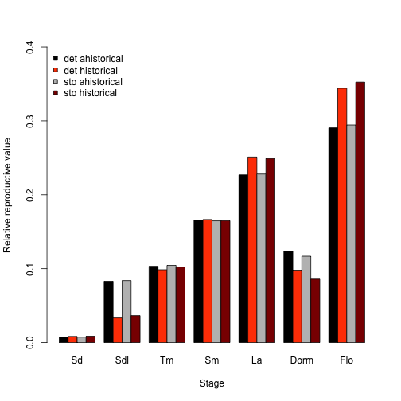

  <p style="text-indent: 20px">In this vignette, we will use the `lathyrus` dataset to illustrate the estimation of **raw MPMs**, with the intention of producing matrices similar to those published in @ehrlen_dynamics_2000. These matrices will not be the same, as the dataset included in this package includes data for more individuals as well as an extra year of monitoring. It also includes differences in classification due to different assumptions regarding transitions to and from vegetative dormancy, which is an unobservable life history stage in which herbaceous perennial plants spend the growing season belowground, without aboveground structures. To reduce output size, we have prevented some statements from running if they produce long stretches of output. Examples include most `summary()` calls. In these cases, we include hashtagged versions of these calls, and our text assumes that the user runs these statements without hashtags. We have also written this vignette using the default Ehrlén format as the output format for all historical MPMs. All examples work with deVries format as well. This vignette is only a sample analysis. Detailed information and instructions on using `lefko3` are available through a free online e-book called *lefko3: a gentle introduction*, available on <a href = "http://www.sheffersonlab.com/projects">the projects page</a> of the Shefferson lab website. This website also includes links to long-format vignettes and other demonstrations of this package.</p>
  
### ORGANISM AND POPULATION 
  
  <p style="text-indent: 20px">*Lathyrus vernus* (family Fabaceae) is a long-lived forest herb, native to Europe and large parts of northern Asia. Individuals increase slowly in size and usually flower only after 10-15 years of vegetative growth. Flowering individuals have an average conditional lifespan of 44.3 years [@ehrlen_how_2002]. *L. vernus* lacks organs for vegetative spread and individuals are well delimited [@ehrlen_assessing_2002]. One or several erect shoots of up to 40 cm height emerge from a subterranean rhizome in March and April. Flowering occurs about four weeks after shoot emergence. Shoot growth is determinate, and the number of flowers is determined in the previous year [@ehrlen_storage_2001]. Individuals do not necessarily produce aboveground structures every year, and instead can remain vegetatively dormant in one or more seasons. *L. vernus* is self-compatible but requires visits from bumble-bees to produce seeds. Individuals produce few, large seeds and establishment from seeds is relatively frequent [@ehrlen_seedling_1996]. The pre-dispersal seed predator *Bruchus atomarius* often consumes a large fraction of developing seeds, and roe deer (*Capreolus capreolus*) sometimes consume the shoots [@ehrlen_timing_2009].</p>
  
  <p style="text-indent: 20px">Data for this study were collected from six permanent plots in a population of *L. vernus* located in a deciduous forest in the Tullgarn area, SE Sweden (58.9496 N, 17.6097 E), from 1988 to 1991 [@ehrlen_demography_1995]. The six plots were relatively similar with regard to soil type, elevation, slope, and canopy cover. Within each plot, all individuals were marked with numbered tags that remained over the study period, and their locations were carefully mapped. New individuals were included in the study in each year. Individuals were recorded at least three times every growing season. At the time of shoot emergence, we recorded whether individuals were alive and produced above-ground shoots, and if shoots had been grazed. During flowering, we recorded flower number and the height and diameter of all shoots. At fruit maturation, we counted the number of intact and damaged seeds. To derive a measure of aboveground size for each individual, we calculated the volume of each shoot as $\pi × (\frac{1}{2} diameter)^2 × height$, and summed the volumes of all shoots. This measure is strongly correlated with the dry mass of aboveground tissues ($R^2 = 0.924$, $P < 0.001$, $n = 50$, log-transformed values; Ehrlén 1995). Size of individuals that had been grazed was estimated based on measures of shoot diameter in grazed shoots, and the relationship between shoot diameter and shoot height in non-grazed individuals. Only individuals with an aboveground volume of more than 230 mm^3^ flowered and produced fruits during this study. Individuals that lacked aboveground structures in one season but reappeared in the following year were considered dormant. Individuals that lacked aboveground structures in two subsequent seasons were considered dead from the year in which they first lacked aboveground structures. Probabilities of seeds surviving to the next year, and of being present as seedlings or seeds in the soil seed bank, were derived from separate yearly sowing experiments in separate plots adjacent to each subplot [@ehrlen_seedling_1996].</p>
  
### BASIC WORKFLOW  
  
  <p style="text-indent: 20px">The dataset that we have provided is organized in horizontal format, meaning that rows correspond to unique individuals and columns correspond to individual condition in particular observation occasions (which we also refer to as *years* here). The original spreadsheet file used to keep the dataset has a repeating pattern to these columns, with each year having a similarly arranged group of variables. Let's take a look at this dataset. First, we clear memory and load it. We will then look at its dimensions and its summary.</p>

```r
rm(list=ls(all=TRUE))
library(lefko3)

data(lathyrus)
dim(lathyrus)
#> [1] 1119   38
#summary(lathyrus)
```

  <p style="text-indent: 20px">This dataset includes information on 1,119 individuals arranged horizontally, so there are 1,119 rows with data. There are 38 columns. The first two columns are variables giving identifying information about each individual. This is followed by four sets of nine columns, each named `VolumeXX`, `lnVolXX`, `FCODEXX`, `FlowXX`, `IntactseedXX`, `Dead19XX`, `DormantXX`, `Missing19XX`, and `SeedlingXX`, where `XX` corresponds to the year of observation and with years organized consecutively. Thus, columns 3-11 refer to year 1988, columns 12-20 refer to year 1989, etc. This strictly repeated pattern allows us to manipulate the original dataset quickly and efficiently via `lefko3`. We should note the number of years, which is 4 here (includes all years from and including 1988 to 1991). Ideally, we should also have arranged the columns in the same order for each year, with years in consecutive order with no extra columns between them. This order is not required, provided that we are willing to input all variable names in the correct order when transforming the dataset later.</p>
  
#### Step 1. Life history model development
  
  <p style="text-indent: 20px">We will now create a **stageframe** describing the life history of the species and linking it to the data. A stageframe is a data frame that describes all stages in the life history of the organism, in a way usable by the functions in this package and using stage names and classifications that completely match those used in the dataset. It links the dataset to the *life cycle graph* used to model the organism's life history. It should include complete descriptions of all stages that occur in the dataset, with each stage defined uniquely. Since this object can be used for automated classification of individuals, all sizes, reproductive states, and other characteristics defining each stage in the dataset need to be accounted for explicitly. The final description of each stage occurring in the dataset must not completely overlap with any other stage also found in the dataset, although partial overlap is allowed and expected.</p>
  
  <p style="text-indent: 20px">Here, we create a stageframe named `lathframe` based on the classification used in @ehrlen_dynamics_2000. We build this by creating vectors of the characteristics describing each stage, with each element always in the same order within the vector. Of particular note are the vectors input as `sizes` and `binhalfwidth` in the `sf_create()` function. The values in the former vector correspond to the midpoint values of each size class bin, while values in the latter vector correspond to one-half of the width of the bin. If size values are not to be binned, then narrow half bin-widths can be used (the default is 0.5, and all entries must be positive). For example, in this dataset, vegetatively dormant individuals necessarily have a size of zero, and so we can set the `halfbinwidth` for this stage to 0.5 provided that the resulting size bin does not overlap with any other size bin matching the other characteristics of vegetative dormancy. Here we use a single size variable, but up to three size variables may be used concurrently. Additionally, `stagenames` must include unique names only. The vectors `repstatus`, `obsstatus`, `matstatus`, `immstatus`, `propstatus`, and `indataset` are binomial vectors referring to status as a reproductive stage, status as an observed stage, status as a mature stage, status as an immature stage, status as a propagule stage, and status as a stage occurring within the user-supplied dataset, respectively. The combination of these characteristics must be completely unique for each stage. The final vector, called `comments`, is a vector of text stage descriptions useful in later interpretation.</p>

```r
sizevector <- c(0, 100, 13, 127, 3730, 3800, 0)
stagevector <- c("Sd", "Sdl", "Tm", "Sm", "La", "Flo", "Dorm")
repvector <- c(0, 0, 0, 0, 0, 1, 0)
obsvector <- c(0, 1, 1, 1, 1, 1, 0)
matvector <- c(0, 0, 1, 1, 1, 1, 1)
immvector <- c(1, 1, 0, 0, 0, 0, 0)
propvector <- c(1, 0, 0, 0, 0, 0, 0)
indataset <- c(0, 1, 1, 1, 1, 1, 1)
binvec <- c(0, 100, 11, 103, 3500, 3800, 0.5)
comments <- c("Dormant seed", "Seedling", "Tiny vegetative", "Small vegetative",
  "Large vegetative", "Flowering", "Vegetatively dormant")

lathframe <- sf_create(sizes = sizevector, stagenames = stagevector, 
  repstatus = repvector, obsstatus = obsvector, propstatus = propvector,
  immstatus = immvector, matstatus = matvector, indataset = indataset,
  binhalfwidth = binvec, comments = comments)
#lathframe
```
  
  <p style="text-indent: 20px">Care should be taken in assigning sizes to stages, particularly when stages occur with `size = 0`. In most cases, a size of zero will mean that the individual is alive but not observable, such as in the case of vegetative dormancy. However, a size of zero may have other meanings. For example, if the size metric used is a logarithm of the measured size, then observable sizes of zero and lower may be possible. These situations may impact matrix construction and analysis, particularly when dealing with function-based MPMs, such as IPMs.</p>
  
#### Step 2a. Data standardization 
  
  <p style="text-indent: 20px">Next, we will standardize the dataset into *vertical format*. Vertically formatted datasets are structured such that each row corresponds to the state of a single individual in two (if ahistorical) or three (if historical) consecutive monitoring occasions. The `verticalize3()` function handles this, creating a *historically formatted vertical dataset*, or *hfv dataset*. We can use one of two approaches for this task, both using this function. In the most general case, we may input all column names from the original dataset in each input option in the same order (corresponding to monitoring occasion). This allows any format of dataset to be used. However, an easier approach may be used in datasets with strictly repeating sets of columns. In this case, most of the inputs to this function's options constitute the names of the first variables coding for particular states. For example, `Seedling1988` is the first variable in the dataset coding for status as a juvenile, `Volume88` is the first variable coding for the main size metric, and `Intactseed88` is the first variable coding for fecundity. The dataset includes a repeating pattern of such variables organized as blocks of nine variables for each year (noted as `blocksize`). There are four monitoring occasions (noted as `noyears`). We also have a repeated censor variable, the first of which is `Missing1988`, and we note here that we wish to censor the data and to keep data points with `NA` values in the censor term. The `patchidcol` and `individcol` terms are variables denoting which patch/subpopulation and individual each row of data belongs to, respectively. The setting `NAas0 = TRUE` tells R that missing values in size and fecundity should be interpreted as zeros, which allows us to infer incidents of vegetative dormancy as cases where size is equal to zero. Finally, `stageassign` ties the dataset to the correct stageframe.</p>

```r
lathvert <- verticalize3(lathyrus, noyears = 4, firstyear = 1988, 
  patchidcol = "SUBPLOT", individcol = "GENET", blocksize = 9, 
  juvcol = "Seedling1988", sizeacol = "Volume88", repstracol = "FCODE88", 
  fecacol = "Intactseed88", deadacol = "Dead1988", nonobsacol = "Dormant1988", 
  stageassign = lathframe, stagesize = "sizea", censorcol = "Missing1988", 
  censorkeep = NA, censor = TRUE, NAas0 = TRUE)
#> hfv dataset has been censored using a non-repeating censor variable.
#>       Please check the resulting dataset with the summary_hfv() function to make
#>       sure that not too much has been removed from the original dataset.
summary_hfv(lathvert, full = FALSE)
#> 
#> This hfv dataset contains 2552 rows, 42 variables, 1 population, 6 patches, 276 individuals, and 3 time steps.
```
  
  <p style="text-indent: 20px">The `verticalize3()` function includes error-checking measures designed to find instances where individual characteristics do not match those assigned to stages in the associated stageframe. In those instances, warning messages will be displayed and the instances will be marked `NoMatch` in `stage1`, `stage2`, or `stage3`. The `summary_hfv()` function allows us to quickly summarize the main characteristics of our resulting hfv dataset, and we could see a longer summary by removing `full = FALSE`.</p>
  
  <p style="text-indent: 20px">It pays to explore the dataset thoroughly, and summaries can help to do that. Our summary reveals that the `verticalize3()` function has automatically subset the data to only those instances in which the individual is alive in occasion *t* (please look at the variable `alive2`). Knowing this can help us interpret other variables. For example, the mean value for `alive3` suggests very high survival to occasion *t*+1 (91.4%; to see this, remove `full = FALSE` from the `summary_hfv()` call). Further, the minimum values for all size variables are zero, suggesting that unobservable stages occur within the dataset (these are instances of vegetative dormancy).</p>
  
  <p style="text-indent: 20px">The resulting reorganization has dramatically changed the dimensions of the dataset, which started with 1119 rows and 38 variables, and now has 2552 rows and 42 variables.</p>
  
  <p style="text-indent: 20px">Subset summaries may shed more light on these data. For example, after subsetting to only cases in which individuals are vegetatively dormant in occasion *t* and narrowing the summary to only variables corresponding to occasion *t* (columns 22 to 33), we see that this particular stage is associated exclusively with a size of zero. We can also see from the dimensions of this subset that vegetative dormancy occurs often in this dataset.</p>

```r
summary(lathvert[which(lathvert$stage2 == "Dorm"),c(22:27)])
#>     repstra2     feca2     juvgiven2   obsstatus2   repstatus2   fecstatus2
#>  Min.   :0   Min.   :0   Min.   :0   Min.   :0    Min.   :0    Min.   :0   
#>  1st Qu.:0   1st Qu.:0   1st Qu.:0   1st Qu.:0    1st Qu.:0    1st Qu.:0   
#>  Median :0   Median :0   Median :0   Median :0    Median :0    Median :0   
#>  Mean   :0   Mean   :0   Mean   :0   Mean   :0    Mean   :0    Mean   :0   
#>  3rd Qu.:0   3rd Qu.:0   3rd Qu.:0   3rd Qu.:0    3rd Qu.:0    3rd Qu.:0   
#>  Max.   :0   Max.   :0   Max.   :0   Max.   :0    Max.   :0    Max.   :0
summary(lathvert[which(lathvert$stage2 == "Dorm"),c(28:33)])
#>    matstatus2     alive2     stage2           stage2index     sizea3           repstra3     
#>  Min.   :1    Min.   :1   Length:138         Min.   :7    Min.   :   0.00   Min.   :0.0000  
#>  1st Qu.:1    1st Qu.:1   Class :character   1st Qu.:7    1st Qu.:  16.02   1st Qu.:0.0000  
#>  Median :1    Median :1   Mode  :character   Median :7    Median :  88.45   Median :0.0000  
#>  Mean   :1    Mean   :1                      Mean   :7    Mean   : 242.33   Mean   :0.0942  
#>  3rd Qu.:1    3rd Qu.:1                      3rd Qu.:7    3rd Qu.: 300.90   3rd Qu.:0.0000  
#>  Max.   :1    Max.   :1                      Max.   :7    Max.   :2637.60   Max.   :1.0000
writeLines("\nDimensions of data subset corresponding to dormant individuals in occasion t: ")
#> 
#> Dimensions of data subset corresponding to dormant individuals in occasion t:
dim(lathvert[which(lathvert$stage2 == "Dorm"),])
#> [1] 138  42
```
  
  <p style="text-indent: 20px">The `verticalize3()` function has made stage assignments for all individuals at each time. This can be seen in the subset summary in the `stage2index` column, which shows all individuals that are alive and have a size of 0 in occasion *t* to be in the seventh stage. Type `lathframe` and enter at the prompt to check that the seventh stage in the stageframe is really vegetative dormancy.</p>
  
  <p style="text-indent: 20px">A further subset summary can teach us how reproduction is handled here. The reproductive status of flowering adults is set as reproductive in `lathframe`, and a subset summary of just those individuals flowering in occasion *t* shows all of those individuals set to reproductive (see the distribution of values for `repstatus2` in the output below). However, fecundity ranges from 0 to over 60 (see `feca2`, which codes for fecundity in occasion *t*), meaning that some flowering adults do not actually produce any offspring. In fact, only 44.3% of flowering plants produced seed in occasion *t*. This has happened because our reproductive status variable, `FCODE88`, notes whether these individuals flowered but not whether they produced seed. Since this plant must be pollinated by an insect vector, some flowers should yield no seed. This issue does not cause problems in the creation of raw matrices, but it might cause difficulties in the creation of function-based matrices under some conditions. It helps to consider whether the definitions used for stages are appropriate, and so whether reproductive status must necessarily be associated with *successful* reproduction or merely the attempt. Here, we associate it with the latter, but in other vignettes we will reconsider this assumption.</p>

```r
summary(lathvert[which(lathvert$stage2 == "Flo"),c(22:27)])
#>     repstra2     feca2          juvgiven2   obsstatus2   repstatus2   fecstatus2    
#>  Min.   :1   Min.   : 0.000   Min.   :0   Min.   :1    Min.   :1    Min.   :0.0000  
#>  1st Qu.:1   1st Qu.: 0.000   1st Qu.:0   1st Qu.:1    1st Qu.:1    1st Qu.:0.0000  
#>  Median :1   Median : 0.000   Median :0   Median :1    Median :1    Median :0.0000  
#>  Mean   :1   Mean   : 4.807   Mean   :0   Mean   :1    Mean   :1    Mean   :0.4426  
#>  3rd Qu.:1   3rd Qu.: 6.000   3rd Qu.:0   3rd Qu.:1    3rd Qu.:1    3rd Qu.:1.0000  
#>  Max.   :1   Max.   :66.000   Max.   :0   Max.   :1    Max.   :1    Max.   :1.0000
summary(lathvert[which(lathvert$stage2 == "Flo"),c(28:33)])
#>    matstatus2     alive2     stage2           stage2index     sizea3          repstra3     
#>  Min.   :1    Min.   :1   Length:601         Min.   :6    Min.   :   0.0   Min.   :0.0000  
#>  1st Qu.:1    1st Qu.:1   Class :character   1st Qu.:6    1st Qu.: 308.0   1st Qu.:0.0000  
#>  Median :1    Median :1   Mode  :character   Median :6    Median : 795.8   Median :1.0000  
#>  Mean   :1    Mean   :1                      Mean   :6    Mean   : 959.8   Mean   :0.5591  
#>  3rd Qu.:1    3rd Qu.:1                      3rd Qu.:6    3rd Qu.:1326.8   3rd Qu.:1.0000  
#>  Max.   :1    Max.   :1                      Max.   :6    Max.   :6539.4   Max.   :1.0000
```
  
#### Step 2b. Provide supplemental information for matrix estimation  
  
  <p style="text-indent: 20px">Now we will create **supplement tables**, which provide external data for matrix estimation not included in the main demographic dataset. Specifically, we will provide the seed dormancy probability and germination rate, which are given as transitions from the dormant seed stage to another year of seed dormancy or to the germinated seedling stage, respectively. We assume that the germination rate is the same regardless of whether the seed was produced in the previous year or has been in the seedbank for longer. We will incorporate both terms as constants for specific transitions within our matrices, and as constant multipliers for fecundity, since fecundity will be estimated as the product of seed produced and either the seed germination rate or the seed dormancy/survival rate.</p>

```r
lathsupp2 <- supplemental(stage3 = c("Sd", "Sdl", "Sd", "Sdl"), 
  stage2 = c("Sd", "Sd", "rep", "rep"),
  givenrate = c(0.345, 0.054, NA, NA),
  multiplier = c(NA, NA, 0.345, 0.054),
  type = c(1, 1, 3, 3), stageframe = lathframe, historical = FALSE)
#lathsupp2
```
  
  <p style="text-indent: 20px">The supplement table above will only work with ahistorical MPMs, while the next supplement table will work for historical MPMs. The primary difference is the incorporation of stage in time *t*-1. Going back a further step to look at time *t*-1 shows us that there are two ways that a dormant seed in time *t* can be a dormant seed in time *t*+1 - it could have been a dormant seed in time *t*-1, or it could have been produced by a flowering adult in time *t*-1. Likewise, a seed in occasion *t* could have become a seedling in occasion *t*+1 after being produced by a flowering adult in occasion *t*-1, or remaining in the seed bank in occasion *t*-1. So, we will enter four given transitions in the historical case, rather than two transitions as in the ahistorical case. We will also designate that transitions from seed in occasion *t*-1 and seedling in occasion *t* to mature stages in occasion *t*+1 should originate from the `NotAlive` stage in occasion *t*-1, because the seed stage does not actually occur in the dataset and so function `rlefko3()` will not estimate these transitions without knowing the appropriate proxy set.</p>

```r
lathsupp3 <- supplemental(stage3 = c("Sd", "Sd", "Sdl", "Sdl", "Sd", "Sdl", "mat"),
  stage2 = c("Sd", "Sd", "Sd", "Sd", "rep", "rep", "Sdl"),
  stage1 = c("Sd", "rep", "Sd", "rep", "npr", "npr", "Sd"),
  eststage3 = c(NA, NA, NA, NA, NA, NA, "mat"),
  eststage2 = c(NA, NA, NA, NA, NA, NA, "Sdl"),
  eststage1 = c(NA, NA, NA, NA, NA, NA, "NotAlive"),
  givenrate = c(0.345, 0.345, 0.054, 0.054, NA, NA, NA),
  multiplier = c(NA, NA, NA, NA, 0.345, 0.054, NA),
  type = c(1, 1, 1, 1, 3, 3, 1), type_t12 = c(1, 2, 1, 2, 1, 1, 1),
  stageframe = lathframe, historical = TRUE)
#lathsupp3
```
  
  <p style="text-indent: 20px">These two supplement tables show us that we have survival-transition probabilities (`type = 1`, whereas fecundity rates would be given as `type = 2`) and fecundity multipliers (`type = 3`), that the second and fourth transitions involve reproduction from occasion *t*-1 to occasion *t* while the others involve survival (`type_t12 = 1` for survival between occasions *t*-1 and *t*, and `type_t12 = 2` for fecundity), that the given transitions originate from the dormant seed stage (`Sd`) in occasion *t* (and seeds or reproductive stages in occasion *t*-1 in the historical case), and the specific values to be used in overwriting and to multiply fecundity values by: `0.345` and `0.054`. If we wished, we could have used the values of transitions to be estimated within this matrix as proxies for these values, in which case we would enter the stages corresponding to the correct transitions in the `eststageX` columns, and the `givenrate` column would be blank. This is precisely what we did for one set of transitions - namely transitions from the seedling class to mature stages. Finally, we have also included fecundity multipliers for newly produced seed in the bottom two rows.</p>
  
  <p style="text-indent: 20px">These supplement tables provide the best means of adding external data to our MPMs because they allow both specific transitions to be isolated, and because they allow the use of shorthand to identify large groups of transitions (e.g. using `mat`, `immat`, `rep`, `nrep`, `prop`, `npr`, `groupX`, or `all` to signify all mature stages, immature stages, reproductive stages, non-reproductive stages, propagule stages, non-propagule stages, stages within group `X`, or simply all stages, respectively). They also allow more powerful changes to MPMs, such as block reset of groups of transitions to zero or other constants.</p>
  
#### Step 3. Tests of history 
  
  <p style="text-indent: 20px">We have chosen to build both ahistorical and historical MPMs in this vignette. However, in a typical analysis, it is most parsimonious to test whether history influences the demography of the population significantly first, and only use historical MPMs if the test supports the hypothesis that it does. A number of methods exist to conduct these tests, and we recommend @brownie_capture-recapture_1993, @pradel_proposal_2003, @pradel_multievent_2005, and @cole_does_2014 for good discussions and tools to help with this.</p>
  
  <p style="text-indent: 20px">In `lefko3`, we provide a function that can be used to test for the effects of history directly from the historical vertical dataset: `modelsearch()`. Function `modelsearch()` estimates best-fit linear models of the key vital rates used to propagate elements in function-based MPMs. There are up to 14 different vital rates possible to test, of which seven are adult vital rates and seven are juvenile vital rates. The standard vital rates that we may wish to test are survival (marked as `surv` in `vitalrates`), primary size (`size`), and fecundity (`fec`), which are the default vital rates assumed by the function. Here, we also test observation status (`obs`), which can serve as a proxy for sprouting probability in cases where plants do not necessarily sprout, and reproductive status (`repst`), which assesses the probability of reproduction in cases where reproduction is not certain. This dataset also includes juveniles whose vital rates we wish to estimate. We designate this by setting `juvestimate` to the correct juvenile stage in the dataset. Because size varies in juveniles, we set `juvsize = TRUE` (this setting defaults to `FALSE`, in which case size is not tested in juvenile vital rate models). To test history with function `modelsearch`: 1) use the historical vertical dataset as input, 2) set `historical = TRUE`, 3) input the relevant vital rates to estimate, 4) set the suite of independent factors to test (size and reproductive status in occasions *t* and *t*-1 and all interactions, or some subset thereof), 5) set the name of the juvenile stage (if juvenile vital rates are to be estimated and such stages occur in the dataset), 6) set the proper distributions to use for size and fecundity, and 7) note which variables code for individual identity (used to treat identity as a random factor in mixed linear models), patch identity (if multiple patches occur in the dataset and vital rates should be estimated with patch as a factor), and observation occasion. We also set `quiet = TRUE` to limit the amount of text output while the function runs.</p>

```r
histtest <- modelsearch(lathvert, historical = TRUE, suite = "size",
  vitalrates = c("surv", "obs", "size", "repst", "fec"), juvestimate = "Sdl", 
  sizedist = "gaussian", fecdist = "gaussian", indiv = "individ", 
  year = "year2", juvsize = TRUE, quiet = TRUE)
#summary(histtest)
```
  
  <p style="text-indent: 20px">The summary generated is quite long, and likely resulted in a series of warnings from the model-building functions utilized. For our purposes, we need only look at elements corresponding to the best-fit models for our tested vital rates, which are the elements marked `survival_model`, `observation_model`, `size_model`, `repstatus_model`, `fecundity_model`, `juv_survival_model`, `juv_observation _model`, `juv_size_model`, `juv_reproduction_model`, and `juv_maturity_model`. The line beginning `Formula:` in each of these sections shows the best-fit model, in standard R formula notation (i.e. $y = ax + b$ is given as `y ~ x`). The independent terms tested include variables coding for size in occasions *t* and *t*-1, given as `sizea2` and `sizea1`, respectively. Since several vital rates show `sizea1` as a term in the best-fit models, most notably for adult survival, primary size, and reproduction probability, we see that individual history has a significant impact on the demography of this population. The quality control information in element `qc` is also of interest, showing that some of our models are quite strong, with accuracy of 0.936 for adult survival and 0.986 for juvenile observation, while others are less accurate, notably fecundity and juvenile size.</p>
  
#### Step 4. MPM estimation 
  
  <p style="text-indent: 20px">Now let's create some raw Lefkovitch MPMs based on @ehrlen_dynamics_2000. We have seen that history should be included in these analyses, which justifies creating only historical matrices. However, to introduce these functions in greater depth and detail, we will first create ahistorical MPMs. The functions we will use to build these MPMs include `rlefko2()` for raw ahistorical MPMs, and `rlefko3()` for raw historical MPMs.</p>
  
  <p style="text-indent: 20px">@ehrlen_dynamics_2000 shows a mean matrix covering years 1989 and 1990 as occasion *t*. We will utilize the entire dataset instead, covering 1988 to 1991, as follows. Note that we will not create matrices for subpopulations in this case (to include them, add the options `patch = "all", patchcol = "patchid"` to the input below).</p>

```r
ehrlen2 <- rlefko2(data = lathvert, stageframe = lathframe, year = "all", 
  stages = c("stage3", "stage2"), supplement = lathsupp2, yearcol = "year2",
  indivcol = "individ")
#ehrlen2
```
  
  <p style="text-indent: 20px">The output from this analysis is a `lefkoMat` object, which is an S3 object (list) with the following elements:</p>
  
  **A**: a list of full population projection matrices, in order of population, patch, and year (order given in `labels`)
  
  **U**: a list of matrices where non-zero entries are limited to survival-transition elements, in the same order as `A`
  
  **F**: a list of matrices where non-zero entries are limited to fecundity elements, in the same order as `A`
  
  **hstages**: a data frame showing the order of paired stages (given if matrices are historical; otherwise `NA`)
  
  **agestages**: a data frame showing the order of age-stage pairs (given if matrices are age-by-stage ahistorical; otherwise `NA`)
  
  **ahstages**: the stageframe used in analysis, with stages potentially reordered and edited as they occur in the matrix
  
  **labels**: a table showing the order of matrices by population, patch, and year
  
  **matrixqc**: a short vector used in `summary` statements to describe the overall quality of each matrix (used in `summary()` calls)
  
  **dataqc**: a short vector used in `summary` statements to describe key sampling aspects of the dataset (used in `summary()` calls)
  
  <p style="text-indent: 20px">Input options for function `rlefko2()` include `year = "all"`, which can be changed to `year = c(1989, 1990)` to focus just on years 1989 and 1990, as in @ehrlen_dynamics_2000, or `year = 1989` to focus exclusively on the transition from 1989 to 1990 (the year entered is the year in occasion *t*). Matrix-estimating functions in `lefko3` have a default behavior of creating matrices for each year in the dataset except the final year, rather than lumping all years together to produce a single matrix. However, patches or subpopulations will only be separated if a patch ID variable is provided as input.</p>
  
  <p style="text-indent: 20px">We can understand `lefkoMat` objects in greater detail through the `summary()` function.</p>

```r
#summary(ehrlen2)
```
  
  <p style="text-indent: 20px">We start off learning that three full `A` matrices and their `U` and `F` decompositions were estimated, and that they are ahistorical. This is expected given that there are four consecutive years of data, yielding three time steps, and an ahistorical matrix requires two consecutive years to estimate transitions. The following line notes the dimensions of those matrices. The third, fourth, fifth, and sixth lines of the summary show how many survival transition and fecundity elements were actually estimated, both overall and per matrix, the number of populations, patches, and time steps covered by the MPM, and the number of individuals and transitions the matrices are based on (these last numbers can be used to understand matrix quality). Finally, the last section shows us summaries of the column sums from the survival-transition (`U`) matrices in this `lefkoMat` object. These column sums correspond to the survival probabilities of the different life stages, and so the summaries must show numbers ranging from 0.0 to 1.0. Additional error-checking can be conducted by checking specific elements within each matrix to see if they match expectation.</p>
  
  <p style="text-indent: 20px">One rather important point to bear in mind about matrix estimating functions in `lefko3` is that they sort the stages provided in the stageframe according to a standardized rubric, and so the order of stages in the `ahstages` element of a `lefkoMat` object may differ from the original input. Particularly, they sort propagules first, followed by immature stages, followed by non-reproductive adult stages, followed by reproductive adult stages. Let's see the order in our matrices. We see that the key difference from the original input is that the order of the flowering stage and the vegetative dormancy stage have been flipped.</p>

```r
#ehrlen2$ahstages
```
  
  <p style="text-indent: 20px">Now we'll estimate historical matrices. Because of the size of these matrices, we will only show the `lefkoMat` summary. Note that we will only create Ehrlén-format matrices - users wishing to create deVries-format hMPMs should add `format = "deVries"` to the input options (the resulting matrices will be bigger, but contain the same number of estimated elements).</p>

```r
ehrlen3 <- rlefko3(data = lathvert, stageframe = lathframe, year = "all", 
  stages = c("stage3", "stage2", "stage1"), supplement = lathsupp3,
  yearcol = "year2", indivcol = "individ")
#summary(ehrlen3)
```
  
  <p style="text-indent: 20px">The summary output shows several differences from the ahistorical case. First, there is one less matrix estimated in the historical case than in the ahistorical case, because raw historical matrices require three consecutive occasions to estimate each transition instead of two. Second, these matrices are larger than ahistorical matrices, with the numbers of rows and columns generally equaling the number of ahistorical rows and columns squared (although deVries-format increases the dimensions through the addition of a prior stage for newborns, and in both Ehrlén and deVries formats the numbers of rows and columns may be reduced under some circumstances as shown in the next block). Finally, a much greater proportion of each matrix is composed of zeros in the historical case than in the ahistorical case, although there are certainly more non-zero elements as well. This sparseness results from historical matrices being composed primarily of structural zeros. As a result, the historical matrices in this example have non-zero entries in (79 + 7) / 2401 = 3.6% of matrix elements, while the equivalent ahistorical matrices have non-zero entries in (24.667 + 2) / 49 = 54.45% of matrix elements.</p>
  
  <p style="text-indent: 20px">We can see the impact of structural zeros by eliminating some of them in the process of matrix estimation. This can be done by setting `reduce = TRUE`, which tells `rlefko3()` to eliminate stage pairs in which both column and row are zero vectors. Here, we now have matrices with 19 fewer rows and columns, and (79 + 7) / 900 = 9.6% of elements as potentially non-zero.</p>

```r
ehrlen3red <- rlefko3(data = lathvert, stageframe = lathframe, 
  year = c(1989, 1990), stages = c("stage3", "stage2", "stage1"), 
  supplement = lathsupp3, yearcol = "year2", indivcol = "individ",
  reduce = TRUE)
#summary(ehrlen3red)
```
  
  <p style="text-indent: 20px">Next we will create the element-wise mean ahistorical matrix.</p>

```r
ehrlen2mean <- lmean(ehrlen2)
#ehrlen2mean
```
  
  <p style="text-indent: 20px">Function `lmean()` creates a `lefkoMat` object retaining all descriptive information from the original `lefkoMat` object. The full output includes the composite mean matrix (shown in element `A`), as well as the mean survival-transition matrix (`U`) and the mean fecundity matrix (`F`), followed by a data frame outlining the definitions and order of historical paired stages (`hstages`, shown as `NA` in this case because the matrices are ahistorical), a data frame outlining the age-by-stage combinations used (`agestages`, shown as `NA` because these are not age-by-stage matrices), a data frame outlining the actual stages as outlined in the `stageframe` object used to create these matrices (`ahstages`), a data frame outlining the definitions and order of the matrices (`labels`), and two quality control vectors used in output for the `summary()` function (`matrixqc` and `dataqc`).</p>
  
  <p style="text-indent: 20px">Users will note in the output that we have a single mean matrix. The default for `lmean()` outputs both patch and population means. However, we did not separate patches in the dataset, so the patch mean is equal to the population mean.</p>
  
  <p style="text-indent: 20px">Now we will estimate the historical element-wise mean matrix. We will use the reduced matrix to simplify later analyses, and show only the top-left corner of the rather large matrix (a section comprised of the first twenty rows and eight columns of the 30 x 30 matrix).</p>

```r
ehrlen3mean <- lmean(ehrlen3red)
#print(ehrlen3mean$A[[1]][1:20,1:8], digits = 3)
```
  
  <p style="text-indent: 20px">The prevalence of zeros in this matrix is normal because most elements are structural zeros and so cannot equal anything else. This matrix is also a raw matrix, meaning that transitions that do not actually occur in the dataset cannot equal anything other than zero. To understand the dominance of structural zeros in the historical case, let's take a look at the `hstages` object associated with this mean matrix.</p>

```r
ehrlen3mean$hstages
#>    stage_id_2 stage_id_1 stage_2 stage_1
#> 1           1          1      Sd      Sd
#> 2           2          1     Sdl      Sd
#> 3           3          2      Tm     Sdl
#> 4           4          2      Sm     Sdl
#> 5           6          2    Dorm     Sdl
#> 6           3          3      Tm      Tm
#> 7           4          3      Sm      Tm
#> 8           5          3      La      Tm
#> 9           6          3    Dorm      Tm
#> 10          3          4      Tm      Sm
#> 11          4          4      Sm      Sm
#> 12          5          4      La      Sm
#> 13          6          4    Dorm      Sm
#> 14          7          4     Flo      Sm
#> 15          3          5      Tm      La
#> 16          4          5      Sm      La
#> 17          5          5      La      La
#> 18          6          5    Dorm      La
#> 19          7          5     Flo      La
#> 20          3          6      Tm    Dorm
#> 21          4          6      Sm    Dorm
#> 22          5          6      La    Dorm
#> 23          6          6    Dorm    Dorm
#> 24          7          6     Flo    Dorm
#> 25          1          7      Sd     Flo
#> 26          2          7     Sdl     Flo
#> 27          4          7      Sm     Flo
#> 28          5          7      La     Flo
#> 29          6          7    Dorm     Flo
#> 30          7          7     Flo     Flo
```
  
  <p style="text-indent: 20px">There are 30 pairs of life history stages, corresponding to the rows and columns of the historical matrices. The pairs are interpreted so that matrix columns represent stages in occasions *t*-1 and *t*, and the rows represent stages in occasions *t* and *t*+1. For an element in the matrix to contain a number other than zero, it must represent the same stage at occasion *t* in both the column stage pairs and the row stage pairs. For example, The element [1, 1] represents the transition probability from dormant seed at occasions *t*-1 and *t* (column pair), to dormant seed at occasions *t* and *t*+1 (row pair) - the occasion *t* stages match, and so this element is possible. However, element [1, 2] represents the transition probability from seedling in occasion *t*-1 and very small adult in occasion *t* (column pair), to dormant seed in occasion *t* and in occasion *t*+1 (row pair). Clearly [1, 2] is a structural zero because it is impossible for an individual to be both a dormant seed and a very small adult at the same time.</p>
  
  <p style="text-indent: 20px">Error-checking is more difficult with historical matrices because they are typically one or two orders of magnitude bigger than their ahistorical counterparts, but the same basic strategy can be used here as with ahistorical matrices. In these cases we can use `summary()` function to assess the key quality control characteristics of the mean hMPM, such as the distribution of survival probability estimates for historical stages.</p>

```r
#summary(ehrlen3mean)
```
  
  <p style="text-indent: 20px">Let's try another approach, looking at some conditional historical matrices. Conditional matrices are matrices showing transitions from stage at occasion *t* to occasion *t*+1, conditional on all individuals having been in the same stage in occasion *t*-1. They are calculated from historical MPMs, and the output below shows all conditional matrices developed from the first `A` matrix of `ehrlen3mean`. The first matrix, for example, shows all transitions involving individuals that had been in the dormant seed stage `Sd` in occasion *t*-1, while the last matrix shows transitions involving individuals that had been vegetatively dormant in occasion *t*-1.</p>

```r
ehrlen3condmn <- cond_hmpm(ehrlen3mean)
#ehrlen3condmn$Mcond[[1]]
```
  
  <p style="text-indent: 20px">Quick scans will show many transitions missing, because each stage has only certain stages that can transition from it, and to which it can transition. Further transitions are missing because the MPM is raw, and some transitions are not parameterized because no individuals made them.</p>
  
  <p style="text-indent: 20px">One last error-checking technique before we analyze our MPMs: matrix visualization plots. These plots provide a relatively easy way to understand the "spatial spread" of values throughout a matrix. Package `lefko3` includes function `image3()`, which provides an easy way to make these images. Let's start off by looking at the ahistorical mean matrix.</p>

```r
image3(ehrlen2mean, used = 1)
```


```
#> [[1]]
#> NULL
```
  
  <p style="text-indent: 20px">The resulting image shows non-zero elements as red spaces, and zero elements as white spaces. Rows and columns are numbered, and we can see that this matrix is reasonably dense.</p>
  
  <p style="text-indent: 20px">Now let's take a look at the mean historical matrix. The historical mean matrix has many more rows and columns, and has more of both zero and non-zero elements. However, it has become a sparse matrix, and it turns out that increasing the numbers of life stages will increase the sparsity of historical projection matrices.</p>

```r
image3(ehrlen3mean, used = 1)
```


```
#> [[1]]
#> NULL
```
  
#### Step 5. MPM analysis 
  
  <p style="text-indent: 20px">Package `lefko3` includes functions to conduct some analyses of population dynamics. We will start by estimating the asymptotic population growth rate ($\lambda$) and the stochastic population growth rate ($a = \text{log} \lambda _{S}$) from the ahistorical MPMs, including both the annual MPM and the mean. For the stochastic case, we will set the seed for R's random number generation to make our output reproducible. Note that each $\lambda$ estimate includes a data frame describing the matrices in order (given as the `labels` object within the output list). Here is the set of ahistorical annual $\lambda$ estimates, followed by $\lambda$ for the mean matrix, and the stochastic population growth rate ($a = \text{log} \lambda _{S}$).</p>

```r
writeLines("Deterministic ahistorical: ")
#> Deterministic ahistorical:
lambda3(ehrlen2)
#>   pop patch year2    lambda
#> 1   1     1  1988 0.8801910
#> 2   1     1  1989 0.9201885
#> 3   1     1  1990 1.0061563
writeLines("Deterministic mean ahistorical: ")
#> Deterministic mean ahistorical:
lambda3(ehrlen2mean)
#>   pop patch    lambda
#> 1   1     1 0.9491146
writeLines("Stochastic ahistorical: ")
#> Stochastic ahistorical:
set.seed(42)
slambda3(ehrlen2)
#>   pop patch           a        var       sd         se
#> 1   1     1 -0.05385279 0.03349303 0.183011 0.00183011
```
  
  <p style="text-indent: 20px">$\lambda$ for the mean ahistorical matrix may seem high relative to the annual matrices. However, elements in raw annual matrices may differ dramatically due to a lack of individuals transitioning through them in a particular year, which is a situation more likely to happen with smaller datasets and larger numbers of recognized stages. Since different elements within the matrix have different amounts of influence on the population growth rate itself, $\lambda$ may differ in ways difficult to predict without conducting a perturbation analysis.</p>
  
  <p style="text-indent: 20px">We will now look at the same numbers for the historical analyses. There are several differences in the output in addition to the lower growth rate estimates. First, because there are four years of data, there are three ahistorical transitions possible for estimation: year 1 to 2, year 2 to 3, and year 3 to 4. However, in the historical case, only two are possible: from years 1 and 2 to 3 (technically, from years 1 [*t*-1] and 2 [*t*] to years 2 [*t*] and 3 [*t*+1]), and from years 2 and 3 to 4 (technically, from years 2 [*t*-1] and 3 [*t*] to years 3 [*t*] and 4 [*t*+1]). Second, historical matrices cover more of the individual heterogeneity in a population by splitting ahistorical transitions by stage in occasion *t*-1. This heterogeneity may reflect the impacts of trade-offs operating across years [@shefferson_longitudinal_2010]. One particularly common trade-off is the cost of growth: an individual that grows a great deal in one time step due to great environmental conditions in that year might pay a large cost of survival, growth, or reproduction in the next if those environmental conditions deteriorate [@shefferson_life_2014; @shefferson_drivers_2018]. Alternatively, these patterns may reflect greater year-to-year variability in allocation to aboveground relative to belowground tissues, the latter of which includes this species' perennating structure. While we do not argue that the drop in $\lambda$ must be due to these issues, and it is certainly possible for historical matrix analysis to lead to higher $\lambda$ estimates, we do believe that these estimates of $\lambda$ and $a = \text{log} \lambda _{S}$ are likely to be more realistic than the higher estimates in the ahistorical case.</p>

```r
writeLines("Deterministic historical: ")
#> Deterministic historical:
lambda3(ehrlen3red)
#>   pop patch    lambda
#> 1   1     1 0.8863499
#> 2   1     1 0.9842366
writeLines("Deterministic mean historical: ")
#> Deterministic mean historical:
lambda3(ehrlen3mean)
#>   pop patch   lambda
#> 1   1     1 0.913948
writeLines("Stochastic historical: ")
#> Stochastic historical:
set.seed(42)
slambda3(ehrlen3red)
#>   pop patch           a       var        sd          se
#> 1   1     1 -0.09374021 0.0193428 0.1390784 0.001390784
```
  
  <p style="text-indent: 20px">We can also examine the stable stage distributions, as follows for the ahistorical case.</p>

```r
ehrlen2mss <- stablestage3(ehrlen2mean)
ehrlen2mss
#>   matrix stage_id stage    ss_prop
#> 1      1        1    Sd 0.29878730
#> 2      1        2   Sdl 0.04676671
#> 3      1        3    Tm 0.22350242
#> 4      1        4    Sm 0.18386817
#> 5      1        5    La 0.07717874
#> 6      1        6  Dorm 0.05581804
#> 7      1        7   Flo 0.11407862
```
  
  <p style="text-indent: 20px">The data frame output shows us the stages themselves (`stage`, and associated number in `stage_id`), which matrix they refer to (`matrix`), and the stable stage distribution (`ss_prop`). Interpreting these values, we find that the mean matrix suggests that, if we project the population forward indefinitely assuming the population dynamics are static and represented by this matrix, we will find that approximately 30% of individuals should be dormant seeds (suggesting a large seedbank). A further 22% and 18% should be very small and small adults, respectively, and 11% should be flowering adults. Almost 6% of the population should eventually be composed of vegetatively dormant adults.</p>
  
  <p style="text-indent: 20px">We can estimate the stable stage distribution for the historical case, as well. Because the historical output for the `stablestage3()` function is a list with two data frames, let's take a look at each of these data frames in turn. The first will be the stage-pair output.</p>

```r
ehrlen3mss <- stablestage3(ehrlen3mean)
#ehrlen3mss$hist
```
  
  <p style="text-indent: 20px">This data frame is structured in historical format, and so shows the stable stage distribution of stage pairs. We may wish to see which stage pair dominates, in which case we might look at the row with the maximum `ss_prop` value.</p>

```r
ehrlen3mss$hist[which(ehrlen3mss$hist$ss_prop == max(ehrlen3mss$hist$ss_prop)),]
#>   matrix stage_id_2 stage_id_1 stage_2 stage_1   ss_prop
#> 6      1          3          3      Tm      Tm 0.2262872
```
  
  <p style="text-indent: 20px">Here we see that about 23% of the population is expected to be composed of tiny adults maintaining themselves as tiny adults.</p>
  
  <p style="text-indent: 20px">The longer format of the historical stable stage output makes it harder to read. However, historical values can also be combined by stage at occasion *t* (`stage_2`) to estimate the **historically-corrected stable stage distribution** shown in the `ahist` element, which allows comparison to a stable stage distribution estimated from a purely ahistorical MPM. Notice below that the `ss_prop` column shows values that are a bit different from the ahistorical case, suggesting the influence of individual history, particularly showing that tiny adults are a larger share of the stage stage structure.</p>

```r
ehrlen3mss$ahist
#>   matrix stage_id stage    ss_prop
#> 1      1        1    Sd 0.27227761
#> 2      1        2   Sdl 0.04261736
#> 3      1        3    Tm 0.28031078
#> 4      1        4    Sm 0.19600432
#> 5      1        5    La 0.06685512
#> 6      1        6  Dorm 0.04835713
#> 7      1        7   Flo 0.09357768
```
  
  <p style="text-indent: 20px">To see the impact of history on the stable stage distribution, let's plot the ahistorical and historically-corrected stable stage distributions together. We will also include the stochastic long-run stage distribution in our output, which is estimated with the same function but using the `stochastic = TRUE` option. This will allow us to see the impact of random temporal variation. We will also set the random seed to make our output reproducible.</p>

```r
ehrlen2mss_s <- stablestage3(ehrlen2, stochastic = TRUE, seed = 42)
ehrlen3mss_s <- stablestage3(ehrlen3red, stochastic = TRUE, seed = 42)
ss_put_together <- cbind.data.frame(ehrlen2mss$ss_prop, ehrlen3mss$ahist$ss_prop,
  ehrlen2mss_s$ss_prop, ehrlen3mss_s$ahist$ss_prop)
names(ss_put_together) <- c("d_ahist", "d_hist", "s_ahist", "s_hist")
rownames(ss_put_together) <- ehrlen2mss$stage

barplot(t(ss_put_together), beside=T, ylab = "Proportion", xlab = "Stage",
  ylim = c(0, 0.35), col = c("black", "orangered", "grey", "darkred"), bty = "n")
legend("topright", c("det ahistorical", "det historical", "sto ahistorical", 
    "sto historical"), pch = 22, col = "black",
  pt.bg = c("black", "orangered", "grey", "darkred"), bty = "n")
```


  
  <p style="text-indent: 20px">Let's take the deterministic portion first. Accounting for individual history increased the prevalence of tiny and small adults, but decreased the prevalence of dormant seeds, and dormant, large, and flowering adults. Now when we also take in the impact of temporal stochasticity, we can see differences in the proportion of dormant seeds, seedlings, and all adult stages, with the greatest differences in dormant seeds and tiny adults.</p>
  
  <p style="text-indent: 20px">Let's take a look at the reproductive values now, in similar order to the stable stage distribution case. Initially, we will create all sets of reproductive value objects, and then we will plot them. The structure of these objects is the same as that of the stable stage structure outputs. Because the four vectors are all standardized such that the first non-zero reproductive value is set to 1.0, they are on different scales, and so we will make them comparable for plotting purposes by standardizing them relative to their respective maxima.</p>

```r
ehrlen2mrv <- repvalue3(ehrlen2mean)
ehrlen3mrv <- repvalue3(ehrlen3mean)
ehrlen2mrv_s <- repvalue3(ehrlen2, stochastic = TRUE, seed = 42)
ehrlen3mrv_s <- repvalue3(ehrlen3red, stochastic = TRUE, seed = 42)
rv_put_together <- cbind.data.frame((ehrlen2mrv$rep_value / max(ehrlen2mrv$rep_value)),
  (ehrlen3mrv$ahist$rep_value / max(ehrlen3mrv$ahist$rep_value)),
  (ehrlen2mrv_s$rep_value / max(ehrlen2mrv_s$rep_value)), 
  (ehrlen3mrv_s$ahist$rep_value / max(ehrlen3mrv_s$ahist$rep_value)))
names(rv_put_together) <- c("det ahist", "det hist", "sto ahist", "sto hist")
rownames(rv_put_together) <- ehrlen2mrv$stage

barplot(t(rv_put_together), beside=T, ylab = "Relative reproductive value",
  ylim = c(0, 1.2), xlab = "Stage", col = c("black", "orangered", "grey", "darkred"),
  bty = "n")
legend("topleft", c("det ahistorical", "det historical", "sto ahistorical", 
    "sto historical"), pch = 22, col = "black",
  pt.bg = c("black", "orangered", "grey", "darkred"), bty = "n")
```


  
  <p style="text-indent: 20px">Both deterministic and stochastic analyses show that flowering adults have the greatest reproductive value in both ahistorical and historical analysis, while dormant seeds have the least. However, the historical MPM suggests lower contributions of dormant seeds, seedlings, and vegetative dormancy.</p>
  
  <p style="text-indent: 20px">Next we will plot the reproductive values of paired stages from the historical MPM. Here is the deterministic case.</p>

```r
labels <- apply(as.matrix(ehrlen3mrv$hist[, c("stage_2", "stage_1")]), 1, function(X) {
  paste(X[1], X[2])
})
barplot(ehrlen3mrv$hist$rep_value, main = "Historical", xaxt = "n", 
  ylab = "Reproductive value", xlab = "Stage")
text(cex=0.5, y = -2.5, x = seq(from = 0,
  to = 1.19*length(ehrlen3mrv$hist$stage_2), by = 1.2), labels, xpd=TRUE, srt=45)
```


  
  <p style="text-indent: 20px">In the bar plot, the labels show the stages in the order of stage in occasion *t* followed by stage in occasion *t*-1. Examining these values reveals that the largest reproductive value is associated with flowering adults that were previously flowering, while the next largest reproductive value is associated with flowering adults that were previously small, and flowering adults that were previously very large. Interestingly, historical transitions to very large adult have lower reproductive value here than we might expect given the ahistorical analysis, in which they were predicted to have the second highest reproductive value.</p>
  
  <p style="text-indent: 20px">Now we will look at the deterministic sensitivities of $\lambda$ to the ahistorical mean matrix elements.</p>

```r
ehrlen2sens <- sensitivity3(ehrlen2mean)
print(ehrlen2sens$ah_sensmats[[1]], digits = 3)
#>        [,1]    [,2]   [,3]   [,4]    [,5]    [,6]    [,7]
#> [1,] 0.0184 0.00288 0.0137 0.0113 0.00475 0.00343 0.00701
#> [2,] 0.2055 0.03217 0.1537 0.1265 0.05309 0.03839 0.07847
#> [3,] 0.2566 0.04017 0.1920 0.1579 0.06629 0.04794 0.09798
#> [4,] 0.4243 0.06641 0.3174 0.2611 0.10960 0.07927 0.16200
#> [5,] 0.5808 0.09091 0.4345 0.3574 0.15003 0.10851 0.22177
#> [6,] 0.3191 0.04995 0.2387 0.1964 0.08243 0.05962 0.12184
#> [7,] 0.7510 0.11755 0.5618 0.4622 0.19400 0.14030 0.28675

writeLines(paste0("\nThe highest sensitivity value is: ",
  max(ehrlen2sens$ah_sensmats[[1]])))
#> 
#> The highest sensitivity value is: 0.751027236713977
writeLines(paste0("This occurs in element ",
  which(ehrlen2sens$ah_sensmats[[1]] == max(ehrlen2sens$ah_sensmats[[1]]))))
#> This occurs in element 7

writeLines(paste0("The highest sensitivity value among biologically plausible elements is: ",
  max(ehrlen2sens$ah_sensmats[[1]][which(ehrlen2mean$A[[1]] > 0)])))
#> The highest sensitivity value among biologically plausible elements is: 0.46216824824681
writeLines(paste0("This occurs in element ", which(ehrlen2sens$ah_sensmats[[1]] ==
    max(ehrlen2sens$ah_sensmats[[1]][which(ehrlen2mean$A[[1]] > 0)]))))
#> This occurs in element 28
```
  
  <p style="text-indent: 20px">The highest sensitivity value is associated with a biologically impossible transition - dormant seeds (stage/column 1) cannot transition to flowering (stage/row 7), but the highest sensitivity value is associated with that element. This is an unfortunate issue in sensitivity analysis, and requires great care to prevent sloppy inference. Within the biologically plausible elements, the highest sensitivity appears to be associated with element 28, which is the transition from small adult (stage/column 4) to flowering (stage/row 7).</p>
  
  <p style="text-indent: 20px">We will now look at the sensitivity of $\lambda$ to elements in the historical mean MPM.</p>

```r
ehrlen3sens <- sensitivity3(ehrlen3mean)
#ehrlen3sens
```
  
  <p style="text-indent: 20px">The first element produced in this analysis is `h_sensmats`, which is a list composed of sensitivity matrices of the historical matrices, in order (we have only one in our mean matrix \code{lefkoMat} object). These matrices are the same dimensions as the historical matrices used as input, and so can be quite huge. This is followed by `ah_sensmats`, which is a list composed of historically-corrected sensitivity matrices of corresponding ahistorical matrix elements (calculated using the historically-corrected stable stage distribution and reproductive value vector produced in `ehrlen3mss` and `ehrlen3mrv`, respectively). So, these are different than the sensitivities estimated from the ahistorical matrices themselves, but have the same dimensions. Next, `h_stages` and `ah_stages` give the order of paired stages and life history stages used in the historical and historically-corrected sensitivity matrices, respectively. Finally, we have the original `A`, `U`, and `F` matrices used as input.</p>
  
  <p style="text-indent: 20px">Our historical matrices are large and full of zeros. So, we will look for the highest sensitivity associated with a biologically plausible element (i.e. non-zero matrix elements). Then, we will assess the highest biologically plausible sensitivity in the historically-corrected sensitivity matrices, to compare against the ahistorical sensitivity analysis.</p>

```r
writeLines(paste0("The highest sensitivity value among biologically plausible elements: ",
  max(ehrlen3sens$h_sensmats[[1]][which(ehrlen3mean$A[[1]] > 0)])))
#> The highest sensitivity value among biologically plausible elements: 0.309610414708719
writeLines(paste0("This value is associated with element: ",
  which(ehrlen3sens$h_sensmats[[1]] ==
    max(ehrlen3sens$h_sensmats[[1]][which(ehrlen3mean$A[[1]] > 0)]))))
#> This value is associated with element: 314

writeLines(paste0("The highest historically-corrected sensitivity value among biologically
      plausible elements is: ", 
    max(ehrlen3sens$ah_sensmats[[1]][which(ehrlen2mean$A[[1]] > 0)])))
#> The highest historically-corrected sensitivity value among biologically
#>       plausible elements is: 0.599012352863096
writeLines(paste0("This occurs in element ", which(ehrlen3sens$ah_sensmats[[1]] ==
    max(ehrlen3sens$ah_sensmats[[1]][which(ehrlen2mean$A[[1]] > 0)]))))
#> This occurs in element 19
```
  
  <p style="text-indent: 20px">The maximum biologically plausible sensitivity value in the historical matrix appears to be element 314, which is associated with column 11 (small adult in occasions *t*-1 and *t*) and row 14 (small adult in occasion *t* to flowering adult in occasion *t*+1). This transition is from small adult in occasions *t*-1 and *t* to flowering adult in *t*+1. The historically-corrected sensitivity analysis finds that $\lambda$ is most sensitive to element 19, which is the transition from tiny adult to large adult. This is a little different from the ahistorical MPM, which suggested element 28 (small adult to flowering adult).</p>
  
  <p style="text-indent: 20px">Before moving on, let's repeat the above exercise with stochastic sensitivities. We will compare ahistorical vs. historical/historically-corrected analyses.</p>

```r
ehrlen2sens_s <- sensitivity3(ehrlen2, stochastic = TRUE)
ehrlen3sens_s <- sensitivity3(ehrlen3red, stochastic = TRUE)

writeLines(paste0("Highest stochastic sensitivity among biologically plausible
      elements (ahistorical): ", 
    max(ehrlen2sens_s$ah_sensmats[[1]][which(ehrlen2mean$A[[1]] > 0)])))
#> Highest stochastic sensitivity among biologically plausible
#>       elements (ahistorical): 0.50818027011384
writeLines(paste0("This value is associated with element: ", 
    which(ehrlen2sens_s$ah_sensmats[[1]] ==
    max(ehrlen2sens_s$ah_sensmats[[1]][which(ehrlen2mean$A[[1]] > 0)]))))
#> This value is associated with element: 28

writeLines(paste0("Highest stochastic sensitivity among biologically plausible
      elements (historical): ",
    max(ehrlen3sens_s$h_sensmats[[1]][which(ehrlen3red$A[[1]] > 0)])))
#> Highest stochastic sensitivity among biologically plausible
#>       elements (historical): 0.392984542682662
writeLines(paste0("This value is associated with element: ",
    which(ehrlen3sens_s$h_sensmats[[1]] ==
    max(ehrlen3sens_s$h_sensmats[[1]][which(ehrlen3red$A[[1]] > 0)]))))
#> This value is associated with element: 157

writeLines(paste0("Highest stochastic sensitivity among biologically plausible
      elements (historically-corrected): ",
    max(ehrlen3sens_s$ah_sensmats[[1]][which(ehrlen2mean$A[[1]] > 0)])))
#> Highest stochastic sensitivity among biologically plausible
#>       elements (historically-corrected): 0.778668143242822
writeLines(paste0("This value is associated with element: ",
    which(ehrlen3sens_s$ah_sensmats[[1]] ==
    max(ehrlen3sens_s$ah_sensmats[[1]][which(ehrlen2mean$A[[1]] > 0)]))))
#> This value is associated with element: 19
```
  
  <p style="text-indent: 20px">We find strong similarities in these baseline inferences between deterministic vs. stochastic analyses, with major disagreement coming primarily from differences between ahistorical vs. historical analyses. Element 157 in the historical case is associated with the transition from tiny adult in times *t*-1 and *t* to small adult in time *t*+1, and so this is another difference from the deterministic case.</p>
  
  <p style="text-indent: 20px">An complementary approach to sensitivity analysis is elasticity analysis. Elasticities are easier to interpret because zero elements produce zero elasticity values, thus eliminating biologically impossible transitions from consideration, and because they are scaled to sum to 1.0. This scaling makes elasticities of survival transitions easier to compare to those of fecundity. However, they are also interpreted differently, because while sensitivity analysis shows the impact of a tiny but *absolute* change to a matrix element on $\lambda$, elasticity analysis shows the impact of a tiny but *proportional* change to a matrix element on $\lambda$. In fact, both sensitivities and elasticities are essentially local slopes, and so are not unit free. It is therefore not unusual for sensitivity and elasticity analysis to yield different inferences (of course, the reality is that they answer different questions).</p>
  
  <p style="text-indent: 20px">Let's look at the elasticity of $\lambda$ to matrix elements in the ahistorical mean matrix.</p>

```r
ehrlen2elas <- elasticity3(ehrlen2mean)
print(ehrlen2elas$ah_elasmats, digits = 3)
#> [[1]]
#>         [,1]    [,2]     [,3]   [,4]     [,5]    [,6]   [,7]
#> [1,] 0.00668 0.00000 0.000000 0.0000 0.000000 0.00000 0.0117
#> [2,] 0.01169 0.00000 0.000000 0.0000 0.000000 0.00000 0.0205
#> [3,] 0.00000 0.02760 0.143899 0.0159 0.000499 0.00409 0.0000
#> [4,] 0.00000 0.00131 0.040093 0.1583 0.022065 0.02225 0.0171
#> [5,] 0.00000 0.00000 0.000587 0.0289 0.048624 0.01773 0.0542
#> [6,] 0.00000 0.00326 0.007377 0.0225 0.009070 0.00645 0.0110
#> [7,] 0.00000 0.00000 0.000000 0.0355 0.069775 0.00911 0.1723

writeLines(paste0("The maximum elasticity value: ",
    max(ehrlen2elas$ah_elasmats[[1]])))
#> The maximum elasticity value: 0.172331468681622
writeLines(paste0("This value is associated with element: ",
    which(ehrlen2elas$ah_elasmats[[1]] == max(ehrlen2elas$ah_elasmats[[1]]))))
#> This value is associated with element: 49
```
  
  <p style="text-indent: 20px">Elasticity analysis exhibits strong differences from sensitivity analysis. In particular, we find that $\lambda$ is most strongly elastic in response to changes in stasis transitions in flowering adults (stage 7). We can sum the columns of the elasticity matrix to see which stages $\lambda$ is most and least elastic in response to, as below.</p>

```r
print(colSums(ehrlen2elas$ah_elasmats[[1]]), digits = 3)
#> [1] 0.0184 0.0322 0.1920 0.2611 0.1500 0.0596 0.2867
```
  
  <p style="text-indent: 20px">Here we see that $\lambda$ is most strongly elastic in response to changes in transitions associated with flowering adults, followed by transitions involving small adults. Dormant seeds and seedlings have the smallest impact on $\lambda$, and the impacts of fecundity (shown in the top-right corner of the elasticity matrix) appear quite small.</p>
  
  <p style="text-indent: 20px">Now on to elasticity analysis of the historical MPMs. Once again, we will not output the matrices. Type `ehrlen3elas` at the prompt to see these matrices.</p>

```r
ehrlen3elas <- elasticity3(ehrlen3mean)

writeLines(paste0("The highest deterministic elasticity value: ",
    max(ehrlen3elas$h_elasmats[[1]])))
#> The highest deterministic elasticity value: 0.156574546847559
writeLines(paste0("This value is associated with element: ",
    which(ehrlen3elas$h_elasmats[[1]] == max(ehrlen3elas$h_elasmats[[1]]))))
#> This value is associated with element: 156
```
  
  <p style="text-indent: 20px">The highest elasticity appears to be associated with the element 156, which is at row 6, column 6. This corresponds to the stasis transition of tiny adults (very small in *t*-1 to very small in *t* to very small in *t*+1). So, accounting for history has changed our perspective on what contributes most to changes in $\lambda$.</p>
  
  <p style="text-indent: 20px">Elasticities are often treated as additive, making the calculation of historically-corrected elasticity matrices easy. These are stored in the `ah_elasmats` element of `elasticity3()` output originating from a historical MPM. Eyeballing this matrix, it appears that the historically-corrected elasticity matrix supports stasis in the tiny adult stage as the transition that $\lambda$ is most elastic to, with stasis as flowering adult a close second. This is a little different from the ahistorical case, which flipped the importance of these two.</p>

```r
print(ehrlen3elas$ah_elasmats, digits = 3)
#> [[1]]
#>         [,1]     [,2]    [,3]   [,4]     [,5]    [,6]    [,7]
#> [1,] 0.00719 0.000000 0.00000 0.0000 0.00e+00 0.00000 0.01186
#> [2,] 0.01186 0.000000 0.00000 0.0000 0.00e+00 0.00000 0.00000
#> [3,] 0.00000 0.011009 0.18282 0.0333 8.31e-05 0.00204 0.00000
#> [4,] 0.00000 0.000269 0.04308 0.1613 2.60e-02 0.02041 0.02900
#> [5,] 0.00000 0.000000 0.00000 0.0313 4.61e-02 0.00962 0.05586
#> [6,] 0.00000 0.000580 0.00331 0.0164 7.68e-03 0.00334 0.00929
#> [7,] 0.00000 0.000000 0.00000 0.0378 6.30e-02 0.00520 0.17036
```
  
  <p style="text-indent: 20px">The historical matrices we used as input are reduced, but the historically-corrected output is in the original dimensions corresponding to the number of stages listed in the stageframe. This makes it easy to compare against the actual ahistorical elasticity matrix, for example by subtracting one matrix from the other to see the differences. We can also subtract the column sums in this exercise to assess overall shifts in the importance of stages.</p>

```r
print((ehrlen3elas$ah_elasmats[[1]] - ehrlen2elas$ah_elasmats[[1]]), digits = 3)
#>          [,1]     [,2]      [,3]     [,4]      [,5]     [,6]      [,7]
#> [1,] 0.000513  0.00000  0.000000  0.00000  0.000000  0.00000  0.000166
#> [2,] 0.000166  0.00000  0.000000  0.00000  0.000000  0.00000 -0.020475
#> [3,] 0.000000 -0.01659  0.038921  0.01739 -0.000416 -0.00205  0.000000
#> [4,] 0.000000 -0.00105  0.002991  0.00295  0.003916 -0.00184  0.011946
#> [5,] 0.000000  0.00000 -0.000587  0.00237 -0.002504 -0.00810  0.001656
#> [6,] 0.000000 -0.00268 -0.004063 -0.00607 -0.001392 -0.00311 -0.001694
#> [7,] 0.000000  0.00000  0.000000  0.00228 -0.006771 -0.00391 -0.001974
writeLines("\nColumn sums of differences:")
#> 
#> Column sums of differences:
colSums((ehrlen3elas$ah_elasmats[[1]] - ehrlen2elas$ah_elasmats[[1]]))
#> [1]  0.0006786214 -0.0203095951  0.0372615723  0.0189219956 -0.0071663071 -0.0190107136 -0.0103755735
```
  
  <p style="text-indent: 20px">Accounting for history shows $\lambda$ to be less elastic in response to transitions from the seedling, vegetative dormancy, large adult, and flowering stages, but more elastic in response to changes in survival-transitions in tiny and small adults.</p>
  
  <p style="text-indent: 20px">Next, we will create a barplot of the elasticities of life history stages from ahistorical vs. historically-corrected analyses. We will also incorporate stochastic elasticity analysis here to assess the importance of temporal environmental stochasticity on population growth.</p>

```r
ehrlen2elas_s <- elasticity3(ehrlen2, stochastic = TRUE)
ehrlen3elas_s <- elasticity3(ehrlen3red, stochastic = TRUE)
elas_put_together <- cbind.data.frame(colSums(ehrlen2elas$ah_elasmats[[1]]), 
  colSums(ehrlen3elas$ah_elasmats[[1]]), colSums(ehrlen2elas_s$ah_elasmats[[1]]),
  colSums(ehrlen3elas_s$ah_elasmats[[1]]))
names(elas_put_together) <- c("det ahist", "det hist", "sto ahist", "sto hist")
rownames(elas_put_together) <- ehrlen2elas$ah_stages$stage

barplot(t(elas_put_together), beside=T, ylab = "Elasticity", xlab = "Stage",
  col = c("black", "orangered", "grey", "darkred"), bty = "n")
legend("topleft", c("det ahistorical", "det historical", "sto ahistorical", 
    "sto historical"), pch = 22, col = "black",
  pt.bg = c("black", "orangered", "grey", "darkred"), bty = "n")
```


  
  <p style="text-indent: 20px">Historical analyses generally find that population growth rate is less elastic in response to seedlings, and large and dormant adults, and more elastic to tiny and small adults than in ahistorical analyses. Stochastic analyses suggest that population growth rate is barely elastic in response to dormant seeds and seedlings, and more elastic in response to tiny and small adults.</p>
  
  <p style="text-indent: 20px">Let's now look at the elasticities of different kinds of transitions. We will use the `summary()` function, which outputs data frames summarizing elasticity sums by the kind of transition. First, we will compare ahistorical against historically-corrected transitions.</p>

```r
ehrlen2elas_sums <- summary(ehrlen2elas)
ehrlen3elas_sums <- summary(ehrlen3elas)
ehrlen2elas_s_sums <- summary(ehrlen2elas_s)
ehrlen3elas_s_sums <- summary(ehrlen3elas_s)

elas_sums_together <- cbind.data.frame(ehrlen2elas_sums$ahist[,2],
  ehrlen3elas_sums$ahist[,2], ehrlen2elas_s_sums$ahist[,2],
  ehrlen3elas_s_sums$ahist[,2])
names(elas_sums_together) <- c("det ahist", "det hist", "sto ahist", "sto hist")
rownames(elas_sums_together) <- ehrlen2elas_sums$ahist$category

barplot(t(elas_sums_together), beside=T, ylab = "Elasticity",
  xlab = "Transition", col = c("black", "orangered", "grey", "darkred"), bty = "n")
legend("topright", c("det ahistorical", "det historical", "stoc ahistorical", 
    "stoc historical"), pch = 22, col = "black",
  pt.bg = c("black", "orangered", "grey", "darkred"), bty = "n")
```


  
  <p style="text-indent: 20px">We see similar patterns across types of elasticity analysis. Particularly, population growth rate is most elastic in response to changes in stasis transitions, and least elastic to changes in fecundity.</p>
  
  <p style="text-indent: 20px">Package `lefko3` also includes functions to conduct deterministic and stochastic life table response experiments, and two general projection functions that can be used for analyses such as quasi-extinction analysis as well as for density dependent analysis. Users wishing to conduct these analyses should see our free e-manual called ***lefko3: a gentle introduction*** and other vignettes, including long-format and video vignettes, on <a href = "http://www.sheffersonlab.com/projects">the projects page</a> of the Shefferson lab website.
  
## Acknowledgements 
  
  <p style="text-indent: 20px">We are grateful to two anonymous reviewers whose scrutiny improved the quality of this vignette. The project resulting in this package and this tutorial was funded by Grant-In-Aid 19H03298 from the Japan Society for the Promotion of Science.</p>
  
  
## Literature cited

<div id="refs"></div>
