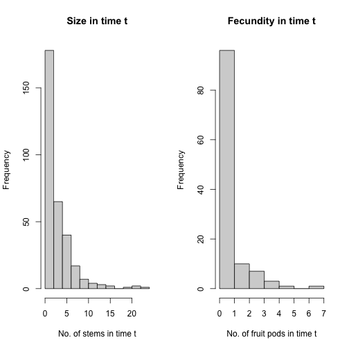
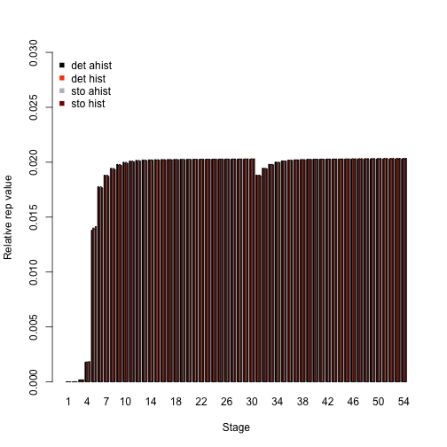
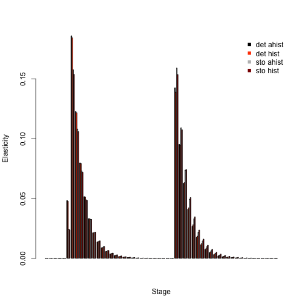
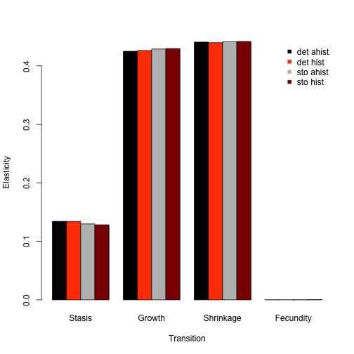

  <p style="text-indent: 20px">This document was built in Markdown in R 4.1.1 and compiled on 17 August 2021. It covers package `lefko3` version 3.7.0. Please note that this vignette was written with space considerations in mind. To reduce output size, we have prevented some statements from running if they produce long stretches of output. Examples include most `summary()` calls. In these cases, we include hashtagged versions of these calls, and our text assumes that the user runs these statements without hashtags. We have also written this vignette using the default Ehrlén format as the output format for all historical MPMs. All examples work with deVries format as well.</p>

## CASE STUDIES OF AMERICAN *Cypripedium candidum* POPULATION

  <p style="text-indent: 20px">In this vignette, we use the `cypdata` dataset to illustrate the estimation of **function-based MPMs**. Please see the other vignettes included in package `lefko3`, as well as further vignettes posted online on <a href = "http://www.sheffersonlab.com/projects">the projects page</a> of the Shefferson lab website, for further demonstrations of raw MPMs, function-based MPMs, IPMs, and age-by-stage MPMs.</p>

### ORGANISM AND POPULATION

  <p style="text-indent: 20px">The white lady's slipper, *Cypripedium candidum*, is a North American perennial herb in the family Orchidaceae. It is long-lived and of conservation concern. The population from which the dataset originates is located within a state nature preserve located in northeastern Illinois, USA. The population was monitored annually from 2004 to 2009, with two monitoring sessions per year. Monitoring sessions took roughly 2 weeks each, and included complete censuses of the population divided into sections referred to as patches. Each monitoring session consisted of searches for previously recorded individuals, which were located according to coordinates relative to fixed stakes at the site, followed by a search for new individuals. Data recorded per individual included: the location, the number of non-flowering sprouts, the number of flowering sprouts, the number of flowers per flowering sprout, and the number of fruit pods per sprout (only in the second monitoring session per year, once fruiting had occurred). Location was used to infer individual identity. More information about this population and its characteristics is given in Shefferson et al. [-@shefferson_estimating_2001] and Shefferson et al. [-@shefferson_predicting_2017].</p>
  
### OVERALL GOALS AND INITIAL CONSIDERATIONS
  
  <p style="text-indent: 20px">Our goal in this exercise will be to produce ahistorical and historical function-based matrices, and to compare these to see if we can spot the influence of individual history. We will also illustrate the use of multiple demographic data formats via comparison with the `cypvert` dataset, which presents the same information as `cypdata` but in ahistorical vertical format. Where appropriate, we will provide commentary to illustrate where analyses may be shortened or altered for more typical analyses.</p>
  
  <p style="text-indent: 20px">Population matrix projection modeling requires an appropriate life history model showing how all stages and transitions are related. The figure below shows a very general life history model detailing these relationships in *Cypripedium candidum*. The first stage of life is a dormant seed stage, although an individual may germinate in the year following seed production. The first germinated stage is a protocorm, which is an underground, mycoheterotrophic stage unique to the families Orchidaceae and Pyrolaceae. There are three years of protocorm stages, followed by a seedling stage, and finally a set of stages that comprise the size-classified adult portion of life. The figure shows 49 such stages, each for a different number of stems (including 0 for vegetative dormancy) and one of two reproductive statuses. These stages may be reorganized for different circumstances (more on this later).</p>
  
</img>
**Figure 5.1.** Life history model of *Cypripedium candidum*. Survival transitions are indicated with solid arrows, while fecundity transitions are indicated with dashed arrows.

  <p style="text-indent: 20px">We can see a variety of transitions within this figure. The juvenile stages have fairly simple transitions. New recruits may enter the population directly from germination of a seed produced the previous year, in which case they start in the protocorm 1 stage, or they may begin as dormant seed. Dormant seed may remain dormant, die, or germinate into the protocorm 1 stage. Protocorms exist for up to 3 years, yielding the protocorm 1, 2, and 3 stages, without any possibility of staying within each of these stages for more than a single year. Protocorm 3 leads to a seedling stage, in which the plant may persist for many years before becoming mature. Here, maturity does not really refer to reproduction *per se*, but rather to a morphology indistinguishable from a reproductive plant except for the lack of a flower. The first mature stage is usually either vegetative dormancy (dorm), during which time the plant does not sprout, or a small, non-flowering adult (1V). Once in this portion of the life history, the plant may transition among 49 mature stages, including vegetative dormancy, 1-24 shoots without flowers, or 1-24 shoots with at least one flower (theoretically, individual plants may be bigger than 24 sprouts, but we have never observed a plant bigger than this in the population).</p>
  
  <p style="text-indent: 20px">The horizontal dataset `cypdata`, and the ahistorical vertical dataset `cypvert` which is the same as `cypdata` but is structured differently, both include only data for the adult stages, and so later we will need to set juvenile transitions to constants. Let's begin by clearing the memory, loading the package, and loading the horizontal dataset.</p>

```r
rm(list=ls(all=TRUE))
library(lefko3)
data(cypdata)
```

#### Step 1. Life history model development

  <p style="text-indent: 20px">We will first need to describe the life history characterizing the dataset, matching it to our analyses properly with a `stageframe` for our *Cypripedium candidum* dataset. Since this analysis will be function-based, we will include all possible size classes here. If constructing raw matrices, all sizes that occur in the dataset need to be accounted for in a way that is both natural and parsimonious with respect to the numbers of individuals moving through actual transitions. If constructing function-based matrices, such as IPMs, then representative sizes at systematic increments will be satisfactory. Since size is count-based in the *Cypripedium candidum* case, we will use all numbers of stems that might occur from 0 to the maximum in the dataset, representing the life history diagram shown in the beginning of this chapter.</p>

```r
sizevector <- c(0, 0, 0, 0, 0, seq(from = 0, t = 24), seq(from = 1, to = 24))
stagevector <- c("SD", "P1", "P2", "P3", "SL", "D", "V1", "V2", "V3", "V4", "V5", 
  "V6", "V7", "V8", "V9", "V10", "V11", "V12", "V13", "V14", "V15", "V16", "V17", 
  "V18", "V19", "V20", "V21", "V22", "V23", "V24", "F1", "F2", "F3", "F4", "F5",
  "F6", "F7", "F8", "F9", "F10", "F11", "F12", "F13", "F14", "F15", "F16", "F17",
  "F18", "F19", "F20", "F21", "F22", "F23", "F24")
repvector <- c(0, 0, 0, 0, 0, rep(0, 25), rep(1, 24))
obsvector <- c(0, 0, 0, 0, 0, 0, rep(1, 48))
matvector <- c(0, 0, 0, 0, 0, rep(1, 49))
immvector <- c(0, 1, 1, 1, 1, rep(0, 49))
propvector <- c(1, rep(0, 53))
indataset <- c(0, 0, 0, 0, 0, rep(1, 49))
comments <- c("Dormant seed", "Yr1 protocorm", "Yr2 protocorm", "Yr3 protocorm",
  "Seedling", "Veg dorm", "Veg adult 1 stem", "Veg adult 2 stems",
  "Veg adult 3 stems", "Veg adult 4 stems", "Veg adult 5 stems",
  "Veg adult 6 stems", "Veg adult 7 stems", "Veg adult 8 stems",
  "Veg adult 9 stems", "Veg adult 10 stems", "Veg adult 11 stems",
  "Veg adult 12 stems", "Veg adult 13 stems", "Veg adult 14 stems",
  "Veg adult 15 stems", "Veg adult 16 stems", "Veg adult 17 stems",
  "Veg adult 18 stems", "Veg adult 19 stems", "Veg adult 20 stems",
  "Veg adult 21 stems", "Veg adult 22 stems", "Veg adult 23 stems",
  "Veg adult 24 stems", "Flo adult 1 stem", "Flo adult 2 stems",
  "Flo adult 3 stems", "Flo adult 4 stems", "Flo adult 5 stems",
  "Flo adult 6 stems", "Flo adult 7 stems", "Flo adult 8 stems",
  "Flo adult 9 stems", "Flo adult 10 stems", "Flo adult 11 stems",
  "Flo adult 12 stems", "Flo adult 13 stems", "Flo adult 14 stems",
  "Flo adult 15 stems", "Flo adult 16 stems", "Flo adult 17 stems",
  "Flo adult 18 stems", "Flo adult 19 stems", "Flo adult 20 stems",
  "Flo adult 21 stems", "Flo adult 22 stems", "Flo adult 23 stems",
  "Flo adult 24 stems")

cypframe <- sf_create(sizes = sizevector, stagenames = stagevector, 
  repstatus = repvector, obsstatus = obsvector, matstatus = matvector, 
  propstatus = propvector, immstatus = immvector, indataset = indataset,
  comments = comments)
#cypframe
```
  
  <p style="text-indent: 20px">A close look at the resulting object, `cypframe`, shows a data frame that includes the following information in order for each stage: the stage's name, the associated size, its reproductive status, its status as an observable stage, its status as a propagule stage, its status as an immature stage, its status as a mature stage, whether it occurs in the dataset, the half-width of its size class bin, the minimum and maximum ages associated with the stage, the minimum and maximum of its size class bin, the centroid of its size class bin (currently the arithmetic mean), its full size class bin width, and a comments field describing the stage. Stage names and combinations of characteristics must be unique to prevent estimation errors, and the comments field may be edited to include any information deemed pertinent.</p>

#### Step 2a. Data organization

  <p style="text-indent: 20px">Now we will transform our vertical dataset into a historically-formatted vertical file. The resulting dataset will have each individual's observed life history broken up into states corresponding to three consecutive monitoring occasions (years) per row, with plant identity marked in each row. To handle this, we use the `verticalize3()` function, as below.</p>

```r
vertdata <- verticalize3(data = cypdata, noyears = 6, firstyear = 2004, 
  patchidcol = "patch", individcol = "plantid", blocksize = 4, 
  sizeacol = "Inf2.04", sizebcol = "Inf.04", sizeccol = "Veg.04", 
  repstracol = "Inf.04", repstrbcol = "Inf2.04", fecacol = "Pod.04", 
  stageassign = cypframe, stagesize = "sizeadded", NAas0 = TRUE)
#summary(vertdata)
```
  
  <p style="text-indent: 20px">In the above code, we described the input dataset in a way that allows R to reorganize it appropriately. Note that in the input to the function, we utilized a repeating pattern of variable names arranged in the same order for each monitoring occasion. This arrangement allows us to enter only the first variable in each set, as long as `noyears` and `blocksize` are set properly and no gaps or shuffles appear in the dataset. The data management functions that we have created for `lefko3` do not require such repeating patterns, but they do make the required input in the function much shorter and more succinct. Without these patterns, column names should be input as vectors in the correct temporal order for each input option, and the `blocksize` option should be omitted.</p>
  
  <p style="text-indent: 20px">The output dataset includes a number of summary variables, but the data is essentially broken down into groups of three consecutive monitoring occasions each (occasions *t*+1, *t*, and *t*-1, corresponding to `year3`, `year2`, and `year1` in the output, respectively), with individuals spread across multiple rows. The output dataset is further limited to those entries in which the individual is alive in occasion *t* (`year2`), meaning that all rows in which an individual is dead or not yet recruited in occasion *t* are dropped. Thus, we have 320 rows of data and 54 variables.</p>
  
  <p style="text-indent: 20px">This reorganized dataset includes a set of interesting terms, the `sizeadded` group of three variables. These are sums of the size variables for each occasion, such that `size1added` is calculated as `sizea1 + sizeb1 + sizec1`. This may or may not make sense depending on the dataset. In this dataset, the full size of the individual in each occasion is this sum, because size is determined as the number of stems per plant, and the 3 original size columns give the numbers of 3 different kinds of stems: `Veg`, `Inf`, and `Inf2` are the numbers of non-reproductive stems, single-flowered inflorescences, and double-flowered inflorescences, respectively, per plant per occasion (an inflorescence is a single flowering stem, and no inflorescence has more than two flowers). Since size is given by the total number of stems in this example, we will use the `sizeadded` group of variables to code individual size.</p>
  
  <p style="text-indent: 20px">Size and fecundity are both count variables here, and we need to determine the appropriate distribution to use in both cases. Let's look at a histogram of size in occasion *t*.</p>

```r
hist(vertdata$size2added, main = "Size in occasion t", xlab = "Number of stems in occasion t")
```


  
  <p style="text-indent: 20px">Stem number has a very low mean, and the curve declines fairly smoothly. The Poisson or negative binomial distribution might work for size. Before determining whether this is indeed the case, let's also look at the distribution of fecundity values. As we see below, fecundity appears to have many 0s, suggesting that we might need a zero-inflated distribution.</p>

```r
hist(subset(vertdata, repstatus2 == 1)$feca2, main = "Fecundity in occasion t", 
  xlab = "Number of fruit pods in occasion t")
```


  <p style="text-indent: 20px">Let's conduct a formal set of tests to determine the appropriate distributions for size and fecundity. The size of 0 is actually absorbed in an unobservable stage, vegetative dormancy (stage D), so we will not test for zero-inflation in the size variable. However, we will test for zero-inflation in fecundity, since fecundity is measured as the number of fruit pods produced, while all flowering individuals are treated as reproductive and so some individuals must have fecundity of 0.</p>

```r
sf_distrib(vertdata, size3 = "size3added", size2 = "size2added",
  obs3 = "obsstatus3", fec = "feca2", repst = "repstatus2", zisize = FALSE)
#> The mean size is 3.653
#> 
#> The variance in size is 13.41
#> 
#> The probability of this dispersion level by chance assuming the true mean size = variance in size, and an alternative hypothesis of overdispersion, is 3.721e-138
#> 
#> Size is significantly overdispersed.
#> 
#> Mean fecundity is 0.7881
#> The variance in fecundity is 1.536
#> The probability of this dispersion level by chance assuming the true mean fecundity = variance in fecundity, and an alternative hypothesis of overdispersion, is 0.1193
#> 
#> Dispersion in fecundity matches expectation.
#> 
#> 
#> Mean lambda is 0.4547
#> The actual number of 0s in fecundity is 68
#> The expected number of 0s in fecundity under the null hypothesis is 53.65
#> The probability of this deviation in 0s is 5.904e-06
#> 
#> Fecundity is significantly zero-inflated.
#> NULL
```

  <p style="text-indent: 20px">The results of these tests show us that size is overdispersed. Since we have no 0s in size, we will use the zero-truncated negative binomial distribution for this vital rate. Our tests of fecundity show no significant overdispersion, but the number of 0s exceeds expectation, suggesting that we use a zero-inflated Poisson distribution.</p>

#### Step 2b. Vertical dataset organization

  <p style="text-indent: 20px">We may also wish to see how to proceed if our original dataset is already in vertical, ahistorical format. This package also includes dataset `cypvert`, which is the same dataset as `cypdata` but set in ahistorical vertical format. Here, we use the `historicalize3()` function to deal with this dataset. First, let's load the ahistorical vertical raw data file, look at its dimensions relative to the original, horizontal dataset, and finally view a summary (remove the hashtag below to run the `summary` statement).</p>

```r
data(cypvert)
dim(cypdata)
#> [1] 77 27
dim(cypvert)
#> [1] 331  12
#summary(cypvert)
```
  
  <p style="text-indent: 20px">This dataset is longer and narrower, with more rows and fewer columns. This is because we constructed the dataset by splitting the data for each individual across multiple rows. After three columns of identifying information (`plantid`, `patch`, and `censor`), a single column designates the time of occasion *t*, given as `year2`. This dataset then includes columns showing individual state in pairs of consecutive years corresponding to occasions *t* and *t*+1. State in occasion *t*-1 is not presented because this is an ahistorical dataset. This dataset includes the `plantid` variable, which is an individual identity term that allows us to associate rows with their individuals and so allows conversion. The `historicalize3()` function uses individual identity to reorganize datasets into historical vertical format.</p>

```r
vertdata2 <- historicalize3(data = cypvert, patchidcol = "patch",
  individcol = "plantid", year2col = "year2", sizea2col = "Inf2.2", 
  sizea3col = "Inf2.3", sizeb2col = "Inf.2", sizeb3col = "Inf.3", 
  sizec2col = "Veg.2", sizec3col = "Veg.3", repstra2col = "Inf2.2", 
  repstra3col = "Inf2.3", repstrb2col = "Inf.2", repstrb3col = "Inf.3", 
  feca2col = "Pod.2", feca3col = "Pod.3", repstrrel = 2, stageassign = cypframe,
  stagesize = "sizeadded", censorcol = "censor", censorkeep = 1, censor = FALSE,
  NAas0 = TRUE, reduce = TRUE)
#summary(vertdata2)
```
  
  <p style="text-indent: 20px">We can compare the dimensions of the new vertical datasets. The lengths of the datasets are the same in terms of rows and columns, and the variables and data are the same although the order of the columns and rows might not match (see the summaries for comparison).</p>

```r
dim(vertdata)
#> [1] 320  54
dim(vertdata2)
#> [1] 320  54
```
  
  <p style="text-indent: 20px">One important consideration is the use of censor variables. Censoring a demographic dataset refers to the elimination of suspect data points from analysis. This is typically accomplished by including a binary variable in the dataset denoting whether an individual datum is to be kept or excluded. The objects `vertdata` and `vertdata2` were both created without using censoring variables. However, because the datasets actually included censor variables (all data were set to be included, with no suspect data), we wished to incorporate those variables in the final datasets. Hence, although `censor = FALSE` in both the call to `verticalize3()` and the call to `historicalize3()`, we also noted `censorcol = "censor"` and `censorkeep = 1` in the call to `historicalize3()`. Failing to add these options to the call to `historicalize3()` will produce approximately the same dataset, but with some zeroes entering variables `censor1`, `censor2`, and `censor3` in the historicalized dataset that do not exist in the first, verticalized dataset.</p>

#### Step 2c. Provide supplemental information for matrix estimation

  <p style="text-indent: 20px">The next steps involve adding some external data to parameterize the matrices properly. There are two approaches for this:</p>
  
  1. using the `supplemental()` function, or
  2. creating a reproductive matrix and using the `overwrite()` function.
  
  <p style="text-indent: 20px">We advise the use of the first approach, the `supplemental()` function, which is more holistic and flexible than the other approach. The `supplemental()` function provides a means of inputting three kinds of data into MPM construction:</p>
  
  1. fixed transition values derived from other studies and added as constants to matrices,
  2. proxy transition values when data for particular transitions does not exist and other, estimable transitions will be used as proxies, and
  3. reproductive multipliers to indicate which stages lead to the production of which stages, and at what level relative to estimated fecundity.
  
  <p style="text-indent: 20px">We will create two supplemental tables taking all of these sorts of data. The first is the supplemental table for the historical analysis, and the second table covers the ahistorical analysis. Each row refers to a specific transition, and in the historical case, there are codes for 19 given transitions (12 for the ahistorical case). The first 9 of the historical transitions are set to specific probabilities, and the next 8 are transitions that will be set to other, estimated transitions (these are the non-NA transitions in `eststage` set below). The final 2 terms of fecundity multipliers. Based on the literature, the proxies for entry into the adult classes are transitions from dormancy, as below. However, in the raw dataset, dormancy is not common enough to use as an effective proxy in raw matrix creation. Hence, we can use different proxies for function-based matrix estimation than for raw matrix estimation. Where necessary, we also use `rep` and `mat` as shorthand to code for all reproductive stages and all mature stages, respectively.</p>

```r
cypsupp3 <- supplemental(stage3 = c("SD", "SD", "P1", "P1", "P2", "P3", "SL",
    "SL", "SL", "D", "V1", "V2", "V3", "D", "V1", "V2", "V3", "SD", "P1"), 
  stage2 = c("SD", "SD", "SD", "SD", "P1", "P2", "P3", "SL", "SL", "SL", "SL", 
    "SL", "SL", "SL", "SL", "SL", "SL", "rep", "rep"), 
  stage1 = c("SD", "rep", "SD", "rep", "SD", "P1", "P2", "P3", "SL", "P3", "P3",
    "P3", "P3", "SL", "SL", "SL", "SL", "mat", "mat"), 
  eststage3 = c(NA, NA, NA, NA, NA, NA, NA, NA, NA, "D", "V1", "V2", "V3", "D",
    "V1", "V2", "V3", NA, NA), 
  eststage2 = c(NA, NA, NA, NA, NA, NA, NA, NA, NA, "D", "D", "D", "D", "D", 
    "D", "D", "D", NA, NA), 
  eststage1 = c(NA, NA, NA, NA, NA, NA, NA, NA, NA, "D", "D", "D", "D", "D", 
    "D", "D", "D", NA, NA), 
  givenrate = c(0.08, 0.08, 0.1, 0.1, 0.1, 0.1, 0.125, 0.2, 0.2, NA, NA, NA, NA, 
    NA, NA, NA, NA, NA, NA),
  multiplier = c(NA, NA, NA, NA, NA, NA, NA, NA, NA, NA, NA, NA, NA, NA, NA, NA,
    NA, 0.5, 0.5),
  type = c("S", "S", "S", "S", "S", "S", "S", "S", "S", "S", "S", "S", "S", "S",
    "S", "S", "S", "R", "R"), 
  type_t12 = c("S", "F", "S", "F", "S", "S", "S", "S", "S", "S", "S", "S", "S",
    "S", "S", "S", "S", "S", "S"), stageframe = cypframe)
cypsupp2 <- supplemental(stage3 = c("SD", "P1", "P2", "P3", "SL", "SL", "D",
    "V1", "V2", "V3", "SD", "P1"), 
  stage2 = c("SD", "SD", "P1", "P2", "P3", "SL", "SL", "SL", "SL", "SL", "rep",
    "rep"), 
  eststage3 = c(NA, NA, NA, NA, NA, NA, "D", "V1", "V2", "V3", NA, NA), 
  eststage2 = c(NA, NA, NA, NA, NA, NA, "D", "D", "D", "D", NA, NA), 
  givenrate = c(0.08, 0.1, 0.1, 0.1, 0.125, 0.2, NA, NA, NA, NA, NA, NA), 
  multiplier = c(NA, NA, NA, NA, NA, NA, NA, NA, NA, NA, 0.5, 0.5),
  type = c("S", "S", "S", "S", "S", "S", "S", "S", "S", "S", "R", "R"),
  stageframe = cypframe, historical = FALSE)
#cypsupp3
#cypsupp2
```
 
  <p style="text-indent: 20px">These supplemental tables provide the best means of adding external data to our MPMs because they allow both specific transitions to be isolated, and because they allow the use of shorthand to identify large groups of transitions (e.g. using `mat`, `rep`, `immat`, `prop`, or `all` to signify all mature stages, reproductive stages, immature stages, propagule stages, or simply all stages, respectively). However, an alternative means is through the creation of a reproductive matrix and an `overwrite` table. The reproductive matrix is an **ahistorical** matrix detailing where fecundity rates are set, and at what level. *Cypripedium candidum* produces seeds that germinate by the following growing season (stage P1, or a first year protocorm), or that remain dormant for the next year (stage SD). In the following matrix, we detail that the fecundity of each reproductive stage needs to be split into two between each of these output stages. The actual split places 50% of the fecundity of a reproductive stage into each category of recruit, where the full fecundity is estimated by linear models that we will create. This reproductive matrix can be used in historical MPM construction, and it is assumed that stage at occasion *t*-1 is set to `all`.</p>

```r
rep.assumptions <- matrix(0, 54, 54)
rep.assumptions[1:2,31:54] <- 0.5
#rep.assumptions
```

  <p style="text-indent: 20px">Next we will create an overwrite table, which outlines transitions that cannot be estimated from the data set and need to be set by other means. Here is an example of two overwrite tables for the *Cypripedium candidum* analysis. Note that they are fundamentally similar to supplemental tables, but do not allow the addition of fecundity multipliers and transition types from occasion *t*-1 to *t*, nor do they involve a check of entered stages against the stage frame.</p>

```r
cypover3 <- overwrite(stage3 = c("SD", "SD", "P1", "P1", "P2", "P3", "SL", "SL", 
    "SL", "D", "V1", "V2", "V3", "D", "V1", "V2", "V3"), 
  stage2 = c("SD", "SD", "SD", "SD", "P1", "P2", "P3", "SL", "SL", "SL", "SL", 
    "SL", "SL", "SL", "SL", "SL", "SL"), 
  stage1 = c("SD", "rep", "SD", "rep", "SD", "P1", "P2", "P3", "SL", "P3", "P3",
    "P3", "P3", "SL", "SL", "SL", "SL"), 
  eststage3 = c(NA, NA, NA, NA, NA, NA, NA, NA, NA, "D", "V1", "V2", "V3", "D",
    "V1", "V2", "V3"), 
  eststage2 = c(NA, NA, NA, NA, NA, NA, NA, NA, NA, "D", "D", "D", "D", "D", 
    "D", "D", "D"), 
  eststage1 = c(NA, NA, NA, NA, NA, NA, NA, NA, NA, "D", "D", "D", "D", "D", 
    "D", "D", "D"), 
  givenrate = c(0.08, 0.08, 0.1, 0.1, 0.1, 0.1, 0.125, 0.2, 0.2, NA, NA, NA, NA, 
    NA, NA, NA, NA), 
  type = c("S", "S", "S", "S", "S", "S", "S", "S", "S", "S", "S", "S", "S", "S",
    "S", "S", "S"))
cypover2 <- overwrite(stage3 = c("SD", "P1", "P2", "P3", "SL", "SL", "D", "V1",
    "V2", "V3"), 
  stage2 = c("SD", "SD", "P1", "P2", "P3", "SL", "SL", "SL", "SL", "SL"), 
  eststage3 = c(NA, NA, NA, NA, NA, NA, "D", "V1", "V2", "V3"), 
  eststage2 = c(NA, NA, NA, NA, NA, NA, "D", "D", "D", "D"), 
  givenrate = c(0.08, 0.1, 0.1, 0.1, 0.125, 0.2, NA, NA, NA, NA), 
  type = c("S", "S", "S", "S", "S", "S", "S", "S", "S", "S"))
#cypover3
#cypover2
```

  <p style="text-indent: 20px">We can now proceed with matrix estimation.</p>

#### Step 3. Tests of history, and vital rate modeling

  <p style="text-indent: 20px">Matrix creation can proceed either as raw matrix creation, as initially outlined in Ehrlén [-@ehrlen_dynamics_2000], or via the creation of function-based matrices, in many ways equivalent to complex integral projection models per Ellner and Rees [-@ellner_integral_2006] and as further described in the non-Gaussian case in Shefferson et al. [-@shefferson_life_2014]. In the raw MPM case, no vital rate models are estimated, whereas in function-based MPMs, vital rates are first analyzed via linear or non-linear models of the raw demographic dataset, and then functions are created that estimate these vital rates according the inputs given. Matrices are then estimated using these functions, as opposed to the raw data.</p>
  
  <p style="text-indent: 20px">Prior to vital rate estimation, a number of key decisions need to be made regarding the assumptions underlying the vital rates, and their relationships with the factors under investigation. These decisions include the **general modeling strategy**, and the **size and fecundity distributions**.</p>
  
#### Step 3a. General modeling strategy

  <p style="text-indent: 20px">Most function-based matrices, whether integral projection models or otherwise, are developed using either a generalized linear modeling (GLM) strategy, or a generalized linear mixed modeling (GLMM) strategy. The former is more common and is simpler, but the latter is more theoretically sound because it provides a means of correcting the lack of independence inherent in datasets incorporating repeated sampling of the same individuals. The difference between the two with regards to vital rate modeling is strongly related to assumptions regarding the individual and spatiotemporal variation in vital rates.</p>
  
  <p style="text-indent: 20px">In both GLM and GLMM-based MPMs, the underlying dataset utilized is a vertical dataset. Each row of data gives the state of the individual in either two consecutive occasions (the ahistorical case), or three consecutive occasions (the historical case). Under a GLM framework, time in occasion *t* is a fixed categorical variable, and individual identity is ignored. Treating time as fixed implies that the actual monitoring occasions are the only times for which inference is sought. Thus, if time is treated as fixed, then it would not be correct to infer future population dynamics after 2009 for a dataset collected between 2004 and 2009. Ignoring individual identity treats all transitions as independent, even though data originating from the same sampled individual is clearly not independent of that individual's previous transitions. This may be interpreted as a form of pseudoreplication because strongly related data is used to create matrices that are assumed to be statistically independent. This might impact demographic modeling by inflating Type 1 error in the linear modeling, yielding more significant terms in the chosen best-fit model and causing the retention of more terms than is warranted.</p>
  
  <p style="text-indent: 20px">Under a GLMM (generalized linear mixed model) framework, both time and individual identity can be treated as random categorical terms. This has two major implications. First, both time and individuals can be assumed to be random samples from a broader population of times and individuals for which inference is sought. Thus, sampled monitoring occasions represent a greater universe of years for which inference can be made, and so their associated coefficients can be assumed to come from a normal distribution with $mean = 0$. Second, treating individual as a random categorical term eliminates the pseudoreplication that is inherent in the GLM approach to vital rate estimation when individuals are monitored potentially many times, because each individual is assumed to be randomly drawn and associated with its own response distribution. Subpopulations may also be considered random, in which case they are assumed to have been sampled from all possible spaces that the species might occupy. We encourage researchers to use the GLMM approach in their demographic work, but we have also included easy-to-use GLM functionality, since many will find the GLM approach particularly useful in cases where mixed modeling breaks down.</p>
  
#### Step 3b. Size and fecundity distributions

  <p style="text-indent: 20px">Once a general approach is decided upon, the next step is to choose the underlying distributions. The probabilities of survival, observation, and reproductive status are automatically set to the binomial distribution, and this cannot be altered. However, the probability of size transition and fecundity rate can be set to the Gaussian, Poisson, or negative binomial distributions, with zero-inflated and zero-truncated versions of the Poisson and negative binomial also available. If size or fecundity rate is a continuous variable (i.e., not an integer or count variable), then it should be set to the Gaussian distribution. However, if size or fecundity is a count variable, then it should be set to the Poisson distribution if the mean equals the variance. The negative binomial distribution is provided in cases where the assumption that the mean equals the variance is clearly broken. We do not encourage the use of the negative binomial except in such cases, as the extra parameters estimated for the negative binomial distribution reduce the power of the modeling exercises conducted.</p>
  
  <p style="text-indent: 20px">The Poisson and the negative binomial distributions both predict specific numbers of 0s in the response variable. If excess 0s occur within the dataset even after including the observation status and reproductive status as vital rates to absorb 0s, then a zero-inflated Poisson or negative binomial distribution may be used. These modeling approaches work by parameterizing a binomial model, typically with a logit link, to predict 0 responses. The Poisson or negative binomial is then used to predict non-zero responses. This conditional model ends up really acting as two separate models in which 0s are assumed to be predicted under potentially different processes than the remaining counts. Users should be aware that, because an extra model is built to cover 0s, zero-inflated models are much more complex and can include many more parameters than their non-inflated counterparts. The principle of parsimony suggests that they should only be used when there are significantly more 0s than expected.</p>
  
  <p style="text-indent: 20px">Cases may arise in which 0s do not exist in either size or fecundity. For these situations, we provide zero-truncated distributions. This may occur in size if all cases of `size = 0` are absorbed by observation status, leaving only positive integers for the size of observed individuals. For example, if an unobservable stage such as vegetative dormancy occurs and absorbs all cases of `size = 0`, then a zero-truncated Poisson or negative binomial distribution will be more appropriate than the equivalent distribution without zero-truncation. It can also occur if all cases of `fecundity = 0` are absorbed by reproductive status. Such distributions only involve the estimation of single, conditional models, and so are simpler than zero-inflated models.</p>
  
  <p style="text-indent: 20px">Package `lefko3` includes a function that can help in determining which distributions to use: `sf_distrib()`. Earlier in this vignette, we used it to determine that we should use the zero-truncated negative binomial for size, and the zero-inflated Poisson for fecundity.</p>

#### Step 3c. Model building and selection

  <p style="text-indent: 20px">In *lefko3*, the `modelsearch` function is the workhorse that conducts vital rate model estimation. Here, we will create a full suite of vital rate models for the *Cypripedium candidum* dataset. Before proceeding, we need to decide on the linear model building strategy, the correct vital rates to model, the proper statistical distributions for estimated vital rates, the proper parameterizations for each vital rate, and the strategy for determination of the best-fit models.</p>
  
  <p style="text-indent: 20px">First, we must determine the model building strategy. In most cases, the best procedure will be through mixed linear models in which monitoring occasion and individual identity are random terms. We will set monitoring occasion as random because we wish to make inferences for the population as a whole and do not wish to restrict ourselves to inference only for the years monitored (i.e. our distribution of monitoring occasions sampled is itself a sample of the population in time). We will set individual identity as random because many or most of the individuals that we have sampled to produce our dataset yield multiple observation data points across time. Thus, we will set `approach = "mixed"`. To make sure that time and individual identity are treated as random, we will set the proper variable names for `indiv` and `year`, corresponding to individual identity (`individ` by default), and to occasion *t* (`year2` by default). The `year.as.random` option is set to random by default, and leaving it this way also means that R will randomly draw coefficient values for years with inestimable coefficients. Setting `year.as.random` to FALSE would make time a fixed categorical variable.</p>
  
  <p style="text-indent: 20px">The mixed modeling approach is usually preferable to the GLM approach. However, a mixed modeling strategy results in lower statistical power and a greater time used in estimating models (or, conversely, it yields truer statistical power while the GLM approach inflates Type I error). Users of package `lefko3` wishing to use a standard generalized linear modeling strategy can set `approach = "glm"`. In this case, individual identity is not used, time is a fixed factor, and all observed transitions are treated as independent.</p>
  
  <p style="text-indent: 20px">Next, we must determine which vital rates to model. Function `modelsearch()` estimates up to 9 vital rate models:</p>
  
  1) survival probability from occasion *t* to occasion *t*+1,
  
  2) observation probability in occasion *t*+1 assuming survival until that time, 
  
  3) size in occasion *t*+1 assuming survival and observation in that time, 
  
  4) reproduction status in occasion *t*+1 assuming survival and observation until that time,
  
  5) fecundity rate assuming survival until and observation and reproduction in the occasion of production of offspring (occasion *t* or *t*+1; mature only),
  
  6) juvenile survival probability from occasion *t* to occasion *t*+1,
  
  7) juvenile observation probability in occasion *t*+1 assuming survival until that time, 
  
  8) juvenile size in occasion *t*+1 assuming survival and observation in that time, and
  
  9) reproduction status in occasion *t*+1 assuming survival and observation until that time of a juvenile in occasion *t* that is becoming mature in occasion *t*+1.
  
  <p style="text-indent: 20px">The default settings for `modelsearch` estimate 1) survival probability, 3) size distribution, and 5) fecundity, which are the minimum 3 vital rates required for a full MPM. Observation probability (option `obs` in `vitalrates`) should only be included when a life history stage or size exists that cannot be observed. For example, in the case of a plant with vegetative dormancy, the observation probability can be thought of as the sprouting probability, which is a biologically meaningful vital rate [@shefferson_estimating_2001]. Further, reproduction status (option `repst` in `vitalrates`) should only be modeled if size classification needs to be stratified by the ability to reproduce, as when 0 fecundity occurs within stages that also produce offspring. Since *Cypripedium candidum* is capable of long bouts of vegetative dormancy, since we wish to stratify the population into reproductive and non-reproductive adults of the same size classes, and since we have no data derived from juvenile individuals, we will set `vitalrates = c("surv", "obs", "size", "repst", "fec")`.</p>
  
  <p style="text-indent: 20px">Third, we need to set the proper statistical distribution for each parameter. Survival probability, observation probability, and reproductive status are all modeled as binomial variables, and this cannot be changed. In the case of this population of *Cypripedium candidum*, size was measured as the number of stems and so is a count variable. Likewise, fecundity is actually estimated as the number of fruits produced per plant, and so is also a count variable. We have already performed tests for overdispersion and zero-inflation, and we are also aware that size in observed stages cannot be 0, requiring zero truncation in that parameter. So we will set size to the zero-truncated negative binomial distribution, and fecundity to the zero-inflated Poisson distribution.</p>
  
  <p style="text-indent: 20px">Fourth, we need the proper model parameterizations for each vital rate, using the `suite` option. The default, `suite = "main"`, under the mixed model setting (`approach = "mixed"`) starts with the estimation of global models that include size and reproductive status in occasions *t* and *t*-1 as fixed factors, with individual identity and time in occasion *t* (year *t*) set as random categorical terms. Other terms can be specified, including individual covariates and age. Setting `suite = "full"` will yield global models that also include all two-way interactions. We will set it to the latter. The default under the GLM setting (`approach = "glm"`) makes time in occasion *t* a fixed term and drops individual identity from consideration. The global model under `suite = "full"` then includes all fixed factors noted before, plus time in occasion *t* and all two-way interactions between fixed factors ("full" is the only setting with interaction terms). If the population is not stratified by reproductive status, then `suite = "size"` will eliminate reproductive status terms and use all others in the global model. If size is not important, then `suite = "rep"` will eliminate size but keep reproductive status and all other terms. Finally, `suite = "cons"` will result in a global model in which neither reproductive status nor size are considered.</p>
  
  <p style="text-indent: 20px">Finally, we need to determine the proper strategy for the determination of the best-fit model. Model building proceeds through the `dredge` function in package `MuMIn` [@barton_mumin_2014], and each model has an associated AICc value. The default setting in `lefko3` (`bestfit = "AICc&k"`) will compare all models within 2.0 AICc units of the model with $\Delta AICc = 0$, and choose the one with the lowest degrees of freedom. This approach is generally better than the alternative, which simply uses the model with $\Delta AICc = 0$ (`bestfit = "AICc"`), as all models within 2.0 AICc units of that model are equally parsimonious and so fewer degrees of freedom result from fewer parameters estimated [@burnham_model_2002].</p>
  
  <p style="text-indent: 20px">In the model building exercise below, we will use the `suite = "full"` option to run all main effects and their two-way interactions. Once done, we can summarize the output with the `summary()` function.</p>

```r
cypmodels3 <- modelsearch(vertdata, historical = TRUE, approach = "mixed", 
  vitalrates = c("surv", "obs", "size", "repst", "fec"), sizedist = "negbin", 
  size.trunc = TRUE, fecdist = "poisson", fec.zero = TRUE, suite = "full", 
  size = c("size3added", "size2added", "size1added"), quiet = TRUE)
#> boundary (singular) fit: see ?isSingular
#> Warning in checkConv(attr(opt, "derivs"), opt$par, ctrl = control$checkConv, : Model failed to converge with
#> max|grad| = 0.00275551 (tol = 0.002, component 1)
#> Warning in checkConv(attr(opt, "derivs"), opt$par, ctrl = control$checkConv, : Model failed to converge with
#> max|grad| = 0.0099624 (tol = 0.002, component 1)
#summary(cypmodels3)
```
  
  <p style="text-indent: 20px">As `modelsearch` works, it produces text describing what is going on. It is actually quite likely that many warning messages will appear, and these may be of use in understanding the dataset and how well it conforms to analytical assumptions. We have silenced most of this with the `quiet = TRUE` option, although some red text still indicates a few warnings that have slipped through. These are not to be terribly concerned about. However, we encourage users to allow the function to run unsilenced in case of severe modeling problems. Please read the documentation for functions `lm`, `glm`, `glm.nb`, `lmer` (lme4 package), `glmer` (lme4 package), `glmmTMB` (glmmTMB package), `zeroinfl` (pscl package), `vglm` (VGAM package), and `dredge` (MuMIn package) for further information on the sources of problems in such models. Note, however, that some warnings are expected, and so are not cause for alarm.</p>
  
  <p style="text-indent: 20px">In the output, we see historical terms determining size, suggesting that we cannot ignore history. The `summary` function gives us a great deal of information about all of the models, but also hides a number of more technical details. For example, the complete model selection tables are actually included in the `modelsearch` output, and users can see these by calling them directly. For example, type `cypmodels3$survival_table` at the prompt to examine the model table for survival.</p>
  
  <p style="text-indent: 20px">Before moving on, we note that the models created above are actually only usable for the construction of historical models. For comparison, we may wish to estimate ahistorical models. In that case, we also need linear models in which the global models tested do not include state at occasion *t*-1, as below.</p>

```r
cypmodels2 <- modelsearch(vertdata, historical = FALSE, approach = "mixed", 
  vitalrates = c("surv", "obs", "size", "repst", "fec"), sizedist = "negbin", 
  size.trunc = TRUE, fecdist = "poisson", fec.zero = TRUE, suite = "full", 
  size = c("size3added", "size2added"), quiet = TRUE)
#> Warning in checkConv(attr(opt, "derivs"), opt$par, ctrl = control$checkConv, : Model failed to converge with
#> max|grad| = 0.0330464 (tol = 0.002, component 1)
#summary(cypmodels2)
```

  <p style="text-indent: 20px">Fewer models were estimated per dredge, since fewer parameters were tested in the global models (size and reproductive status in occasion *t*-1 were not included). So, the best-fit models should look a little bit different. However, a more thorough comparison will show that many of the best-fit models are similar between historical and ahistorical analysis. This is not guaranteed - in this case, it may be that the relatively small number of years and small overall sample size leaves too little power to find an impact of historical status on most vital rates. However, with size impacted by history, the choice of a historical model is better here.</p>
  
#### Step 4. MPM estimation

  <p style="text-indent: 20px">Now we will create function-based MPMs. Function-based matrices have been taking over in population ecology, probably because of their ability to parse out interesting trends and influential factors picked up by the linear modeling of vital rates. Most of these are integral projection models, which involve the creation of many fine-scale size bins to capture the variation in a continuous size metric. However, function-based matrices can also be developed for organisms in which size is measured as a count. That is what we will do here. Let's first create a set of ahistorical matrices.</p>

```r
cypmatrix2 <- flefko2(stageframe = cypframe, supplement = cypsupp2, 
  modelsuite = cypmodels2, data = vertdata, year.as.random = TRUE)
summary(cypmatrix2)
#> 
#> This ahistorical lefkoMat object contains 5 matrices.
#> 
#> Each matrix is a square matrix with 54 rows and columns, and a total of 2916 elements.
#> A total of 12055 survival transitions were estimated, with 2411 per matrix.
#> A total of 240 fecundity transitions were estimated, with 48 per matrix.
#> 
#> Vital rate modeling quality control:
#> 
#> Survival estimated with 74 individuals and 320 individual transitions.
#> Observation estimated with 70 individuals and 303 individual transitions.
#> Size estimated with 70 individuals and 288 individual transitions.
#> Reproductive status estimated with 70 individuals and 288 individual transitions.
#> Fecundity estimated with 51 individuals and 118 individual transitions.
#> Juvenile survival not estimated.
#> Juvenile observation probability not estimated.
#> Juvenile size transition not estimated.
#> Juvenile reproduction probability not estimated.
#> 
#> Survival probability sum check (each matrix represented by column in order):
#>          [,1]  [,2]  [,3]  [,4]  [,5]
#> Min.    0.100 0.100 0.100 0.100 0.100
#> 1st Qu. 0.991 0.991 0.991 0.991 0.991
#> Median  1.000 1.000 1.000 1.000 1.000
#> Mean    0.924 0.927 0.926 0.926 0.922
#> 3rd Qu. 1.000 1.000 1.000 1.000 1.000
#> Max.    1.000 1.000 1.000 1.000 1.000
#> NULL
```
  
  <p style="text-indent: 20px">A quick glance at the summary output will highlight that many more elements are estimated for function-based matrices than for raw matrices - here, 2,459 out of 2,916 total elements (84.3%). In raw matrices, elements associated with transitions from specific stages are only estimated when individuals actually exist within those particular stages, and so the number of stages is strongly limited by the size of the dataset. In function-based matrices, in contrast, the linear models estimated allow the estimation of all elements that are theoretically possible (i.e. only structural 0s are not estimated), and so stages may be developed for the full range of sizes experienced by individuals.</p>
 
  <p style="text-indent: 20px">The survival probability summaries at the bottom of the output are also very important. Column sums are very useful tools to help you check your work, because they are equal to the overall annual survival of each ahMPM stage or each hMPM stage pair. The use of externally-supplied rates and probabilities, as supplied via the supplement and overwrite tables, can result in some stages or stage-pairs having survival probabilities greater than 1.0, and if that occurs, then the supplement/overwrite tables need to be corrected to reduce survival to something reasonable.</p>
  
  <p style="text-indent: 20px">The output of the `flefko2()` call includes several key elements. One of the most important is a data frame showing the order of matrices produced. Let's take a look at this object.</p>

```r
cypmatrix2$labels
#>   pop patch year2
#> 1   1     1  2004
#> 2   1     1  2005
#> 3   1     1  2006
#> 4   1     1  2007
#> 5   1     1  2008
```
  
  <p style="text-indent: 20px">Here we see that our 5 matrices are annual matrices all corresponding to the same population/patch. Other elements in this object include summaries of the stages used, in the order that they occur in the matrix. Since this is an ahistorical MPM, the key element here is `cypmatrix2$ahstages`. If this were a historical MPM, then `cypmatrix2$ahstages` would give the order of stages, and `cypmatrix2$hstages` would include the order of stage-pairs corresponding to the rows and columns in such MPMs.</p>
  
  <p style="text-indent: 20px">Before moving on, we can also create the same matrices using the overwrite tables and reproduction matrix. Here is an example, with a summary.</p>

```r
cypmatrix2_alt <- flefko2(stageframe = cypframe, overwrite = cypover2,
  repmatrix = rep.assumptions, modelsuite = cypmodels2, data = vertdata,
  year.as.random = TRUE)
summary(cypmatrix2_alt)
#> 
#> This ahistorical lefkoMat object contains 5 matrices.
#> 
#> Each matrix is a square matrix with 54 rows and columns, and a total of 2916 elements.
#> A total of 12055 survival transitions were estimated, with 2411 per matrix.
#> A total of 240 fecundity transitions were estimated, with 48 per matrix.
#> 
#> Vital rate modeling quality control:
#> 
#> Survival estimated with 74 individuals and 320 individual transitions.
#> Observation estimated with 70 individuals and 303 individual transitions.
#> Size estimated with 70 individuals and 288 individual transitions.
#> Reproductive status estimated with 70 individuals and 288 individual transitions.
#> Fecundity estimated with 51 individuals and 118 individual transitions.
#> Juvenile survival not estimated.
#> Juvenile observation probability not estimated.
#> Juvenile size transition not estimated.
#> Juvenile reproduction probability not estimated.
#> 
#> Survival probability sum check (each matrix represented by column in order):
#>          [,1]  [,2]  [,3]  [,4]  [,5]
#> Min.    0.100 0.100 0.100 0.100 0.100
#> 1st Qu. 0.991 0.991 0.991 0.991 0.991
#> Median  1.000 1.000 1.000 1.000 1.000
#> Mean    0.924 0.927 0.926 0.926 0.922
#> 3rd Qu. 1.000 1.000 1.000 1.000 1.000
#> Max.    1.000 1.000 1.000 1.000 1.000
#> NULL
```
  
  <p style="text-indent: 20px">The general details are essentially the same. However, it is important to note that the supplemental table approach allows both more flexibility and a greater detail in designating transitions, particularly historical fecundity. These differences may result in some differences in matrices between these approaches, particularly in historical MPMs. We encourage the use of supplemental tables instead of overwrite tables and reproduction matrices.</p>
  
  <p style="text-indent: 20px">Next, we will create a set of historical Lefkovitch matrices.</p>

```r
cypmatrix3 <- flefko3(stageframe = cypframe, supplement = cypsupp3, 
  modelsuite = cypmodels3, data = vertdata, yearcol = "year2",
  year.as.random = TRUE)
summary(cypmatrix3)
#> 
#> This historical lefkoMat object contains 5 matrices.
#> 
#> Each matrix is a square matrix with 2916 rows and columns, and a total of 8503056 elements.
#> A total of 588560 survival transitions were estimated, with 117712 per matrix.
#> A total of 11760 fecundity transitions were estimated, with 2352 per matrix.
#> 
#> Vital rate modeling quality control:
#> 
#> Survival estimated with 74 individuals and 320 individual transitions.
#> Observation estimated with 70 individuals and 303 individual transitions.
#> Size estimated with 70 individuals and 288 individual transitions.
#> Reproductive status estimated with 70 individuals and 288 individual transitions.
#> Fecundity estimated with 51 individuals and 118 individual transitions.
#> Juvenile survival not estimated.
#> Juvenile observation probability not estimated.
#> Juvenile size transition not estimated.
#> Juvenile reproduction probability not estimated.
#> 
#> Survival probability sum check (each matrix represented by column in order):
#>          [,1]  [,2]  [,3]  [,4]  [,5]
#> Min.    0.000 0.000 0.000 0.000 0.000
#> 1st Qu. 0.965 0.965 0.965 0.965 0.965
#> Median  1.000 1.000 1.000 1.000 1.000
#> Mean    0.819 0.819 0.819 0.819 0.819
#> 3rd Qu. 1.000 1.000 1.000 1.000 1.000
#> Max.    1.000 1.000 1.000 1.000 1.000
#> NULL
```

  <p style="text-indent: 20px">Once again, we see many more total elements (over 8.5 million, in comparison to 2,916 in the ahistorical case), and many more rows and columns (54 rows and columns in the ahistorical case, and 54<sup>2</sup> = 2,916 rows and columns in the historical case). However, historical matrices are composed primarily of structural 0s. Thus, with only 117,712 + 2,352 = 120,064 elements estimated per matrix, only 1.4% of elements are non-zero (the equivalent percentage for the ahistorical case is 84.3%).</p>

  <p style="text-indent: 20px">Now let's estimate some element-wise mean matrices. First, we will create the ahistorical mean matrix and look at its summary.</p>

```r
tmeans2r <- lmean(cypmatrix2)
summary(tmeans2r)
#> 
#> This ahistorical lefkoMat object contains 1 matrix.
#> 
#> Each matrix is a square matrix with 54 rows and columns, and a total of 2916 elements.
#> A total of 2411 survival transitions were estimated, with 2411 per matrix.
#> A total of 48 fecundity transitions were estimated, with 48 per matrix.
#> 
#> Survival probability sum check (each matrix represented by column in order):
#>          [,1]
#> Min.    0.100
#> 1st Qu. 0.991
#> Median  1.000
#> Mean    0.925
#> 3rd Qu. 1.000
#> Max.    1.000
#> NULL
```

  <p style="text-indent: 20px">Next we will estimate the historical element-wise mean matrix, along with its column sums (these represent the survival of stage pairs in occasion *t*-1 and occasion *t*).</p>

```r
tmeans3r <- lmean(cypmatrix3)
summary(tmeans3r)
#> 
#> This historical lefkoMat object contains 1 matrix.
#> 
#> Each matrix is a square matrix with 2916 rows and columns, and a total of 8503056 elements.
#> A total of 117712 survival transitions were estimated, with 117712 per matrix.
#> A total of 2352 fecundity transitions were estimated, with 2352 per matrix.
#> 
#> Survival probability sum check (each matrix represented by column in order):
#>          [,1]
#> Min.    0.000
#> 1st Qu. 0.965
#> Median  1.000
#> Mean    0.819
#> 3rd Qu. 1.000
#> Max.    1.000
#> NULL
```

  <p style="text-indent: 20px">It might help to do a more holistic comparison of the ahistorical vs. historical MPMs. Let's create matrix plots of the ahistorical and historical means. For this purpose, we will use the `image3()` function. Let's first view the ahistorical matrix image.</p>

```r
image3(tmeans2r, used = 1)
```



```
#> NULL
```

  <p style="text-indent: 20px">This is a fairly large matrix, and rather dense though with obviously large clusters of zero elements particularly at the edges. Now let's see the historical matrix.</p>

```r
image3(tmeans3r, used = 1)
```


```
#> NULL
```

  <p style="text-indent: 20px">Historical matrices are often huge and always sparse, just as our historical matrix is in the plot above. Although there are roughly 8.5 million elements, very few are non-zero and those are identified as the red streaks in the matrix image above.</p>
  
  <p style="text-indent: 20px">For further comparison, let's decompose the mean historical matrix into conditional historical matrices. We'll take a look at the matrix conditional on vegetative dormancy in occasion *t*-1.</p>

```r
condm3r <- cond_hmpm(tmeans3r)
#print(condm3r$Acond[[1]]$D, digits = 3)
```

#### Step 5. MPM analysis

  <p style="text-indent: 20px">Let's now conduct some quick population analyses. First, we can estimate the deterministic and stochastic population growth rates for these means. The use of `set.seed` is to make our stochastic results reproducible.</p>

```r
set.seed(42)
cypann2s <- slambda3(cypmatrix2)
set.seed(42)
cypann3s <- slambda3(cypmatrix3)

lambda3(tmeans2r)
#>   pop patch    lambda
#> 1   1     1 0.9566185
lambda3(tmeans3r)
#>   pop patch    lambda
#> 1   1     1 0.9570233
cypann2s
#>   pop patch           a         var         sd           se
#> 1   1     1 -0.04430779 0.002874545 0.05361478 0.0005361478
cypann3s
#>   pop patch           a         var         sd           se
#> 1   1     1 -0.04385809 0.002821368 0.05311655 0.0005311655
```

  <p style="text-indent: 20px">The $\lambda$ values are similar to one another, as are estimates of $a = \text{log} \lambda _{S}$. Let's take a look at a plot of annual deterministic growth rates (stochastic growth rate is calculated across time so is not included).</p>

```r
cypann3 <- lambda3(cypmatrix3)
cypann2 <- lambda3(cypmatrix2)

plot(lambda ~ year2, data = cypann2, xlab = "Year", ylab = "Lambda", ylim = c(0.93, 0.98), type = "l", lty= 1, lwd = 2, bty = "n")
lines(lambda ~ year2, data = cypann3, lty = 2, lwd= 2, col = "red")
legend("bottomright", c("ahistorical", "historical"), lty = c(1, 2), col = c("black", "red"), lwd = 2, bty = "n")
```



  <p style="text-indent: 20px">We find that annual $\lambda$ estimates differ only slightly between ahistorical and historical analyses.</p>

  <p style="text-indent: 20px">Now let's take a look at the stable stage distributions. We will look at deterministic and stochastic versions of the ahistorical and historical MPMs.</p>

```r
tm2ss <- stablestage3(tmeans2r)
tm3ss <- stablestage3(tmeans3r)
tm2ss_s <- stablestage3(cypmatrix2, stochastic = TRUE, seed = 42)
tm3ss_s <- stablestage3(cypmatrix3, stochastic = TRUE, seed = 42)

ss_put_together <- cbind.data.frame(tm2ss$ss_prop, tm3ss$ahist$ss_prop,
  tm2ss_s$ss_prop, tm3ss_s$ahist$ss_prop)
names(ss_put_together) <- c("det ahist", "det hist", "sto ahist", "sto hist")
rownames(ss_put_together) <- tm2ss$stage_id

barplot(t(ss_put_together), beside=T, ylab = "Proportion", xlab = "Stage", 
  ylim = c(0, 0.15), col = c("black", "orangered", "grey", "darkred"), bty = "n")
legend("topright", c("det ahist", "det hist", "sto ahist", "sto hist"),
  col = c("black", "orangered", "grey", "darkred"), pch = 15, bty = "n")
```



  <p style="text-indent: 20px">Overall, these are very similar patterns. Whether ahistorical or historical, deterministic or stochastic, our analyses suggest that small non-reproductive adults take up the greatest share of the stable stage structure, with dormant seed and 1st-year protocorms coming next, and then reproductive adults. The main differences appear to be a decreased presence of protocorms and increased presence of flowering adults in historical analysis. Stochastic analyses also reduce the importance of most stages with high proportions, while increasing the importance of rarer stages.</p>

  <p style="text-indent: 20px">Next let's look at the reproductive values associated with both ahistorical and historical approaches. We will standardize against the maximum value in each case to make these comparable.</p>

```r
tm2rv <- repvalue3(tmeans2r)
tm3rv <- repvalue3(tmeans3r)
tm2rv_s <- repvalue3(cypmatrix2, stochastic = TRUE, seed = 42)
tm3rv_s <- repvalue3(cypmatrix3, stochastic = TRUE, seed = 42)

rv_put_together <- cbind.data.frame((tm2rv$rep_value / max(tm2rv$rep_value)),
  (tm3rv$ahist$rep_value / max(tm3rv$ahist$rep_value)),
  (tm2rv_s$rep_value / max(tm2rv_s$rep_value)),
  (tm3rv_s$ahist$rep_value / max(tm3rv_s$ahist$rep_value)))
names(rv_put_together) <- c("det ahist", "det hist", "sto ahist", "sto hist")
rownames(rv_put_together) <- tm2rv$stage_id

barplot(t(rv_put_together), beside=T, ylab = "Relative rep value", xlab = "Stage",
  ylim = c(0, 1.3), col = c("black", "orangered", "grey", "darkred"), bty = "n")
legend("topleft", c("det ahist", "det hist", "sto ahist", "sto hist"),
  col = c("black", "orangered", "grey", "darkred"), pch = 15, bty = "n")
```


  <p style="text-indent: 20px">We see some big differences here. In the deterministic analyses, the historical case predicts a greater importance of small and medium-sized flowering adults, and a lower importance of all other stages than the ahistorical case. In the stochastic analyses, the highest reproductive values are in the largest flowering adults. So, both history and temporal stochasticity have large effects here. Interesting results in need of further study!</p>
  
  <p style="text-indent: 20px">Let's now do a sensitivity analysis, again using both deterministic and stochastic approaches. First we will look at the ahistorical MPM.</p>

```r
tm2sens <- sensitivity3(tmeans2r)
set.seed(42)
tm2sens_s <- sensitivity3(cypmatrix2, stochastic = TRUE)

writeLines("\nThe highest deterministic sensitivity value: ")
#> 
#> The highest deterministic sensitivity value:
max(tm2sens$ah_sensmats[[1]][which(tmeans2r$A[[1]] > 0)])
#> [1] 0.2132667
writeLines("\nThis value is associated with element: ")
#> 
#> This value is associated with element:
which(tm2sens$ah_sensmats[[1]] == max(tm2sens$ah_sensmats[[1]][which(tmeans2r$A[[1]] > 0)]))
#> [1] 378

writeLines("\nThe highest stochastic sensitivity value: ")
#> 
#> The highest stochastic sensitivity value:
max(tm2sens_s$ah_sensmats[[1]][which(tmeans2r$A[[1]] > 0)])
#> [1] 0.2213405
writeLines("\nThis value is associated with element: ")
#> 
#> This value is associated with element:
which(tm2sens_s$ah_sensmats[[1]] == max(tm2sens_s$ah_sensmats[[1]][which(tmeans2r$A[[1]] > 0)]))
#> [1] 378
```

  <p style="text-indent: 20px">The highest sensitivity value in both cases appears to be associated with the transition from 1-sprouted non-flowering adult to the largest flowering adult (element 378, which is in the 7th column and 54th row). Inspecting each sensitivity matrix also shows that transitions near that element in both matrices are also associated with rather high sensitivities.</p>

  <p style="text-indent: 20px">Now let's compare with the historical case. We will compare both the full historical sensitivity matrices, and also look at the historically-corrected deterministic sensitivities.</p>

```r
tm3sens <- sensitivity3(tmeans3r)
set.seed(42)
tm3sens_s <- sensitivity3(cypmatrix3, stochastic = TRUE)

writeLines("\nThe highest deterministic sensitivity value: ")
#> 
#> The highest deterministic sensitivity value:
max(tm3sens$h_sensmats[[1]][which(tmeans3r$A[[1]] > 0)])
#> [1] 0.05718035
writeLines("\nThis value is associated with element: ")
#> 
#> This value is associated with element:
which(tm3sens$h_sensmats[[1]] == max(tm3sens$h_sensmats[[1]][which(tmeans3r$A[[1]] > 0)]))
#> [1] 962658
writeLines("\nThe highest stochastic sensitivity value: ")
#> 
#> The highest stochastic sensitivity value:
max(tm3sens_s$h_sensmats[[1]][which(tmeans3r$A[[1]] > 0)])
#> [1] 0.05900047
writeLines("\nThis value is associated with element: ")
#> 
#> This value is associated with element:
which(tm3sens_s$h_sensmats[[1]] == max(tm3sens_s$h_sensmats[[1]][which(tmeans3r$A[[1]] > 0)]))
#> [1] 962658

writeLines("\nThe highest deterministic sensitivity value (historically-corrected): ")
#> 
#> The highest deterministic sensitivity value (historically-corrected):
max(tm3sens$ah_sensmats[[1]][which(tmeans2r$A[[1]] > 0)])
#> [1] 0.2160675
writeLines("\nThis value is associated with element: ")
#> 
#> This value is associated with element:
which(tm3sens$ah_sensmats[[1]] == max(tm3sens$ah_sensmats[[1]][which(tmeans2r$A[[1]] > 0)]))
#> [1] 374
writeLines("\nThe highest stochastic sensitivity value (historically-corrected): ")
#> 
#> The highest stochastic sensitivity value (historically-corrected):
max(tm3sens_s$ah_sensmats[[1]][which(tmeans2r$A[[1]] > 0)])
#> [1] 0.2254779
writeLines("\nThis value is associated with element: ")
#> 
#> This value is associated with element:
which(tm3sens_s$ah_sensmats[[1]] == max(tm3sens_s$ah_sensmats[[1]][which(tmeans2r$A[[1]] > 0)]))
#> [1] 378
```

  <p style="text-indent: 20px">Here, we see both deterministic and stochastic sensitivity analyses supporting the transition from 1-sprouted vegetative adult in occasions *t*-1 and *t* to the largest flowering adult in occasion *t*+1. The highest historically-corrected deterministic sensitivity value is associated with the transition from 1-sprouted non-flowering adult to 20-sprouted flowering adults (element 374), while the historically-corrected stochastic sensitivity value is associated with the transitions from 1-sprouted non-flowering adult to the largest flowering adult stage (element 378). Thus, our results generally reinforce the results of the ahistorical case.</p>

  <p style="text-indent: 20px">Let's now assess the elasticity of $\lambda$ to matrix elements, comparing the ahistorical to the historically-corrected case in both deterministic and stochastic analyses.</p>

```r
tm2elas <- elasticity3(tmeans2r)
tm3elas <- elasticity3(tmeans3r)
set.seed(42)
tm2elas_s <- elasticity3(cypmatrix2, stochastic = TRUE)
set.seed(42)
tm3elas_s <- elasticity3(cypmatrix3, stochastic = TRUE)

writeLines("\nThe largest ahistorical deterministic elasticity is associated with element: ")
#> 
#> The largest ahistorical deterministic elasticity is associated with element:
which(tm2elas$ah_elasmats[[1]] == max(tm2elas$ah_elasmats[[1]]))
#> [1] 331
writeLines("\nThe largest historically-corrected deterministic elasticity is associated with element: ")
#> 
#> The largest historically-corrected deterministic elasticity is associated with element:
which(tm3elas$ah_elasmats[[1]] == max(tm3elas$ah_elasmats[[1]]))
#> [1] 331
writeLines("\nThe largest historical deterministic elasticity is associated with element: ")
#> 
#> The largest historical deterministic elasticity is associated with element:
which(tm3elas$h_elasmats[[1]] == max(tm3elas$h_elasmats[[1]]))
#> [1] 962611

writeLines("\nThe largest ahistorical stochastic elasticity is associated with element: ")
#> 
#> The largest ahistorical stochastic elasticity is associated with element:
which(tm2elas_s$ah_elasmats[[1]] == max(tm2elas_s$ah_elasmats[[1]]))
#> [1] 331
writeLines("\nThe largest historically-corrected stochastic elasticity is associated with element: ")
#> 
#> The largest historically-corrected stochastic elasticity is associated with element:
which(tm3elas_s$ah_elasmats[[1]] == max(tm3elas_s$ah_elasmats[[1]]))
#> [1] 331
writeLines("\nThe largest historical stochastic elasticity is associated with element: ")
#> 
#> The largest historical stochastic elasticity is associated with element:
which(tm3elas_s$h_elasmats[[1]] == max(tm3elas_s$h_elasmats[[1]]))
#> [1] 962611
```
  
  <p style="text-indent: 20px">Ahistorical and historical, deterministic and stochastic analyses suggest that population growth rate is most elastic in response to stasis as 1-sprouted non-flowering adult (element 331). This is a remarkably consistent result, reinforcing the importance of this stage as seen in sensitivity analyses.</p>
  
  <p style="text-indent: 20px">Now let's compare the elasticity of population growth rate in relation to the core life history stages, via a barplot comparison.</p>

```r
elas_put_together <- cbind.data.frame(colSums(tm2elas$ah_elasmats[[1]]),
  colSums(tm3elas$ah_elasmats[[1]]), colSums(tm2elas_s$ah_elasmats[[1]]),
  colSums(tm3elas_s$ah_elasmats[[1]]))
names(elas_put_together) <- c("det ahist", "det hist", "sto ahist", "sto hist")
rownames(elas_put_together) <- tm2elas$ah_stages$stage_id

barplot(t(elas_put_together), beside=T, ylab = "Elasticity", xlab = "Stage",
  col = c("black", "orangered", "grey", "darkred"), bty = "n")
legend("topright", c("det ahist", "det hist", "sto ahist", "sto hist"),
  col = c("black", "orangered", "grey", "darkred"), pch = 15, bty = "n")
```


  <p style="text-indent: 20px">Elasticity analyses in these plots look fairly similar, with most of the differences appearing to lie in elasticity of small non-flowering vs. flowering adults in the ahistorical vs. historical comparison.</p>

  <p style="text-indent: 20px">Finally, let's take a look at how the importance of different kinds of transitions changes, by looking at elasticity sums.</p>

```r
tm2elas_sums <- summary(tm2elas)
tm3elas_sums <- summary(tm3elas)
tm2elas_s_sums <- summary(tm2elas_s)
tm3elas_s_sums <- summary(tm3elas_s)

elas_sums_together <- cbind.data.frame(tm2elas_sums$ahist[,2],
  tm3elas_sums$ahist[,2], tm2elas_s_sums$ahist[,2], tm3elas_s_sums$ahist[,2])
names(elas_sums_together) <- c("det ahist", "det hist", "sto ahist", "sto hist")
rownames(elas_sums_together) <- tm2elas_sums$ahist$category

barplot(t(elas_sums_together), beside=T, ylab = "Elasticity", xlab = "Transition",
  col = c("black", "orangered", "grey", "darkred"), bty = "n")
legend("topright", c("det ahist", "det hist", "sto ahist", "sto hist"),
  col = c("black", "orangered", "grey", "darkred"), pch = 15, bty = "n")
```


  
  <p style="text-indent: 20px">Fecundity makes little difference in all cases, but the importance of stasis transitions drops a bit in historical analysis, while growth transitions increase a bit in importance. Next, we can see which historical transitions are most important.</p>

```r
elas_hist2plot <- cbind.data.frame(tm3elas_sums$hist[,2], tm3elas_s_sums$hist[,2])
names(elas_hist2plot) <- c("det hist", "sto hist")
rownames(elas_hist2plot) <- tm3elas_sums$hist$category

par(mar = c(7, 4, 2, 2) + 0.2)
barplot(t(elas_hist2plot), beside = T, ylab = "Elasticity", xlab = "", xaxt = "n",
  col = c("orangered", "darkred"), bty = "n")
text(cex=1, x=seq(from = -0.5, to = 2.8*length(tm3elas_sums$hist$category), by = 2.85),
  y=-0.07, tm3elas_sums$hist$category, xpd=TRUE, srt=45)
legend("topright", c("det ahist", "det hist", "sto ahist", "sto hist"),
  col = c("orangered", "darkred"), pch = 15, bty = "n")
```


  <p style="text-indent: 20px">We can see that growth from occasion *t*-1 to *t* followed by shrinkage to occasion *t*+1 is associated with the greatest summed elasticities, while the inverse, shrinkage from occasion *t*-1 to *t* followed by growth to occasion *t*+1 is the next most important. Transitions associated with fecundity are associated with the lowest summed elasticities.</p>
  
  <p style="text-indent: 20px">Package `lefko3` also includes functions to conduct deterministic and stochastic life table response experiments. Users wishing to conduct these analyses should see our new vignette on this topic.</p>
  
  <p style="text-indent: 20px">Further analytical tools are being planned for `lefko3`, but packages that handle projection matrices can typically handle the individual matrices produced and saved in `lefkoMat` objects in this package. Differences, obscure results, and errors sometimes arise when packages are not made to handle large and/or sparse matrices - historical matrices are both, and so care must be taken with their analysis.</p>


## Acknowledgements

  <p style="text-indent: 20px">We are grateful to two anonymous reviewers whose scrutiny improved the quality of this vignette. The project resulting in this package and this tutorial was funded by Grant-In-Aid 19H03298 from the Japan Society for the Promotion of Science.</p>
  
  
## Literature cited

<div id="refs"></div>
